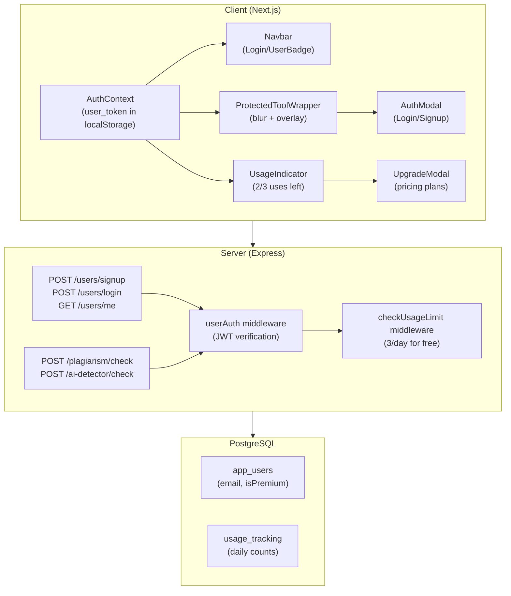

# Authentication, Usage Limits & Premium Subscription System

Add auth-based access control, freemium usage limits, and a premium subscription model to ScholarAssist's existing tools (Plagiarism Checker, AI Detector, Editor).

## User Review Required

> [!IMPORTANT]
> **Authentication Model**: The existing system uses `admin_users` for admin dashboard access with JWT. I'll create a **separate `app_users` table** for public-facing user auth (signup/login) so admin and tool users are distinct. This is critical — the current `admin_users` table should remain untouched for admin panel.

> [!IMPORTANT]
> **Payment Integration**: Stripe integration is included as Feature 7 (optional). I'll scaffold the payment flow with a **simulated upgrade** button for now (marks user as premium in DB). Actual Stripe/Razorpay can be wired in later with real API keys. Do you want me to:
> - **(A)** Build full Stripe checkout integration now (needs Stripe API keys in `.env`)
> - **(B)** Build the upgrade UI with a simulate/mock payment flow that can be swapped for real Stripe later

> [!WARNING]
> **Daily Usage Limit Scope**: Should the 3 daily uses be:
> - **(A)** Combined across all tools (3 total: any mix of plagiarism/AI/editor actions)
> - **(B)** Per-tool (3 plagiarism + 3 AI + 3 editor = 9 total)
>
> I'll default to **(A) combined** unless you specify otherwise.

---

## Proposed Changes

### Database Schema

New tables added to the existing PostgreSQL schema for user accounts and usage tracking.

#### [MODIFY] [schema.sql](file:///Users/rituraj/Downloads/Projects/Scholarassist-main/server/db/schema.sql)

Add these tables:

```sql
-- Public-facing app users (separate from admin_users)
CREATE TABLE IF NOT EXISTS app_users (
  id UUID PRIMARY KEY DEFAULT uuid_generate_v4(),
  name VARCHAR(255) NOT NULL,
  email VARCHAR(255) NOT NULL UNIQUE,
  password_hash VARCHAR(255) NOT NULL,
  is_premium BOOLEAN DEFAULT false,
  subscription_expiry TIMESTAMP WITH TIME ZONE,
  created_at TIMESTAMP WITH TIME ZONE DEFAULT NOW(),
  updated_at TIMESTAMP WITH TIME ZONE DEFAULT NOW()
);

-- Daily usage tracking
CREATE TABLE IF NOT EXISTS usage_tracking (
  id UUID PRIMARY KEY DEFAULT uuid_generate_v4(),
  user_id UUID REFERENCES app_users(id) ON DELETE CASCADE,
  usage_date DATE NOT NULL DEFAULT CURRENT_DATE,
  plagiarism_count INTEGER DEFAULT 0,
  ai_detector_count INTEGER DEFAULT 0,
  editor_count INTEGER DEFAULT 0,
  UNIQUE(user_id, usage_date)
);

CREATE INDEX IF NOT EXISTS idx_app_users_email ON app_users(email);
CREATE INDEX IF NOT EXISTS idx_usage_tracking_user_date ON usage_tracking(user_id, usage_date);
```

---

### Server — Authentication & Middleware

#### [NEW] [userAuth.js](file:///Users/rituraj/Downloads/Projects/Scholarassist-main/server/src/middleware/userAuth.js)

New middleware for public-facing user authentication (separate from admin auth):
- `authenticateUser` — Verifies JWT token from `app_users` table, attaches `req.user`
- `optionalAuth` — Same but doesn't reject unauthenticated requests (sets `req.user = null`)
- `checkUsageLimit` — Middleware that checks daily usage for free users, rejects if exceeded
- `checkPremium` — Middleware to verify premium status

#### [NEW] [userRoutes.js](file:///Users/rituraj/Downloads/Projects/Scholarassist-main/server/src/routes/userRoutes.js)

Public-facing user auth endpoints:
- `POST /api/users/signup` — Register with name, email, password (bcrypt hashed)
- `POST /api/users/login` — Login with email + password, returns JWT
- `GET /api/users/me` — Get current user profile (auth required)
- `GET /api/users/usage` — Get today's usage stats
- `POST /api/users/upgrade` — Simulate premium upgrade (or Stripe webhook)

#### [NEW] [usageRoutes.js](file:///Users/rituraj/Downloads/Projects/Scholarassist-main/server/src/routes/usageRoutes.js)

Usage tracking endpoints:
- `GET /api/usage/today` — Returns `{plagiarismCount, aiDetectorCount, editorCount, totalUsed, limit, remaining}`
- Internal helper: `incrementUsage(userId, toolName)` — Called from tool routes after successful check

#### [MODIFY] [plagiarismRoutes.js](file:///Users/rituraj/Downloads/Projects/Scholarassist-main/server/src/routes/plagiarismRoutes.js)

- Add `authenticateUser` middleware to `POST /check`
- Add `checkUsageLimit('plagiarism')` middleware
- After successful check, call `incrementUsage(req.user.id, 'plagiarism')`

#### [MODIFY] [aiDetectorRoutes.js](file:///Users/rituraj/Downloads/Projects/Scholarassist-main/server/src/routes/aiDetectorRoutes.js)

- Add `authenticateUser` middleware to `POST /check`
- Add `checkUsageLimit('ai_detector')` middleware
- After successful check, call `incrementUsage(req.user.id, 'ai_detector')`

#### [MODIFY] [documentRoutes.js](file:///Users/rituraj/Downloads/Projects/Scholarassist-main/server/src/routes/documentRoutes.js)

- Add `authenticateUser` middleware alongside existing admin auth (dual support)
- Track editor usage on document creation

#### [MODIFY] [index.js](file:///Users/rituraj/Downloads/Projects/Scholarassist-main/server/src/index.js)

- Register new routes: `app.use('/api/users', userRoutes)`

---

### Client — Auth Context & Provider

#### [NEW] [AuthContext.tsx](file:///Users/rituraj/Downloads/Projects/Scholarassist-main/client/src/lib/AuthContext.tsx)

React context for user authentication state:
- `user` — Current user object (name, email, isPremium, subscriptionExpiry)
- `isAuthenticated` — Boolean
- `login(email, password)` — Login function
- `signup(name, email, password)` — Signup function
- `logout()` — Clear tokens
- `usage` — Current usage stats `{used, limit, remaining}`
- `refreshUsage()` — Fetch latest usage data
- Stores JWT in `localStorage` as `user_token` (separate from `admin_token`)

#### [MODIFY] [api.ts](file:///Users/rituraj/Downloads/Projects/Scholarassist-main/client/src/lib/api.ts)

- Update interceptor to also check for `user_token` alongside `admin_token`
- Priority: if on admin pages use `admin_token`, otherwise use `user_token`

#### [MODIFY] [layout.tsx](file:///Users/rituraj/Downloads/Projects/Scholarassist-main/client/src/app/layout.tsx)

- Wrap app with `<AuthProvider>` context

---

### Client — UI Components

#### [NEW] [AuthModal.tsx](file:///Users/rituraj/Downloads/Projects/Scholarassist-main/client/src/components/AuthModal.tsx)

Premium login/signup modal with:
- Glassmorphism design with smooth animations
- Toggle between Login and Signup modes
- Form fields: Name (signup only), Email, Password
- Loading states, validation, error messages
- Social login buttons (visual only, can be wired later)
- "Forgot Password" link placeholder
- Animated transitions between modes

#### [NEW] [ProtectedToolWrapper.tsx](file:///Users/rituraj/Downloads/Projects/Scholarassist-main/client/src/components/ProtectedToolWrapper.tsx)

Reusable wrapper component that:
- If user is **NOT logged in**: Shows blurred preview of child content with overlay
  - "Login to use this tool" message
  - Login / Signup buttons (opens AuthModal)
  - Glassmorphic overlay with backdrop-blur
- If user **IS logged in but limit exceeded**: Shows disabled state with upgrade prompt
- If user **IS logged in with uses remaining**: Renders children normally

#### [NEW] [UsageIndicator.tsx](file:///Users/rituraj/Downloads/Projects/Scholarassist-main/client/src/components/UsageIndicator.tsx)

Floating usage indicator showing:
- Animated progress bar: "2/3 uses left today"
- Color transitions (green → yellow → red)
- Premium badge for premium users: "∞ Unlimited"
- Micro-animation on use count change

#### [NEW] [UpgradeModal.tsx](file:///Users/rituraj/Downloads/Projects/Scholarassist-main/client/src/components/UpgradeModal.tsx)

Premium upgrade popup:
- Triggered when usage limit reached
- Shows plan comparison (Free vs Premium)
- Pricing cards: Monthly / Yearly options
- Feature list with checkmarks
- CTA button → Simulated upgrade or Stripe checkout
- Animated entrance

#### [NEW] [UserBadge.tsx](file:///Users/rituraj/Downloads/Projects/Scholarassist-main/client/src/components/UserBadge.tsx)

Small badge component for navbar:
- Shows user avatar initial + name
- "Free" or "Premium ★" badge
- Dropdown with: Profile, Usage, Upgrade, Logout

---

### Client — Page Modifications

#### [MODIFY] [Navbar.tsx](file:///Users/rituraj/Downloads/Projects/Scholarassist-main/client/src/components/Navbar.tsx)

- Replace "Free Consultation" CTA with:
  - If not logged in: "Login" button (opens AuthModal)
  - If logged in: `<UserBadge />` component with dropdown
- Add usage indicator in navbar for logged-in users

#### [MODIFY] [plagiarism-checker/page.tsx](file:///Users/rituraj/Downloads/Projects/Scholarassist-main/client/src/app/plagiarism-checker/page.tsx)

- Wrap the tool section with `<ProtectedToolWrapper toolName="plagiarism">`
- Update hero badge from "Free Tool — No Login Required" to dynamic text
- Add `<UsageIndicator />` for logged-in users
- Handle 403 usage-limit errors from API

#### [MODIFY] [ai-detector/page.tsx](file:///Users/rituraj/Downloads/Projects/Scholarassist-main/client/src/app/ai-detector/page.tsx)

- Same treatment as plagiarism checker page
- Wrap with `<ProtectedToolWrapper toolName="ai_detector">`
- Add usage indicator

#### [MODIFY] [editor/page.tsx](file:///Users/rituraj/Downloads/Projects/Scholarassist-main/client/src/app/editor/page.tsx)

- Wrap with `<ProtectedToolWrapper toolName="editor">`
- Track editor document creation as usage

---

### Client — Styling

#### [MODIFY] [globals.css](file:///Users/rituraj/Downloads/Projects/Scholarassist-main/client/src/app/globals.css)

Add new animations and utility classes:
- Modal entrance/exit animations (scale + fade)
- Blur overlay styles
- Usage progress bar animations
- Premium badge shimmer effect
- Upgrade popup animations

---

## Architecture Diagram



---

## Open Questions

> [!IMPORTANT]
> 1. **Payment Flow**: Option (A) full Stripe integration now, or (B) mock/simulate for now? See above.
> 2. **Usage Limit Scope**: Combined (3 total) or per-tool (3 each)? Defaulting to combined.
> 3. **Premium Pricing**: What prices to display? I'll use placeholder values (₹199/mo, ₹1499/yr) — easy to change.
> 4. **Editor Auth**: Currently the editor uses `admin_users` auth for document saving. Should I:
>    - **(A)** Make editor documents work with the new `app_users` auth system too (recommended)
>    - **(B)** Keep editor document saving as admin-only, but just gate access to the editor page

---

## Verification Plan

### Automated Tests
- Run `npm run build` on client to verify no TypeScript errors
- Test all API endpoints with curl:
  - `POST /api/users/signup` → creates user
  - `POST /api/users/login` → returns JWT
  - `POST /api/plagiarism/check` without token → 401
  - `POST /api/plagiarism/check` with token → success + usage incremented
  - After 3 uses → 403 with limit message

### Manual Verification
- Browser test: Visit plagiarism checker while logged out → blurred overlay visible
- Browser test: Login via modal → tool unlocked
- Browser test: Use tool 3 times → upgrade popup appears
- Visual check of all new UI components matching existing design system
