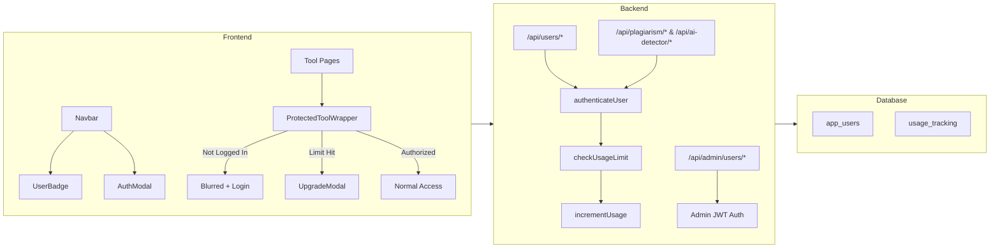

# Walkthrough: Freemium Access Control & Admin User Management

## Summary
Implemented a complete freemium model with user authentication, daily usage limits (3/day for free users), premium subscriptions, and admin user management across the ScholarAssist application.

---

## Changes Made

### Database Schema
#### [MODIFY] [schema.sql](file:///Users/rituraj/Downloads/Projects/Scholarassist-main/server/db/schema.sql)
- Added `app_users` table (separate from `admin_users`) with `is_premium`, `subscription_expiry` fields
- Added `usage_tracking` table with daily per-tool counters and unique constraint on `(user_id, usage_date)`

---

### Server — New Files

#### [NEW] [userAuth.js](file:///Users/rituraj/Downloads/Projects/Scholarassist-main/server/src/middleware/userAuth.js)
Core middleware providing:
- `authenticateUser` — JWT verification against `app_users` table
- `optionalAuth` — Non-blocking auth check
- `checkUsageLimit(toolName)` — Enforces 3 combined daily uses for free users
- `incrementUsage(userId, toolName)` — Upserts usage count after successful tool use
- `getUserUsage(userId)` — Returns today's usage stats

#### [NEW] [userRoutes.js](file:///Users/rituraj/Downloads/Projects/Scholarassist-main/server/src/routes/userRoutes.js)
Public user API endpoints:
- `POST /api/users/signup` — Creates account, returns JWT
- `POST /api/users/login` — Authenticates, returns JWT
- `GET /api/users/me` — Returns user profile + usage stats
- `GET /api/users/usage` — Returns today's usage only
- `POST /api/users/upgrade` — Simulated premium upgrade (mock payment)

#### [NEW] [adminUserRoutes.js](file:///Users/rituraj/Downloads/Projects/Scholarassist-main/server/src/routes/adminUserRoutes.js)
Admin CRUD for managing app users (protected by admin auth):
- `GET /api/admin/users` — List all users with search, filter, pagination
- `GET /api/admin/users/stats` — Aggregate stats (total, premium, free, new this week)
- `GET /api/admin/users/:id` — Single user with 7-day usage history
- `POST /api/admin/users` — Create user (with optional premium flag)
- `PUT /api/admin/users/:id` — Update user (name, email, password, premium)
- `DELETE /api/admin/users/:id` — Delete user + cascading usage data
- `PATCH /api/admin/users/:id/toggle-premium` — Toggle premium status

---

### Server — Modified Files

```diff:plagiarismRoutes.js
const express = require('express');
const multer = require('multer');
const path = require('path');
const router = express.Router();

// File upload config (in-memory for text extraction)
const upload = multer({
    storage: multer.memoryStorage(),
    limits: { fileSize: 5 * 1024 * 1024 },
    fileFilter: (req, file, cb) => {
        const allowed = ['.pdf', '.docx', '.txt'];
        const ext = path.extname(file.originalname).toLowerCase();
        if (allowed.includes(ext)) cb(null, true);
        else cb(new Error('Only PDF, DOCX, and TXT files are allowed'));
    },
});

// ─── Extract text from uploaded file ───
async function extractTextFromFile(file) {
    const ext = path.extname(file.originalname).toLowerCase();
    if (ext === '.txt') return file.buffer.toString('utf-8');
    if (ext === '.pdf') {
        const pdfParse = require('pdf-parse');
        return (await pdfParse(file.buffer)).text;
    }
    if (ext === '.docx') {
        const mammoth = require('mammoth');
        return (await mammoth.extractRawText({ buffer: file.buffer })).value;
    }
    throw new Error('Unsupported file type');
}

// ─── Split text into sentences (min 20 chars) ───
function splitIntoSentences(text) {
    return text
        .replace(/\r\n/g, ' ')
        .replace(/\n/g, ' ')
        .replace(/\s+/g, ' ')
        .trim()
        .split(/[.!?]+/)
        .map(s => s.trim())
        .filter(s => s.length > 20);
}

// ════════════════════════════════════════════════════
// WEB SEARCH — DuckDuckGo HTML + CrossRef API
// Both free, zero API keys needed
// ════════════════════════════════════════════════════
async function searchWeb(query) {
    const urls = [];

    // 1) DuckDuckGo HTML search (free, no API key)
    try {
        const searchQuery = encodeURIComponent(query.slice(0, 200));
        const ddgUrl = `https://html.duckduckgo.com/html/?q=${searchQuery}`;

        const response = await fetch(ddgUrl, {
            headers: {
                'User-Agent': 'Mozilla/5.0 (Windows NT 10.0; Win64; x64) AppleWebKit/537.36 (KHTML, like Gecko) Chrome/120.0.0.0 Safari/537.36',
            },
        });

        const html = await response.text();
        const resultMatches = html.match(/uddg=([^"&]+)/g) || [];
        const ddgUrls = resultMatches
            .map(match => {
                const encoded = match.replace('uddg=', '');
                try { return decodeURIComponent(encoded); } catch { return null; }
            })
            .filter(url => url && url.startsWith('http') && !url.includes('duckduckgo.com'))
            .slice(0, 8);

        urls.push(...ddgUrls.filter(u => u !== null));
    } catch (error) {
        console.error('DuckDuckGo search error:', error.message);
    }

    // 2) CrossRef API (free, no API key — academic papers)
    try {
        const searchQuery = encodeURIComponent(query.slice(0, 150));
        const crossrefUrl = `https://api.crossref.org/works?query=${searchQuery}&rows=5`;
        const adminEmail = process.env.ADMIN_EMAIL || 'admin@scholarassist.com';

        const response = await fetch(crossrefUrl, {
            headers: {
                'User-Agent': `ScholarAssist/1.0 (https://scholarassist.com; mailto:${adminEmail})`,
            }
        });

        if (!response.ok) {
            console.warn(`CrossRef search failed (${response.status}): ${response.statusText}`);
            return urls;
        }

        const data = await response.json().catch(() => null);
        if (data && data.message?.items) {
            for (const item of data.message.items) {
                if (item.URL) urls.push(item.URL);
            }
        }
    } catch (error) {
        console.error('CrossRef search error:', error.message);
    }

    return [...new Set(urls)].slice(0, 10);
}

// ════════════════════════════════════════════════════
// FETCH PAGE CONTENT — strips HTML to plain text
// ════════════════════════════════════════════════════
async function fetchPageContent(url) {
    try {
        const controller = new AbortController();
        const timeoutId = setTimeout(() => controller.abort(), 8000);

        const response = await fetch(url, {
            headers: {
                'User-Agent': 'Mozilla/5.0 (Windows NT 10.0; Win64; x64) AppleWebKit/537.36 (KHTML, like Gecko) Chrome/120.0.0.0 Safari/537.36',
                'Accept': 'text/html,application/xhtml+xml,application/xml;q=0.9,*/*;q=0.8',
                'Accept-Language': 'en-US,en;q=0.5',
            },
            signal: controller.signal,
        });

        clearTimeout(timeoutId);
        if (!response.ok) return '';

        const html = await response.text();

        // Strip HTML tags, scripts, styles, nav, footer etc.
        const text = html
            .replace(/<script[^>]*>.*?<\/script>/gis, '')
            .replace(/<style[^>]*>.*?<\/style>/gis, '')
            .replace(/<nav[^>]*>.*?<\/nav>/gis, '')
            .replace(/<header[^>]*>.*?<\/header>/gis, '')
            .replace(/<footer[^>]*>.*?<\/footer>/gis, '')
            .replace(/<aside[^>]*>.*?<\/aside>/gis, '')
            .replace(/<[^>]+>/g, ' ')
            .replace(/&[a-z]+;/gi, ' ')
            .replace(/\s+/g, ' ')
            .trim();

        return text.slice(0, 5000);
    } catch (error) {
        return '';
    }
}

const STOP_WORDS = new Set(['a', 'an', 'the', 'and', 'or', 'but', 'if', 'because', 'as', 'until', 'while', 'of', 'at', 'by', 'for', 'with', 'about', 'against', 'between', 'into', 'through', 'during', 'before', 'after', 'above', 'below', 'to', 'from', 'up', 'down', 'in', 'out', 'on', 'off', 'over', 'under', 'again', 'further', 'then', 'once', 'here', 'there', 'when', 'where', 'why', 'how', 'all', 'any', 'both', 'each', 'few', 'more', 'most', 'other', 'some', 'such', 'no', 'nor', 'not', 'only', 'own', 'same', 'so', 'than', 'too', 'very', 's', 't', 'can', 'will', 'just', 'don', 'should', 'now', 'i', 'me', 'my', 'myself', 'we', 'our', 'ours', 'ourselves', 'you', 'your', 'yours', 'yourself', 'yourselves', 'he', 'him', 'his', 'himself', 'she', 'her', 'hers', 'herself', 'it', 'its', 'itself', 'they', 'them', 'their', 'theirs', 'themselves', 'what', 'which', 'who', 'whom', 'this', 'that', 'these', 'those', 'am', 'is', 'are', 'was', 'were', 'be', 'been', 'being', 'have', 'has', 'had', 'having', 'do', 'does', 'did', 'doing']);

function cleanTextForSimilarity(text) {
    return text.toLowerCase()
        .replace(/[^\w\s]/g, ' ')
        .split(/\s+/)
        .filter(w => w.length > 2 && !STOP_WORDS.has(w))
        .join(' ');
}

// ════════════════════════════════════════════════════
// SIMILARITY — Cosine + N-Gram (with Stop-Word Filtering)
// ════════════════════════════════════════════════════
function calculateSimilarity(text1, text2) {
    const cleaned1 = cleanTextForSimilarity(text1);
    const cleaned2 = cleanTextForSimilarity(text2);
    
    if (cleaned1.length < 5 || cleaned2.length < 5) return 0;

    const words1 = cleaned1.split(/\s+/);
    const words2 = cleaned2.split(/\s+/);

    const allWords = [...new Set([...words1, ...words2])];

    const vector1 = allWords.map(word => words1.filter(w => w === word).length);
    const vector2 = allWords.map(word => words2.filter(w => w === word).length);

    const dotProduct = vector1.reduce((sum, val, i) => sum + val * vector2[i], 0);
    const magnitude1 = Math.sqrt(vector1.reduce((sum, val) => sum + val * val, 0));
    const magnitude2 = Math.sqrt(vector2.reduce((sum, val) => sum + val * val, 0));

    if (magnitude1 === 0 || magnitude2 === 0) return 0;
    return dotProduct / (magnitude1 * magnitude2);
}

function nGramSimilarity(text1, text2, n = 3) { // Reduced n for better fuzzy matching
    const createNGrams = (text) => {
        const cleaned = cleanTextForSimilarity(text);
        const words = cleaned.split(/\s+/);
        const ngrams = new Set();
        if (words.length < n) return ngrams;
        for (let i = 0; i <= words.length - n; i++) {
            ngrams.add(words.slice(i, i + n).join(' '));
        }
        return ngrams;
    };

    const ngrams1 = createNGrams(text1);
    const ngrams2 = createNGrams(text2);

    if (ngrams1.size === 0 || ngrams2.size === 0) return 0;

    let matches = 0;
    for (const gram of ngrams1) {
        if (ngrams2.has(gram)) matches++;
    }

    return matches / Math.max(ngrams1.size, ngrams2.size);
}

// ─── Extract page title from URL for display ───
function extractTitleFromUrl(url) {
    try {
        const parsed = new URL(url);
        let host = parsed.hostname.replace('www.', '');
        // Capitalize first letter
        host = host.charAt(0).toUpperCase() + host.slice(1);
        const pathParts = parsed.pathname.split('/').filter(Boolean);
        if (pathParts.length > 0) {
            const last = pathParts[pathParts.length - 1]
                .replace(/[-_]/g, ' ')
                .replace(/\.[^.]+$/, '') // remove extension
                .replace(/\b\w/g, c => c.toUpperCase());
            return `${host} — ${last}`.substring(0, 60);
        }
        return host;
    } catch {
        return url.substring(0, 50);
    }
}

// ════════════════════════════════════════════════════
// POST /check — Main plagiarism check endpoint
// ════════════════════════════════════════════════════
router.post('/check', upload.single('file'), async (req, res) => {
    try {
        let text = '';

        if (req.file) {
            text = await extractTextFromFile(req.file);
        } else if (req.body.text && req.body.text.trim()) {
            text = req.body.text.trim();
        } else {
            return res.status(400).json({ error: 'Please provide text or upload a file to check.' });
        }

        if (text.length < 50) {
            return res.status(400).json({ error: 'Text is too short. Please provide at least 50 characters.' });
        }

        const words = text.split(/\s+/).filter(w => w.length > 0);
        const wordCount = words.length;
        const sentences = splitIntoSentences(text);

        if (sentences.length < 1) {
            return res.status(400).json({ error: 'Not enough sentences for analysis.' });
        }

        // Dynamic sentence limit based on word count (scale from 15 to 150)
        let maxSentencesToCheck = 15;
        if (wordCount > 4000) maxSentencesToCheck = 150;
        else if (wordCount > 2000) maxSentencesToCheck = 100;
        else if (wordCount > 500) maxSentencesToCheck = 40;

        // Intelligent Sentence Selection (Rank by Information Density)
        const rankedSentences = sentences
            .map(s => {
                const words = s.toLowerCase().split(/\s+/).filter(w => !STOP_WORDS.has(w));
                const density = (words.length * new Set(words).size) / (s.length || 1);
                return { text: s, density };
            })
            .sort((a, b) => b.density - a.density)
            .slice(0, maxSentencesToCheck)
            .map(item => item.text);

        const results = [];
        console.log(`[Plagiarism] ULTRA ANALYSIS: Checking ${rankedSentences.length} segments with 10 concurrent threads...`);

        // Concurrent processing with a limit (batching)
        const concurrencyLimit = 10;
        for (let i = 0; i < rankedSentences.length; i += concurrencyLimit) {
            const batch = rankedSentences.slice(i, i + concurrencyLimit);
            
            const batchResults = await Promise.all(batch.map(async (sentence) => {
                const urls = await searchWeb(sentence);
                let maxSimilarity = 0;
                const matchedSources = [];

                for (const url of urls) {
                    const content = await fetchPageContent(url);
                    if (content && content.length > 200) { // Increased min content length for better accuracy
                        const cosineSim = calculateSimilarity(sentence, content);
                        const ngramSim = nGramSimilarity(sentence, content, 5);
                        const similarity = Math.max(cosineSim, ngramSim);

                        if (similarity > maxSimilarity) {
                            maxSimilarity = similarity;
                        }

                        if (similarity > 0.15) {
                            matchedSources.push({
                                url,
                                title: extractTitleFromUrl(url),
                                similarity: Math.round(similarity * 100),
                            });
                        }
                    }
                }

                matchedSources.sort((a, b) => b.similarity - a.similarity);

                return {
                    text: sentence,
                    similarity: Math.round(maxSimilarity * 100),
                    sources: matchedSources.slice(0, 3),
                    isPlagiarized: maxSimilarity > 0.5,
                };
            }));

            results.push(...batchResults);
        }

        // Calculate overall score
        const totalSimilarity = results.reduce((sum, r) => sum + r.similarity, 0);
        const overallScore = Math.round(totalSimilarity / results.length);

        // Flagged sentences (similarity > 20%)
        const flaggedSentences = results
            .filter(r => r.similarity > 20 && r.sources.length > 0)
            .map(r => ({
                text: r.text,
                similarity: r.similarity,
                source: r.sources[0], // top source
            }));

        // Determine verdict
        let verdict, verdictLabel;
        if (overallScore >= 50) {
            verdict = 'high';
            verdictLabel = 'High Plagiarism Detected';
        } else if (overallScore >= 20) {
            verdict = 'moderate';
            verdictLabel = 'Moderate Similarity Found';
        } else if (overallScore >= 10) {
            verdict = 'low';
            verdictLabel = 'Low Similarity — Mostly Original';
        } else {
            verdict = 'original';
            verdictLabel = 'Original Content';
        }

        res.json({
            score: overallScore,
            verdict,
            verdictLabel,
            wordCount,
            sentencesAnalyzed: results.length,
            totalSentences: sentences.length,
            flaggedSentences,
            text,
        });
    } catch (err) {
        console.error('Plagiarism check error:', err);
        res.status(500).json({ error: 'An error occurred during analysis. Please try again.' });
    }
});

module.exports = router;
===
const express = require('express');
const multer = require('multer');
const path = require('path');
const router = express.Router();
const { authenticateUser, checkUsageLimit, incrementUsage } = require('../middleware/userAuth');

// File upload config (in-memory for text extraction)
const upload = multer({
    storage: multer.memoryStorage(),
    limits: { fileSize: 5 * 1024 * 1024 },
    fileFilter: (req, file, cb) => {
        const allowed = ['.pdf', '.docx', '.txt'];
        const ext = path.extname(file.originalname).toLowerCase();
        if (allowed.includes(ext)) cb(null, true);
        else cb(new Error('Only PDF, DOCX, and TXT files are allowed'));
    },
});

// ─── Extract text from uploaded file ───
async function extractTextFromFile(file) {
    const ext = path.extname(file.originalname).toLowerCase();
    if (ext === '.txt') return file.buffer.toString('utf-8');
    if (ext === '.pdf') {
        const pdfParse = require('pdf-parse');
        return (await pdfParse(file.buffer)).text;
    }
    if (ext === '.docx') {
        const mammoth = require('mammoth');
        return (await mammoth.extractRawText({ buffer: file.buffer })).value;
    }
    throw new Error('Unsupported file type');
}

// ─── Split text into sentences (min 20 chars) ───
function splitIntoSentences(text) {
    return text
        .replace(/\r\n/g, ' ')
        .replace(/\n/g, ' ')
        .replace(/\s+/g, ' ')
        .trim()
        .split(/[.!?]+/)
        .map(s => s.trim())
        .filter(s => s.length > 20);
}

// ════════════════════════════════════════════════════
// WEB SEARCH — DuckDuckGo HTML + CrossRef API
// Both free, zero API keys needed
// ════════════════════════════════════════════════════
async function searchWeb(query) {
    const urls = [];

    // 1) DuckDuckGo HTML search (free, no API key)
    try {
        const searchQuery = encodeURIComponent(query.slice(0, 200));
        const ddgUrl = `https://html.duckduckgo.com/html/?q=${searchQuery}`;

        const response = await fetch(ddgUrl, {
            headers: {
                'User-Agent': 'Mozilla/5.0 (Windows NT 10.0; Win64; x64) AppleWebKit/537.36 (KHTML, like Gecko) Chrome/120.0.0.0 Safari/537.36',
            },
        });

        const html = await response.text();
        const resultMatches = html.match(/uddg=([^"&]+)/g) || [];
        const ddgUrls = resultMatches
            .map(match => {
                const encoded = match.replace('uddg=', '');
                try { return decodeURIComponent(encoded); } catch { return null; }
            })
            .filter(url => url && url.startsWith('http') && !url.includes('duckduckgo.com'))
            .slice(0, 8);

        urls.push(...ddgUrls.filter(u => u !== null));
    } catch (error) {
        console.error('DuckDuckGo search error:', error.message);
    }

    // 2) CrossRef API (free, no API key — academic papers)
    try {
        const searchQuery = encodeURIComponent(query.slice(0, 150));
        const crossrefUrl = `https://api.crossref.org/works?query=${searchQuery}&rows=5`;
        const adminEmail = process.env.ADMIN_EMAIL || 'admin@scholarassist.com';

        const response = await fetch(crossrefUrl, {
            headers: {
                'User-Agent': `ScholarAssist/1.0 (https://scholarassist.com; mailto:${adminEmail})`,
            }
        });

        if (!response.ok) {
            console.warn(`CrossRef search failed (${response.status}): ${response.statusText}`);
            return urls;
        }

        const data = await response.json().catch(() => null);
        if (data && data.message?.items) {
            for (const item of data.message.items) {
                if (item.URL) urls.push(item.URL);
            }
        }
    } catch (error) {
        console.error('CrossRef search error:', error.message);
    }

    return [...new Set(urls)].slice(0, 10);
}

// ════════════════════════════════════════════════════
// FETCH PAGE CONTENT — strips HTML to plain text
// ════════════════════════════════════════════════════
async function fetchPageContent(url) {
    try {
        const controller = new AbortController();
        const timeoutId = setTimeout(() => controller.abort(), 8000);

        const response = await fetch(url, {
            headers: {
                'User-Agent': 'Mozilla/5.0 (Windows NT 10.0; Win64; x64) AppleWebKit/537.36 (KHTML, like Gecko) Chrome/120.0.0.0 Safari/537.36',
                'Accept': 'text/html,application/xhtml+xml,application/xml;q=0.9,*/*;q=0.8',
                'Accept-Language': 'en-US,en;q=0.5',
            },
            signal: controller.signal,
        });

        clearTimeout(timeoutId);
        if (!response.ok) return '';

        const html = await response.text();

        // Strip HTML tags, scripts, styles, nav, footer etc.
        const text = html
            .replace(/<script[^>]*>.*?<\/script>/gis, '')
            .replace(/<style[^>]*>.*?<\/style>/gis, '')
            .replace(/<nav[^>]*>.*?<\/nav>/gis, '')
            .replace(/<header[^>]*>.*?<\/header>/gis, '')
            .replace(/<footer[^>]*>.*?<\/footer>/gis, '')
            .replace(/<aside[^>]*>.*?<\/aside>/gis, '')
            .replace(/<[^>]+>/g, ' ')
            .replace(/&[a-z]+;/gi, ' ')
            .replace(/\s+/g, ' ')
            .trim();

        return text.slice(0, 5000);
    } catch (error) {
        return '';
    }
}

const STOP_WORDS = new Set(['a', 'an', 'the', 'and', 'or', 'but', 'if', 'because', 'as', 'until', 'while', 'of', 'at', 'by', 'for', 'with', 'about', 'against', 'between', 'into', 'through', 'during', 'before', 'after', 'above', 'below', 'to', 'from', 'up', 'down', 'in', 'out', 'on', 'off', 'over', 'under', 'again', 'further', 'then', 'once', 'here', 'there', 'when', 'where', 'why', 'how', 'all', 'any', 'both', 'each', 'few', 'more', 'most', 'other', 'some', 'such', 'no', 'nor', 'not', 'only', 'own', 'same', 'so', 'than', 'too', 'very', 's', 't', 'can', 'will', 'just', 'don', 'should', 'now', 'i', 'me', 'my', 'myself', 'we', 'our', 'ours', 'ourselves', 'you', 'your', 'yours', 'yourself', 'yourselves', 'he', 'him', 'his', 'himself', 'she', 'her', 'hers', 'herself', 'it', 'its', 'itself', 'they', 'them', 'their', 'theirs', 'themselves', 'what', 'which', 'who', 'whom', 'this', 'that', 'these', 'those', 'am', 'is', 'are', 'was', 'were', 'be', 'been', 'being', 'have', 'has', 'had', 'having', 'do', 'does', 'did', 'doing']);

function cleanTextForSimilarity(text) {
    return text.toLowerCase()
        .replace(/[^\w\s]/g, ' ')
        .split(/\s+/)
        .filter(w => w.length > 2 && !STOP_WORDS.has(w))
        .join(' ');
}

// ════════════════════════════════════════════════════
// SIMILARITY — Cosine + N-Gram (with Stop-Word Filtering)
// ════════════════════════════════════════════════════
function calculateSimilarity(text1, text2) {
    const cleaned1 = cleanTextForSimilarity(text1);
    const cleaned2 = cleanTextForSimilarity(text2);
    
    if (cleaned1.length < 5 || cleaned2.length < 5) return 0;

    const words1 = cleaned1.split(/\s+/);
    const words2 = cleaned2.split(/\s+/);

    const allWords = [...new Set([...words1, ...words2])];

    const vector1 = allWords.map(word => words1.filter(w => w === word).length);
    const vector2 = allWords.map(word => words2.filter(w => w === word).length);

    const dotProduct = vector1.reduce((sum, val, i) => sum + val * vector2[i], 0);
    const magnitude1 = Math.sqrt(vector1.reduce((sum, val) => sum + val * val, 0));
    const magnitude2 = Math.sqrt(vector2.reduce((sum, val) => sum + val * val, 0));

    if (magnitude1 === 0 || magnitude2 === 0) return 0;
    return dotProduct / (magnitude1 * magnitude2);
}

function nGramSimilarity(text1, text2, n = 3) { // Reduced n for better fuzzy matching
    const createNGrams = (text) => {
        const cleaned = cleanTextForSimilarity(text);
        const words = cleaned.split(/\s+/);
        const ngrams = new Set();
        if (words.length < n) return ngrams;
        for (let i = 0; i <= words.length - n; i++) {
            ngrams.add(words.slice(i, i + n).join(' '));
        }
        return ngrams;
    };

    const ngrams1 = createNGrams(text1);
    const ngrams2 = createNGrams(text2);

    if (ngrams1.size === 0 || ngrams2.size === 0) return 0;

    let matches = 0;
    for (const gram of ngrams1) {
        if (ngrams2.has(gram)) matches++;
    }

    return matches / Math.max(ngrams1.size, ngrams2.size);
}

// ─── Extract page title from URL for display ───
function extractTitleFromUrl(url) {
    try {
        const parsed = new URL(url);
        let host = parsed.hostname.replace('www.', '');
        // Capitalize first letter
        host = host.charAt(0).toUpperCase() + host.slice(1);
        const pathParts = parsed.pathname.split('/').filter(Boolean);
        if (pathParts.length > 0) {
            const last = pathParts[pathParts.length - 1]
                .replace(/[-_]/g, ' ')
                .replace(/\.[^.]+$/, '') // remove extension
                .replace(/\b\w/g, c => c.toUpperCase());
            return `${host} — ${last}`.substring(0, 60);
        }
        return host;
    } catch {
        return url.substring(0, 50);
    }
}

// ════════════════════════════════════════════════════
// POST /check — Main plagiarism check endpoint
// ════════════════════════════════════════════════════
router.post('/check', authenticateUser, checkUsageLimit('plagiarism'), upload.single('file'), async (req, res) => {
    try {
        let text = '';

        if (req.file) {
            text = await extractTextFromFile(req.file);
        } else if (req.body.text && req.body.text.trim()) {
            text = req.body.text.trim();
        } else {
            return res.status(400).json({ error: 'Please provide text or upload a file to check.' });
        }

        if (text.length < 50) {
            return res.status(400).json({ error: 'Text is too short. Please provide at least 50 characters.' });
        }

        const words = text.split(/\s+/).filter(w => w.length > 0);
        const wordCount = words.length;
        const sentences = splitIntoSentences(text);

        if (sentences.length < 1) {
            return res.status(400).json({ error: 'Not enough sentences for analysis.' });
        }

        // Dynamic sentence limit based on word count (scale from 15 to 150)
        let maxSentencesToCheck = 15;
        if (wordCount > 4000) maxSentencesToCheck = 150;
        else if (wordCount > 2000) maxSentencesToCheck = 100;
        else if (wordCount > 500) maxSentencesToCheck = 40;

        // Intelligent Sentence Selection (Rank by Information Density)
        const rankedSentences = sentences
            .map(s => {
                const words = s.toLowerCase().split(/\s+/).filter(w => !STOP_WORDS.has(w));
                const density = (words.length * new Set(words).size) / (s.length || 1);
                return { text: s, density };
            })
            .sort((a, b) => b.density - a.density)
            .slice(0, maxSentencesToCheck)
            .map(item => item.text);

        const results = [];
        console.log(`[Plagiarism] ULTRA ANALYSIS: Checking ${rankedSentences.length} segments with 10 concurrent threads...`);

        // Concurrent processing with a limit (batching)
        const concurrencyLimit = 10;
        for (let i = 0; i < rankedSentences.length; i += concurrencyLimit) {
            const batch = rankedSentences.slice(i, i + concurrencyLimit);
            
            const batchResults = await Promise.all(batch.map(async (sentence) => {
                const urls = await searchWeb(sentence);
                let maxSimilarity = 0;
                const matchedSources = [];

                for (const url of urls) {
                    const content = await fetchPageContent(url);
                    if (content && content.length > 200) { // Increased min content length for better accuracy
                        const cosineSim = calculateSimilarity(sentence, content);
                        const ngramSim = nGramSimilarity(sentence, content, 5);
                        const similarity = Math.max(cosineSim, ngramSim);

                        if (similarity > maxSimilarity) {
                            maxSimilarity = similarity;
                        }

                        if (similarity > 0.15) {
                            matchedSources.push({
                                url,
                                title: extractTitleFromUrl(url),
                                similarity: Math.round(similarity * 100),
                            });
                        }
                    }
                }

                matchedSources.sort((a, b) => b.similarity - a.similarity);

                return {
                    text: sentence,
                    similarity: Math.round(maxSimilarity * 100),
                    sources: matchedSources.slice(0, 3),
                    isPlagiarized: maxSimilarity > 0.5,
                };
            }));

            results.push(...batchResults);
        }

        // Calculate overall score
        const totalSimilarity = results.reduce((sum, r) => sum + r.similarity, 0);
        const overallScore = Math.round(totalSimilarity / results.length);

        // Flagged sentences (similarity > 20%)
        const flaggedSentences = results
            .filter(r => r.similarity > 20 && r.sources.length > 0)
            .map(r => ({
                text: r.text,
                similarity: r.similarity,
                source: r.sources[0], // top source
            }));

        // Determine verdict
        let verdict, verdictLabel;
        if (overallScore >= 50) {
            verdict = 'high';
            verdictLabel = 'High Plagiarism Detected';
        } else if (overallScore >= 20) {
            verdict = 'moderate';
            verdictLabel = 'Moderate Similarity Found';
        } else if (overallScore >= 10) {
            verdict = 'low';
            verdictLabel = 'Low Similarity — Mostly Original';
        } else {
            verdict = 'original';
            verdictLabel = 'Original Content';
        }

        // Increment usage for free users
        if (req.user && !req.user.is_premium) {
            await incrementUsage(req.user.id, 'plagiarism');
        }

        res.json({
            score: overallScore,
            verdict,
            verdictLabel,
            wordCount,
            sentencesAnalyzed: results.length,
            totalSentences: sentences.length,
            flaggedSentences,
            text,
        });
    } catch (err) {
        console.error('Plagiarism check error:', err);
        res.status(500).json({ error: 'An error occurred during analysis. Please try again.' });
    }
});

module.exports = router;
```

```diff:aiDetectorRoutes.js
const express = require('express');
const multer = require('multer');
const path = require('path');
const router = express.Router();

// Hugging Face Inference API config
const { HfInference } = require('@huggingface/inference');
const HF_TOKEN = process.env.HUGGINGFACE_API_TOKEN || '';
const hf = new HfInference(HF_TOKEN);

// File upload config (in-memory for text extraction)
const upload = multer({
    storage: multer.memoryStorage(),
    limits: { fileSize: 5 * 1024 * 1024 },
    fileFilter: (req, file, cb) => {
        const allowed = ['.pdf', '.docx', '.txt'];
        const ext = path.extname(file.originalname).toLowerCase();
        if (allowed.includes(ext)) cb(null, true);
        else cb(new Error('Only PDF, DOCX, and TXT files are allowed'));
    },
});

// ─── Helper: Extract text from uploaded file ───
async function extractTextFromFile(file) {
    const ext = path.extname(file.originalname).toLowerCase();
    if (ext === '.txt') return file.buffer.toString('utf-8');
    if (ext === '.pdf') {
        const pdfParse = require('pdf-parse');
        return (await pdfParse(file.buffer)).text;
    }
    if (ext === '.docx') {
        const mammoth = require('mammoth');
        return (await mammoth.extractRawText({ buffer: file.buffer })).value;
    }
    throw new Error('Unsupported file type');
}

// ─── Helper: Split text into sentences ───
function splitIntoSentences(text) {
    const cleaned = text.replace(/\r\n/g, ' ').replace(/\n/g, ' ').replace(/\s+/g, ' ').trim();
    return cleaned.split(/(?<=[.!?])\s+/).filter(s => s.split(/\s+/).length >= 5);
}

// ─── Common AI transition words / phrases ───
const AI_TRANSITIONS = [
    'however', 'moreover', 'furthermore', 'additionally', 'consequently',
    'nevertheless', 'nonetheless', 'in conclusion', 'in summary', 'therefore',
    'thus', 'hence', 'accordingly', 'subsequently', 'in addition',
    'as a result', 'on the other hand', 'in contrast', 'similarly',
    'notably', 'specifically', 'essentially', 'ultimately', 'overall',
    'it is important to note', 'it is worth noting', 'in other words',
    'for instance', 'for example', 'in particular', 'as mentioned',
    'delve', 'tapestry', 'multifaceted', 'nuanced', 'landscape',
    'leverage', 'utilize', 'facilitate', 'encompass', 'underscore',
];

// ─── Common AI sentence starters ───
const AI_STARTERS = [
    'this is', 'it is', 'there are', 'there is', 'in today',
    'in the', 'one of', 'the importance', 'when it comes',
    'as we', 'in this', 'by understanding', 'by leveraging',
    'with the', 'from the', 'through the', 'understanding the',
    // Transition starters (strong AI signal)
    'however', 'moreover', 'furthermore', 'additionally', 'consequently',
    'nevertheless', 'nonetheless', 'therefore', 'thus', 'hence',
    'accordingly', 'subsequently', 'similarly', 'notably', 'specifically',
    'essentially', 'ultimately', 'overall', 'in conclusion', 'in summary',
    'in addition', 'as a result', 'on the other',
];

// ════════════════════════════════════════════════════
// METRIC 1: Burstiness (sentence length variation)
// Human writing: high variance in sentence lengths
// AI writing: very uniform sentence lengths
// ════════════════════════════════════════════════════
function analyzeBurstiness(sentences) {
    if (sentences.length < 3) return { score: 50, label: 'Insufficient data' };

    const lengths = sentences.map(s => s.split(/\s+/).length);
    const mean = lengths.reduce((a, b) => a + b, 0) / lengths.length;
    const variance = lengths.reduce((sum, l) => sum + (l - mean) ** 2, 0) / lengths.length;
    const stdDev = Math.sqrt(variance);
    const coeffOfVariation = mean > 0 ? stdDev / mean : 0;

    // CoV < 0.25 → very uniform (AI-like), CoV > 0.5 → varied (human-like)
    let aiScore;
    if (coeffOfVariation < 0.15) aiScore = 95;
    else if (coeffOfVariation < 0.25) aiScore = 80;
    else if (coeffOfVariation < 0.35) aiScore = 60;
    else if (coeffOfVariation < 0.50) aiScore = 35;
    else aiScore = 15;

    return {
        score: aiScore,
        coeffOfVariation: Math.round(coeffOfVariation * 100) / 100,
        avgSentenceLength: Math.round(mean),
        stdDev: Math.round(stdDev * 10) / 10,
    };
}

// ════════════════════════════════════════════════════
// METRIC 2: Vocabulary Richness (Type-Token Ratio)
// Human writing: richer, more diverse vocabulary
// AI writing: tends to reuse common words
// ════════════════════════════════════════════════════
function analyzeVocabularyRichness(text) {
    const words = text.toLowerCase().replace(/[^\w\s]/g, '').split(/\s+/).filter(w => w.length > 2);
    if (words.length < 20) return { score: 50, label: 'Insufficient data' };

    const uniqueWords = new Set(words);
    const ttr = uniqueWords.size / words.length;

    // Corrected TTR (for longer texts, TTR naturally decreases)
    const correctedTTR = ttr * Math.sqrt(words.length / 100);
    const normalizedTTR = Math.min(correctedTTR, 1);

    // Low TTR → AI-like, High TTR → human-like
    let aiScore;
    if (normalizedTTR < 0.35) aiScore = 85;
    else if (normalizedTTR < 0.45) aiScore = 70;
    else if (normalizedTTR < 0.55) aiScore = 50;
    else if (normalizedTTR < 0.65) aiScore = 30;
    else aiScore = 15;

    return {
        score: aiScore,
        ttr: Math.round(ttr * 100) / 100,
        uniqueWords: uniqueWords.size,
        totalWords: words.length,
    };
}

// ════════════════════════════════════════════════════
// METRIC 3: Sentence Opener Diversity
// Human: varied sentence beginnings
// AI: repetitive starters like "The", "It is", "This"
// ════════════════════════════════════════════════════
function analyzeSentenceOpeners(sentences) {
    if (sentences.length < 3) return { score: 50, label: 'Insufficient data' };

    const firstWords = sentences.map(s => s.split(/\s+/)[0]?.toLowerCase());
    const firstTwoWords = sentences.map(s => s.split(/\s+/).slice(0, 2).join(' ').toLowerCase());

    // Count unique first words
    const uniqueFirstWords = new Set(firstWords);
    const openerDiversity = uniqueFirstWords.size / firstWords.length;

    // Check for AI-style starters
    let aiStarterCount = 0;
    for (const starter of firstTwoWords) {
        if (AI_STARTERS.some(as => starter.startsWith(as))) aiStarterCount++;
    }
    const aiStarterRatio = aiStarterCount / sentences.length;

    // Combine signals
    let aiScore;
    if (openerDiversity < 0.3 || aiStarterRatio > 0.6) aiScore = 90;
    else if (openerDiversity < 0.45 || aiStarterRatio > 0.4) aiScore = 70;
    else if (openerDiversity < 0.6 || aiStarterRatio > 0.25) aiScore = 50;
    else if (openerDiversity < 0.75) aiScore = 30;
    else aiScore = 15;

    return {
        score: aiScore,
        openerDiversity: Math.round(openerDiversity * 100) / 100,
        aiStarterRatio: Math.round(aiStarterRatio * 100) / 100,
    };
}

// ════════════════════════════════════════════════════
// METRIC 4: Transition Word Density
// AI over-uses transition words like "However", "Moreover"
// ════════════════════════════════════════════════════
function analyzeTransitionDensity(text) {
    const lower = text.toLowerCase();
    const words = lower.split(/\s+/).filter(w => w.length > 0);
    if (words.length < 30) return { score: 50, label: 'Insufficient data' };

    let transitionCount = 0;
    const foundTransitions = [];

    for (const transition of AI_TRANSITIONS) {
        const regex = new RegExp(`\\b${transition.replace(/[.*+?^${}()|[\]\\]/g, '\\$&')}\\b`, 'gi');
        const matches = lower.match(regex);
        if (matches) {
            transitionCount += matches.length;
            foundTransitions.push({ word: transition, count: matches.length });
        }
    }

    const density = transitionCount / (words.length / 100); // per 100 words

    let aiScore;
    if (density > 8) aiScore = 95;
    else if (density > 5) aiScore = 80;
    else if (density > 3) aiScore = 60;
    else if (density > 1.5) aiScore = 35;
    else aiScore = 15;

    return {
        score: aiScore,
        density: Math.round(density * 10) / 10,
        transitionCount,
        topTransitions: foundTransitions.sort((a, b) => b.count - a.count).slice(0, 5),
    };
}

// ════════════════════════════════════════════════════
// METRIC 5: Punctuation Variety
// Human: uses diverse punctuation (?, !, —, ;, :, etc.)
// AI: mostly periods and commas
// ════════════════════════════════════════════════════
function analyzePunctuationVariety(text) {
    if (text.length < 100) return { score: 50, label: 'Insufficient data' };

    const punctuationTypes = {
        periods: (text.match(/\./g) || []).length,
        commas: (text.match(/,/g) || []).length,
        questions: (text.match(/\?/g) || []).length,
        exclamations: (text.match(/!/g) || []).length,
        semicolons: (text.match(/;/g) || []).length,
        colons: (text.match(/:/g) || []).length,
        dashes: (text.match(/[—–-]{2,}|—|–/g) || []).length,
        parentheses: (text.match(/[()]/g) || []).length,
    };

    const totalPunctuation = Object.values(punctuationTypes).reduce((a, b) => a + b, 0);
    const typesUsed = Object.values(punctuationTypes).filter(v => v > 0).length;

    // If almost all punctuation is periods+commas, it's AI-like
    const periodsCommasRatio = totalPunctuation > 0
        ? (punctuationTypes.periods + punctuationTypes.commas) / totalPunctuation
        : 1;

    let aiScore;
    if (typesUsed <= 2 && periodsCommasRatio > 0.95) aiScore = 85;
    else if (typesUsed <= 3 && periodsCommasRatio > 0.9) aiScore = 70;
    else if (typesUsed <= 4) aiScore = 50;
    else if (typesUsed <= 5) aiScore = 30;
    else aiScore = 15;

    return {
        score: aiScore,
        typesUsed,
        periodsCommasRatio: Math.round(periodsCommasRatio * 100) / 100,
    };
}

// ════════════════════════════════════════════════════
// METRIC 6: Word Length Uniformity
// AI produces more uniform word lengths
// Human writing has more variance in word complexity
// ════════════════════════════════════════════════════
function analyzeWordLengthUniformity(text) {
    const words = text.replace(/[^\w\s]/g, '').split(/\s+/).filter(w => w.length > 0);
    if (words.length < 30) return { score: 50, label: 'Insufficient data' };

    const lengths = words.map(w => w.length);
    const mean = lengths.reduce((a, b) => a + b, 0) / lengths.length;
    const variance = lengths.reduce((sum, l) => sum + (l - mean) ** 2, 0) / lengths.length;
    const stdDev = Math.sqrt(variance);
    const coeffOfVariation = mean > 0 ? stdDev / mean : 0;

    let aiScore;
    if (coeffOfVariation < 0.35) aiScore = 85;
    else if (coeffOfVariation < 0.42) aiScore = 65;
    else if (coeffOfVariation < 0.50) aiScore = 45;
    else if (coeffOfVariation < 0.60) aiScore = 30;
    else aiScore = 15;

    return {
        score: aiScore,
        avgWordLength: Math.round(mean * 10) / 10,
        coeffOfVariation: Math.round(coeffOfVariation * 100) / 100,
    };
}

// ─── Highlight AI-likely sentences ───
function highlightSuspiciousSentences(sentences) {
    const highlighted = [];

    for (const sentence of sentences.slice(0, 30)) {
        const lower = sentence.toLowerCase();
        let suspiciousness = 0;
        const reasons = [];

        // Check for AI transition overuse within this sentence
        let transInSentence = 0;
        for (const t of AI_TRANSITIONS) {
            if (lower.includes(t)) transInSentence++;
        }
        if (transInSentence >= 2) {
            suspiciousness += 30;
            reasons.push('Multiple AI-typical transitions');
        } else if (transInSentence === 1) {
            suspiciousness += 10;
        }

        // Check for AI starter pattern
        const firstTwo = lower.split(/\s+/).slice(0, 2).join(' ');
        if (AI_STARTERS.some(s => firstTwo.startsWith(s))) {
            suspiciousness += 15;
            reasons.push('Common AI sentence opener');
        }

        // Check for overly long, well-structured sentence (AI tends to write these)
        const wordCount = sentence.split(/\s+/).length;
        if (wordCount > 30 && !sentence.includes('?') && !sentence.includes('!')) {
            suspiciousness += 20;
            reasons.push('Unusually structured long sentence');
        }

        // Check for generic qualifying statements
        const genericPatterns = [
            /it is (important|essential|crucial|vital|worth)/i,
            /plays a (key|crucial|vital|important|significant) role/i,
            /in today's (world|society|digital|modern)/i,
            /it's (important|essential|crucial) to (note|understand|recognize)/i,
            /has become (increasingly|more and more)/i,
        ];
        for (const pattern of genericPatterns) {
            if (pattern.test(sentence)) {
                suspiciousness += 25;
                reasons.push('Generic AI phrasing');
                break;
            }
        }

        if (suspiciousness >= 25) {
            highlighted.push({
                text: sentence,
                confidence: Math.min(suspiciousness, 98),
                reasons,
            });
        }
    }

    return highlighted.sort((a, b) => b.confidence - a.confidence).slice(0, 8);
}

// ─── POST /check — Main AI detection endpoint ───
router.post('/check', upload.single('file'), async (req, res) => {
    try {
        let text = '';

        if (req.file) {
            text = await extractTextFromFile(req.file);
        } else if (req.body.text && req.body.text.trim()) {
            text = req.body.text.trim();
        } else {
            return res.status(400).json({ error: 'Please provide text or upload a file to check.' });
        }

        if (text.length < 100) {
            return res.status(400).json({ error: 'Text is too short. Please provide at least 100 characters for accurate analysis.' });
        }

        // Basic stats
        const words = text.split(/\s+/).filter(w => w.length > 0);
        const wordCount = words.length;
        const sentences = splitIntoSentences(text);

        if (sentences.length < 3) {
            return res.status(400).json({ error: 'Not enough sentences for analysis. Please provide at least 3 complete sentences.' });
        }

        // Run all heuristic analyzers
        const burstiness = analyzeBurstiness(sentences);
        const vocabulary = analyzeVocabularyRichness(text);
        const openers = analyzeSentenceOpeners(sentences);
        const transitions = analyzeTransitionDensity(text);
        const punctuation = analyzePunctuationVariety(text);
        const wordLength = analyzeWordLengthUniformity(text);

        // ─── RoBERTa ML model via Hugging Face API ───
        let roberta = { score: null, label: 'Not available' };
        let useML = false;

        if (HF_TOKEN) {
            try {
                // Split text into chunks (model max ~512 tokens)
                const chunks = [];
                for (let i = 0; i < text.length; i += 512) {
                    chunks.push(text.slice(i, i + 512));
                }
                const chunksToCheck = chunks.slice(0, 5); // max 5 chunks

                const chunkScores = [];
                for (const chunk of chunksToCheck) {
                    const data = await hf.textClassification({
                        model: 'roberta-base-openai-detector',
                        inputs: chunk
                    });

                    if (Array.isArray(data)) {
                        const fakeEntry = data.find(d => d.label === 'LABEL_1' || d.label === 'Fake');
                        if (fakeEntry) {
                            chunkScores.push(Math.round(fakeEntry.score * 100));
                        }
                    }
                }

                if (chunkScores.length > 0) {
                    const avgScore = Math.round(chunkScores.reduce((a, b) => a + b, 0) / chunkScores.length);
                    roberta = { score: avgScore, chunksAnalyzed: chunkScores.length };
                    useML = true;
                    console.log(`[AI Detector] RoBERTa ML score: ${avgScore}% (from ${chunkScores.length} chunks)`);
                }
            } catch (err) {
                console.error('[AI Detector] Hugging Face API error:', err.message);
            }
        }

        // Weighted average — prioritize Burstiness as the strongest indicator of modern AI models
        let weights, overallScore;

        if (useML) {
            weights = {
                roberta: 0.15,
                burstiness: 0.30,
                vocabulary: 0.10,
                openers: 0.15,
                transitions: 0.10,
                punctuation: 0.10,
                wordLength: 0.10,
            };
            overallScore = Math.round(
                roberta.score * weights.roberta +
                burstiness.score * weights.burstiness +
                vocabulary.score * weights.vocabulary +
                openers.score * weights.openers +
                transitions.score * weights.transitions +
                punctuation.score * weights.punctuation +
                wordLength.score * weights.wordLength
            );
        } else {
            weights = {
                burstiness: 0.35,
                vocabulary: 0.10,
                openers: 0.20,
                transitions: 0.10,
                punctuation: 0.15,
                wordLength: 0.10,
            };
            overallScore = Math.round(
                burstiness.score * weights.burstiness +
                vocabulary.score * weights.vocabulary +
                openers.score * weights.openers +
                transitions.score * weights.transitions +
                punctuation.score * weights.punctuation +
                wordLength.score * weights.wordLength
            );
        }

        // Apply critical signal overrides (Modern LLMs like ChatGPT often defeat vocabulary checks but fail burstiness entirely)
        if (burstiness.score >= 90 && punctuation.score >= 80) {
            overallScore = Math.max(overallScore, 88); // Highly robotic structure
        } else if (burstiness.score >= 80) {
            overallScore = Math.max(overallScore, 75); // Moderately robotic structure
        } else if (roberta.score >= 85) {
            overallScore = Math.max(overallScore, 85); // If ML is extremely confident it's fake
        }

        // Determine verdict
        let verdict, verdictLabel;
        if (overallScore >= 75) {
            verdict = 'ai';
            verdictLabel = 'Likely AI-Generated';
        } else if (overallScore >= 55) {
            verdict = 'mixed';
            verdictLabel = 'Mixed — Possibly AI-Assisted';
        } else if (overallScore >= 35) {
            verdict = 'uncertain';
            verdictLabel = 'Uncertain — Needs Review';
        } else {
            verdict = 'human';
            verdictLabel = 'Likely Human-Written';
        }

        // Get highlighted suspicious sentences
        const highlightedSentences = highlightSuspiciousSentences(sentences);

        res.json({
            score: overallScore,
            verdict,
            verdictLabel,
            wordCount,
            sentenceCount: sentences.length,
            metrics: {
                ...(useML ? { roberta: { label: 'RoBERTa ML Model', weight: weights.roberta, ...roberta } } : {}),
                burstiness: { label: 'Sentence Uniformity', weight: weights.burstiness, ...burstiness },
                vocabulary: { label: 'Vocabulary Richness', weight: weights.vocabulary, ...vocabulary },
                openers: { label: 'Sentence Opener Variety', weight: weights.openers, ...openers },
                transitions: { label: 'Transition Word Density', weight: weights.transitions, ...transitions },
                punctuation: { label: 'Punctuation Variety', weight: weights.punctuation, ...punctuation },
                wordLength: { label: 'Word Length Uniformity', weight: weights.wordLength, ...wordLength },
            },
            highlightedSentences,
            text, // Added text to response
        });
    } catch (err) {
        console.error('AI Detection error:', err);
        res.status(500).json({ error: 'An error occurred during analysis. Please try again.' });
    }
});

module.exports = router;
===
const express = require('express');
const multer = require('multer');
const path = require('path');
const router = express.Router();
const { authenticateUser, checkUsageLimit, incrementUsage } = require('../middleware/userAuth');

// Hugging Face Inference API config
const { HfInference } = require('@huggingface/inference');
const HF_TOKEN = process.env.HUGGINGFACE_API_TOKEN || '';
const hf = new HfInference(HF_TOKEN);

// File upload config (in-memory for text extraction)
const upload = multer({
    storage: multer.memoryStorage(),
    limits: { fileSize: 5 * 1024 * 1024 },
    fileFilter: (req, file, cb) => {
        const allowed = ['.pdf', '.docx', '.txt'];
        const ext = path.extname(file.originalname).toLowerCase();
        if (allowed.includes(ext)) cb(null, true);
        else cb(new Error('Only PDF, DOCX, and TXT files are allowed'));
    },
});

// ─── Helper: Extract text from uploaded file ───
async function extractTextFromFile(file) {
    const ext = path.extname(file.originalname).toLowerCase();
    if (ext === '.txt') return file.buffer.toString('utf-8');
    if (ext === '.pdf') {
        const pdfParse = require('pdf-parse');
        return (await pdfParse(file.buffer)).text;
    }
    if (ext === '.docx') {
        const mammoth = require('mammoth');
        return (await mammoth.extractRawText({ buffer: file.buffer })).value;
    }
    throw new Error('Unsupported file type');
}

// ─── Helper: Split text into sentences ───
function splitIntoSentences(text) {
    const cleaned = text.replace(/\r\n/g, ' ').replace(/\n/g, ' ').replace(/\s+/g, ' ').trim();
    return cleaned.split(/(?<=[.!?])\s+/).filter(s => s.split(/\s+/).length >= 5);
}

// ─── Common AI transition words / phrases ───
const AI_TRANSITIONS = [
    'however', 'moreover', 'furthermore', 'additionally', 'consequently',
    'nevertheless', 'nonetheless', 'in conclusion', 'in summary', 'therefore',
    'thus', 'hence', 'accordingly', 'subsequently', 'in addition',
    'as a result', 'on the other hand', 'in contrast', 'similarly',
    'notably', 'specifically', 'essentially', 'ultimately', 'overall',
    'it is important to note', 'it is worth noting', 'in other words',
    'for instance', 'for example', 'in particular', 'as mentioned',
    'delve', 'tapestry', 'multifaceted', 'nuanced', 'landscape',
    'leverage', 'utilize', 'facilitate', 'encompass', 'underscore',
];

// ─── Common AI sentence starters ───
const AI_STARTERS = [
    'this is', 'it is', 'there are', 'there is', 'in today',
    'in the', 'one of', 'the importance', 'when it comes',
    'as we', 'in this', 'by understanding', 'by leveraging',
    'with the', 'from the', 'through the', 'understanding the',
    // Transition starters (strong AI signal)
    'however', 'moreover', 'furthermore', 'additionally', 'consequently',
    'nevertheless', 'nonetheless', 'therefore', 'thus', 'hence',
    'accordingly', 'subsequently', 'similarly', 'notably', 'specifically',
    'essentially', 'ultimately', 'overall', 'in conclusion', 'in summary',
    'in addition', 'as a result', 'on the other',
];

// ════════════════════════════════════════════════════
// METRIC 1: Burstiness (sentence length variation)
// Human writing: high variance in sentence lengths
// AI writing: very uniform sentence lengths
// ════════════════════════════════════════════════════
function analyzeBurstiness(sentences) {
    if (sentences.length < 3) return { score: 50, label: 'Insufficient data' };

    const lengths = sentences.map(s => s.split(/\s+/).length);
    const mean = lengths.reduce((a, b) => a + b, 0) / lengths.length;
    const variance = lengths.reduce((sum, l) => sum + (l - mean) ** 2, 0) / lengths.length;
    const stdDev = Math.sqrt(variance);
    const coeffOfVariation = mean > 0 ? stdDev / mean : 0;

    // CoV < 0.25 → very uniform (AI-like), CoV > 0.5 → varied (human-like)
    let aiScore;
    if (coeffOfVariation < 0.15) aiScore = 95;
    else if (coeffOfVariation < 0.25) aiScore = 80;
    else if (coeffOfVariation < 0.35) aiScore = 60;
    else if (coeffOfVariation < 0.50) aiScore = 35;
    else aiScore = 15;

    return {
        score: aiScore,
        coeffOfVariation: Math.round(coeffOfVariation * 100) / 100,
        avgSentenceLength: Math.round(mean),
        stdDev: Math.round(stdDev * 10) / 10,
    };
}

// ════════════════════════════════════════════════════
// METRIC 2: Vocabulary Richness (Type-Token Ratio)
// Human writing: richer, more diverse vocabulary
// AI writing: tends to reuse common words
// ════════════════════════════════════════════════════
function analyzeVocabularyRichness(text) {
    const words = text.toLowerCase().replace(/[^\w\s]/g, '').split(/\s+/).filter(w => w.length > 2);
    if (words.length < 20) return { score: 50, label: 'Insufficient data' };

    const uniqueWords = new Set(words);
    const ttr = uniqueWords.size / words.length;

    // Corrected TTR (for longer texts, TTR naturally decreases)
    const correctedTTR = ttr * Math.sqrt(words.length / 100);
    const normalizedTTR = Math.min(correctedTTR, 1);

    // Low TTR → AI-like, High TTR → human-like
    let aiScore;
    if (normalizedTTR < 0.35) aiScore = 85;
    else if (normalizedTTR < 0.45) aiScore = 70;
    else if (normalizedTTR < 0.55) aiScore = 50;
    else if (normalizedTTR < 0.65) aiScore = 30;
    else aiScore = 15;

    return {
        score: aiScore,
        ttr: Math.round(ttr * 100) / 100,
        uniqueWords: uniqueWords.size,
        totalWords: words.length,
    };
}

// ════════════════════════════════════════════════════
// METRIC 3: Sentence Opener Diversity
// Human: varied sentence beginnings
// AI: repetitive starters like "The", "It is", "This"
// ════════════════════════════════════════════════════
function analyzeSentenceOpeners(sentences) {
    if (sentences.length < 3) return { score: 50, label: 'Insufficient data' };

    const firstWords = sentences.map(s => s.split(/\s+/)[0]?.toLowerCase());
    const firstTwoWords = sentences.map(s => s.split(/\s+/).slice(0, 2).join(' ').toLowerCase());

    // Count unique first words
    const uniqueFirstWords = new Set(firstWords);
    const openerDiversity = uniqueFirstWords.size / firstWords.length;

    // Check for AI-style starters
    let aiStarterCount = 0;
    for (const starter of firstTwoWords) {
        if (AI_STARTERS.some(as => starter.startsWith(as))) aiStarterCount++;
    }
    const aiStarterRatio = aiStarterCount / sentences.length;

    // Combine signals
    let aiScore;
    if (openerDiversity < 0.3 || aiStarterRatio > 0.6) aiScore = 90;
    else if (openerDiversity < 0.45 || aiStarterRatio > 0.4) aiScore = 70;
    else if (openerDiversity < 0.6 || aiStarterRatio > 0.25) aiScore = 50;
    else if (openerDiversity < 0.75) aiScore = 30;
    else aiScore = 15;

    return {
        score: aiScore,
        openerDiversity: Math.round(openerDiversity * 100) / 100,
        aiStarterRatio: Math.round(aiStarterRatio * 100) / 100,
    };
}

// ════════════════════════════════════════════════════
// METRIC 4: Transition Word Density
// AI over-uses transition words like "However", "Moreover"
// ════════════════════════════════════════════════════
function analyzeTransitionDensity(text) {
    const lower = text.toLowerCase();
    const words = lower.split(/\s+/).filter(w => w.length > 0);
    if (words.length < 30) return { score: 50, label: 'Insufficient data' };

    let transitionCount = 0;
    const foundTransitions = [];

    for (const transition of AI_TRANSITIONS) {
        const regex = new RegExp(`\\b${transition.replace(/[.*+?^${}()|[\]\\]/g, '\\$&')}\\b`, 'gi');
        const matches = lower.match(regex);
        if (matches) {
            transitionCount += matches.length;
            foundTransitions.push({ word: transition, count: matches.length });
        }
    }

    const density = transitionCount / (words.length / 100); // per 100 words

    let aiScore;
    if (density > 8) aiScore = 95;
    else if (density > 5) aiScore = 80;
    else if (density > 3) aiScore = 60;
    else if (density > 1.5) aiScore = 35;
    else aiScore = 15;

    return {
        score: aiScore,
        density: Math.round(density * 10) / 10,
        transitionCount,
        topTransitions: foundTransitions.sort((a, b) => b.count - a.count).slice(0, 5),
    };
}

// ════════════════════════════════════════════════════
// METRIC 5: Punctuation Variety
// Human: uses diverse punctuation (?, !, —, ;, :, etc.)
// AI: mostly periods and commas
// ════════════════════════════════════════════════════
function analyzePunctuationVariety(text) {
    if (text.length < 100) return { score: 50, label: 'Insufficient data' };

    const punctuationTypes = {
        periods: (text.match(/\./g) || []).length,
        commas: (text.match(/,/g) || []).length,
        questions: (text.match(/\?/g) || []).length,
        exclamations: (text.match(/!/g) || []).length,
        semicolons: (text.match(/;/g) || []).length,
        colons: (text.match(/:/g) || []).length,
        dashes: (text.match(/[—–-]{2,}|—|–/g) || []).length,
        parentheses: (text.match(/[()]/g) || []).length,
    };

    const totalPunctuation = Object.values(punctuationTypes).reduce((a, b) => a + b, 0);
    const typesUsed = Object.values(punctuationTypes).filter(v => v > 0).length;

    // If almost all punctuation is periods+commas, it's AI-like
    const periodsCommasRatio = totalPunctuation > 0
        ? (punctuationTypes.periods + punctuationTypes.commas) / totalPunctuation
        : 1;

    let aiScore;
    if (typesUsed <= 2 && periodsCommasRatio > 0.95) aiScore = 85;
    else if (typesUsed <= 3 && periodsCommasRatio > 0.9) aiScore = 70;
    else if (typesUsed <= 4) aiScore = 50;
    else if (typesUsed <= 5) aiScore = 30;
    else aiScore = 15;

    return {
        score: aiScore,
        typesUsed,
        periodsCommasRatio: Math.round(periodsCommasRatio * 100) / 100,
    };
}

// ════════════════════════════════════════════════════
// METRIC 6: Word Length Uniformity
// AI produces more uniform word lengths
// Human writing has more variance in word complexity
// ════════════════════════════════════════════════════
function analyzeWordLengthUniformity(text) {
    const words = text.replace(/[^\w\s]/g, '').split(/\s+/).filter(w => w.length > 0);
    if (words.length < 30) return { score: 50, label: 'Insufficient data' };

    const lengths = words.map(w => w.length);
    const mean = lengths.reduce((a, b) => a + b, 0) / lengths.length;
    const variance = lengths.reduce((sum, l) => sum + (l - mean) ** 2, 0) / lengths.length;
    const stdDev = Math.sqrt(variance);
    const coeffOfVariation = mean > 0 ? stdDev / mean : 0;

    let aiScore;
    if (coeffOfVariation < 0.35) aiScore = 85;
    else if (coeffOfVariation < 0.42) aiScore = 65;
    else if (coeffOfVariation < 0.50) aiScore = 45;
    else if (coeffOfVariation < 0.60) aiScore = 30;
    else aiScore = 15;

    return {
        score: aiScore,
        avgWordLength: Math.round(mean * 10) / 10,
        coeffOfVariation: Math.round(coeffOfVariation * 100) / 100,
    };
}

// ─── Highlight AI-likely sentences ───
function highlightSuspiciousSentences(sentences) {
    const highlighted = [];

    for (const sentence of sentences.slice(0, 30)) {
        const lower = sentence.toLowerCase();
        let suspiciousness = 0;
        const reasons = [];

        // Check for AI transition overuse within this sentence
        let transInSentence = 0;
        for (const t of AI_TRANSITIONS) {
            if (lower.includes(t)) transInSentence++;
        }
        if (transInSentence >= 2) {
            suspiciousness += 30;
            reasons.push('Multiple AI-typical transitions');
        } else if (transInSentence === 1) {
            suspiciousness += 10;
        }

        // Check for AI starter pattern
        const firstTwo = lower.split(/\s+/).slice(0, 2).join(' ');
        if (AI_STARTERS.some(s => firstTwo.startsWith(s))) {
            suspiciousness += 15;
            reasons.push('Common AI sentence opener');
        }

        // Check for overly long, well-structured sentence (AI tends to write these)
        const wordCount = sentence.split(/\s+/).length;
        if (wordCount > 30 && !sentence.includes('?') && !sentence.includes('!')) {
            suspiciousness += 20;
            reasons.push('Unusually structured long sentence');
        }

        // Check for generic qualifying statements
        const genericPatterns = [
            /it is (important|essential|crucial|vital|worth)/i,
            /plays a (key|crucial|vital|important|significant) role/i,
            /in today's (world|society|digital|modern)/i,
            /it's (important|essential|crucial) to (note|understand|recognize)/i,
            /has become (increasingly|more and more)/i,
        ];
        for (const pattern of genericPatterns) {
            if (pattern.test(sentence)) {
                suspiciousness += 25;
                reasons.push('Generic AI phrasing');
                break;
            }
        }

        if (suspiciousness >= 25) {
            highlighted.push({
                text: sentence,
                confidence: Math.min(suspiciousness, 98),
                reasons,
            });
        }
    }

    return highlighted.sort((a, b) => b.confidence - a.confidence).slice(0, 8);
}

// ─── POST /check — Main AI detection endpoint ───
router.post('/check', authenticateUser, checkUsageLimit('ai_detector'), upload.single('file'), async (req, res) => {
    try {
        let text = '';

        if (req.file) {
            text = await extractTextFromFile(req.file);
        } else if (req.body.text && req.body.text.trim()) {
            text = req.body.text.trim();
        } else {
            return res.status(400).json({ error: 'Please provide text or upload a file to check.' });
        }

        if (text.length < 100) {
            return res.status(400).json({ error: 'Text is too short. Please provide at least 100 characters for accurate analysis.' });
        }

        // Basic stats
        const words = text.split(/\s+/).filter(w => w.length > 0);
        const wordCount = words.length;
        const sentences = splitIntoSentences(text);

        if (sentences.length < 3) {
            return res.status(400).json({ error: 'Not enough sentences for analysis. Please provide at least 3 complete sentences.' });
        }

        // Run all heuristic analyzers
        const burstiness = analyzeBurstiness(sentences);
        const vocabulary = analyzeVocabularyRichness(text);
        const openers = analyzeSentenceOpeners(sentences);
        const transitions = analyzeTransitionDensity(text);
        const punctuation = analyzePunctuationVariety(text);
        const wordLength = analyzeWordLengthUniformity(text);

        // ─── RoBERTa ML model via Hugging Face API ───
        let roberta = { score: null, label: 'Not available' };
        let useML = false;

        if (HF_TOKEN) {
            try {
                // Split text into chunks (model max ~512 tokens)
                const chunks = [];
                for (let i = 0; i < text.length; i += 512) {
                    chunks.push(text.slice(i, i + 512));
                }
                const chunksToCheck = chunks.slice(0, 5); // max 5 chunks

                const chunkScores = [];
                for (const chunk of chunksToCheck) {
                    const data = await hf.textClassification({
                        model: 'roberta-base-openai-detector',
                        inputs: chunk
                    });

                    if (Array.isArray(data)) {
                        const fakeEntry = data.find(d => d.label === 'LABEL_1' || d.label === 'Fake');
                        if (fakeEntry) {
                            chunkScores.push(Math.round(fakeEntry.score * 100));
                        }
                    }
                }

                if (chunkScores.length > 0) {
                    const avgScore = Math.round(chunkScores.reduce((a, b) => a + b, 0) / chunkScores.length);
                    roberta = { score: avgScore, chunksAnalyzed: chunkScores.length };
                    useML = true;
                    console.log(`[AI Detector] RoBERTa ML score: ${avgScore}% (from ${chunkScores.length} chunks)`);
                }
            } catch (err) {
                console.error('[AI Detector] Hugging Face API error:', err.message);
            }
        }

        // Weighted average — prioritize Burstiness as the strongest indicator of modern AI models
        let weights, overallScore;

        if (useML) {
            weights = {
                roberta: 0.15,
                burstiness: 0.30,
                vocabulary: 0.10,
                openers: 0.15,
                transitions: 0.10,
                punctuation: 0.10,
                wordLength: 0.10,
            };
            overallScore = Math.round(
                roberta.score * weights.roberta +
                burstiness.score * weights.burstiness +
                vocabulary.score * weights.vocabulary +
                openers.score * weights.openers +
                transitions.score * weights.transitions +
                punctuation.score * weights.punctuation +
                wordLength.score * weights.wordLength
            );
        } else {
            weights = {
                burstiness: 0.35,
                vocabulary: 0.10,
                openers: 0.20,
                transitions: 0.10,
                punctuation: 0.15,
                wordLength: 0.10,
            };
            overallScore = Math.round(
                burstiness.score * weights.burstiness +
                vocabulary.score * weights.vocabulary +
                openers.score * weights.openers +
                transitions.score * weights.transitions +
                punctuation.score * weights.punctuation +
                wordLength.score * weights.wordLength
            );
        }

        // Apply critical signal overrides (Modern LLMs like ChatGPT often defeat vocabulary checks but fail burstiness entirely)
        if (burstiness.score >= 90 && punctuation.score >= 80) {
            overallScore = Math.max(overallScore, 88); // Highly robotic structure
        } else if (burstiness.score >= 80) {
            overallScore = Math.max(overallScore, 75); // Moderately robotic structure
        } else if (roberta.score >= 85) {
            overallScore = Math.max(overallScore, 85); // If ML is extremely confident it's fake
        }

        // Determine verdict
        let verdict, verdictLabel;
        if (overallScore >= 75) {
            verdict = 'ai';
            verdictLabel = 'Likely AI-Generated';
        } else if (overallScore >= 55) {
            verdict = 'mixed';
            verdictLabel = 'Mixed — Possibly AI-Assisted';
        } else if (overallScore >= 35) {
            verdict = 'uncertain';
            verdictLabel = 'Uncertain — Needs Review';
        } else {
            verdict = 'human';
            verdictLabel = 'Likely Human-Written';
        }

        // Get highlighted suspicious sentences
        const highlightedSentences = highlightSuspiciousSentences(sentences);

        // Increment usage for free users
        if (req.user && !req.user.is_premium) {
            await incrementUsage(req.user.id, 'ai_detector');
        }

        res.json({
            score: overallScore,
            verdict,
            verdictLabel,
            wordCount,
            sentenceCount: sentences.length,
            metrics: {
                ...(useML ? { roberta: { label: 'RoBERTa ML Model', weight: weights.roberta, ...roberta } } : {}),
                burstiness: { label: 'Sentence Uniformity', weight: weights.burstiness, ...burstiness },
                vocabulary: { label: 'Vocabulary Richness', weight: weights.vocabulary, ...vocabulary },
                openers: { label: 'Sentence Opener Variety', weight: weights.openers, ...openers },
                transitions: { label: 'Transition Word Density', weight: weights.transitions, ...transitions },
                punctuation: { label: 'Punctuation Variety', weight: weights.punctuation, ...punctuation },
                wordLength: { label: 'Word Length Uniformity', weight: weights.wordLength, ...wordLength },
            },
            highlightedSentences,
            text,
        });
    } catch (err) {
        console.error('AI Detection error:', err);
        res.status(500).json({ error: 'An error occurred during analysis. Please try again.' });
    }
});

module.exports = router;
```

```diff:index.js
require('dotenv').config();
const express = require('express');
const morgan = require('morgan');
const path = require('path');
const { setupSecurity } = require('./middleware/security');

const authRoutes = require('./routes/authRoutes');
const inquiryRoutes = require('./routes/inquiryRoutes');
const fileRoutes = require('./routes/fileRoutes');
const blogRoutes = require('./routes/blogRoutes');
const contactRoutes = require('./routes/contactRoutes');
const analyticsRoutes = require('./routes/analyticsRoutes');
const testimonialRoutes = require('./routes/testimonialRoutes');
const plagiarismRoutes = require('./routes/plagiarismRoutes');
const aiDetectorRoutes = require('./routes/aiDetectorRoutes');
const documentRoutes = require('./routes/documentRoutes');

const app = express();
const PORT = process.env.PORT || 5000;

// Security middleware
setupSecurity(app);

// Body parsing
app.use(express.json({ limit: '10mb' }));
app.use(express.urlencoded({ extended: true, limit: '10mb' }));

// Logging
if (process.env.NODE_ENV !== 'test') {
    app.use(morgan('combined'));
}

// Health check
app.get('/api/health', (req, res) => {
    res.json({ status: 'ok', timestamp: new Date().toISOString() });
});

// Serve uploaded files (blog images etc.)
app.use('/uploads', express.static(path.join(__dirname, '..', process.env.UPLOAD_DIR || './uploads')));

// Routes
app.use('/api/auth', authRoutes);
app.use('/api/inquiries', inquiryRoutes);
app.use('/api/files', fileRoutes);
app.use('/api/blog', blogRoutes);
app.use('/api/contact', contactRoutes);
app.use('/api/analytics', analyticsRoutes);
app.use('/api/testimonials', testimonialRoutes);
app.use('/api/plagiarism', plagiarismRoutes);
app.use('/api/ai-detector', aiDetectorRoutes);
app.use('/api/documents', documentRoutes);

// Error handling middleware
app.use((err, req, res, next) => {
    console.error('Unhandled error:', err);

    if (err.code === 'LIMIT_FILE_SIZE') {
        return res.status(400).json({ error: 'File too large. Maximum size is 10MB.' });
    }

    if (err.message && err.message.includes('File type not allowed')) {
        return res.status(400).json({ error: err.message });
    }

    res.status(500).json({ error: 'Internal server error' });
});

// 404 handler
app.use((req, res) => {
    res.status(404).json({ error: 'Route not found' });
});

app.listen(PORT, () => {
    console.log(`ScholarAssist API running on port ${PORT}`);
    console.log(`Environment: ${process.env.NODE_ENV || 'development'}`);
});

module.exports = app;
===
require('dotenv').config();
const express = require('express');
const morgan = require('morgan');
const path = require('path');
const { setupSecurity } = require('./middleware/security');

const authRoutes = require('./routes/authRoutes');
const inquiryRoutes = require('./routes/inquiryRoutes');
const fileRoutes = require('./routes/fileRoutes');
const blogRoutes = require('./routes/blogRoutes');
const contactRoutes = require('./routes/contactRoutes');
const analyticsRoutes = require('./routes/analyticsRoutes');
const testimonialRoutes = require('./routes/testimonialRoutes');
const plagiarismRoutes = require('./routes/plagiarismRoutes');
const aiDetectorRoutes = require('./routes/aiDetectorRoutes');
const documentRoutes = require('./routes/documentRoutes');
const userRoutes = require('./routes/userRoutes');
const adminUserRoutes = require('./routes/adminUserRoutes');

const app = express();
const PORT = process.env.PORT || 5000;

// Security middleware
setupSecurity(app);

// Body parsing
app.use(express.json({ limit: '10mb' }));
app.use(express.urlencoded({ extended: true, limit: '10mb' }));

// Logging
if (process.env.NODE_ENV !== 'test') {
    app.use(morgan('combined'));
}

// Health check
app.get('/api/health', (req, res) => {
    res.json({ status: 'ok', timestamp: new Date().toISOString() });
});

// Serve uploaded files (blog images etc.)
app.use('/uploads', express.static(path.join(__dirname, '..', process.env.UPLOAD_DIR || './uploads')));

// Routes
app.use('/api/auth', authRoutes);
app.use('/api/inquiries', inquiryRoutes);
app.use('/api/files', fileRoutes);
app.use('/api/blog', blogRoutes);
app.use('/api/contact', contactRoutes);
app.use('/api/analytics', analyticsRoutes);
app.use('/api/testimonials', testimonialRoutes);
app.use('/api/plagiarism', plagiarismRoutes);
app.use('/api/ai-detector', aiDetectorRoutes);
app.use('/api/documents', documentRoutes);
app.use('/api/users', userRoutes);
app.use('/api/admin/users', adminUserRoutes);

// Error handling middleware
app.use((err, req, res, next) => {
    console.error('Unhandled error:', err);

    if (err.code === 'LIMIT_FILE_SIZE') {
        return res.status(400).json({ error: 'File too large. Maximum size is 10MB.' });
    }

    if (err.message && err.message.includes('File type not allowed')) {
        return res.status(400).json({ error: err.message });
    }

    res.status(500).json({ error: 'Internal server error' });
});

// 404 handler
app.use((req, res) => {
    res.status(404).json({ error: 'Route not found' });
});

app.listen(PORT, () => {
    console.log(`ScholarAssist API running on port ${PORT}`);
    console.log(`Environment: ${process.env.NODE_ENV || 'development'}`);
});

module.exports = app;
```

```diff:validate.js
const { body, param, query, validationResult } = require('express-validator');

// Middleware to check validation results and return errors
function handleValidationErrors(req, res, next) {
    const errors = validationResult(req);
    if (!errors.isEmpty()) {
        return res.status(400).json({
            error: 'Validation failed',
            details: errors.array().map(e => ({ field: e.path, message: e.msg })),
        });
    }
    next();
}

// ==================== REUSABLE VALIDATORS ====================

const validateUUID = (paramName = 'id') =>
    param(paramName)
        .isUUID()
        .withMessage(`${paramName} must be a valid UUID`);

const validatePagination = [
    query('page')
        .optional()
        .isInt({ min: 1, max: 1000 })
        .withMessage('Page must be a positive integer')
        .toInt(),
    query('limit')
        .optional()
        .isInt({ min: 1, max: 100 })
        .withMessage('Limit must be between 1 and 100')
        .toInt(),
];

// ==================== AUTH VALIDATORS ====================

const validateLogin = [
    body('username')
        .trim()
        .notEmpty().withMessage('Username is required')
        .isLength({ min: 3, max: 50 }).withMessage('Username must be 3-50 characters')
        .matches(/^[a-zA-Z0-9_]+$/).withMessage('Username must be alphanumeric'),
    body('password')
        .notEmpty().withMessage('Password is required')
        .isLength({ min: 6, max: 100 }).withMessage('Password must be 6-100 characters'),
    handleValidationErrors,
];

const validateSeed = [
    body('username')
        .trim()
        .notEmpty().withMessage('Username is required')
        .isLength({ min: 3, max: 50 }).withMessage('Username must be 3-50 characters'),
    body('email')
        .trim()
        .notEmpty().withMessage('Email is required')
        .isEmail().withMessage('Invalid email format')
        .normalizeEmail(),
    body('password')
        .notEmpty().withMessage('Password is required')
        .isLength({ min: 6, max: 100 }).withMessage('Password must be 6-100 characters'),
    handleValidationErrors,
];

// ==================== INQUIRY VALIDATORS ====================

const validateInquiry = [
    body('name')
        .trim()
        .notEmpty().withMessage('Name is required')
        .isLength({ min: 2, max: 100 }).withMessage('Name must be 2-100 characters')
        .escape(),
    body('email')
        .trim()
        .notEmpty().withMessage('Email is required')
        .isEmail().withMessage('Invalid email format')
        .isLength({ max: 255 }).withMessage('Email too long')
        .normalizeEmail(),
    body('phone')
        .optional({ values: 'falsy' })
        .trim()
        .matches(/^[0-9+\-\s()]{7,20}$/).withMessage('Invalid phone number format'),
    body('academic_level')
        .optional({ values: 'falsy' })
        .trim()
        .isLength({ max: 100 }).withMessage('Academic level must be under 100 characters')
        .escape(),
    body('service_type')
        .trim()
        .notEmpty().withMessage('Service type is required')
        .isLength({ max: 100 }).withMessage('Service type must be under 100 characters')
        .escape(),
    body('deadline')
        .optional({ values: 'falsy' })
        .isISO8601().withMessage('Deadline must be a valid date'),
    body('message')
        .optional({ values: 'falsy' })
        .trim()
        .isLength({ max: 5000 }).withMessage('Message must be under 5000 characters'),
    handleValidationErrors,
];

const validateInquiryStatus = [
    body('status')
        .trim()
        .notEmpty().withMessage('Status is required')
        .isIn(['new', 'in_progress', 'completed']).withMessage('Invalid status value'),
    handleValidationErrors,
];

// ==================== CONTACT VALIDATORS ====================

const validateContact = [
    body('name')
        .trim()
        .notEmpty().withMessage('Name is required')
        .isLength({ min: 2, max: 100 }).withMessage('Name must be 2-100 characters')
        .escape(),
    body('email')
        .trim()
        .notEmpty().withMessage('Email is required')
        .isEmail().withMessage('Invalid email format')
        .isLength({ max: 255 }).withMessage('Email too long')
        .normalizeEmail(),
    body('subject')
        .optional({ values: 'falsy' })
        .trim()
        .isLength({ max: 200 }).withMessage('Subject must be under 200 characters')
        .escape(),
    body('message')
        .trim()
        .notEmpty().withMessage('Message is required')
        .isLength({ min: 10, max: 5000 }).withMessage('Message must be 10-5000 characters'),
    handleValidationErrors,
];

// ==================== BLOG VALIDATORS ====================

const validateBlogPost = [
    body('title')
        .trim()
        .notEmpty().withMessage('Title is required')
        .isLength({ min: 3, max: 200 }).withMessage('Title must be 3-200 characters'),
    body('content')
        .notEmpty().withMessage('Content is required')
        .isLength({ max: 50000 }).withMessage('Content too long'),
    body('excerpt')
        .optional({ values: 'falsy' })
        .trim()
        .isLength({ max: 500 }).withMessage('Excerpt must be under 500 characters'),
    body('category_id')
        .optional({ values: 'falsy' })
        .isUUID().withMessage('Invalid category ID'),
    body('published')
        .optional()
        .isBoolean().withMessage('Published must be true or false'),
    body('meta_title')
        .optional({ values: 'falsy' })
        .trim()
        .isLength({ max: 100 }).withMessage('Meta title must be under 100 characters'),
    body('meta_description')
        .optional({ values: 'falsy' })
        .trim()
        .isLength({ max: 300 }).withMessage('Meta description must be under 300 characters'),
    handleValidationErrors,
];

const validateBlogCategory = [
    body('name')
        .trim()
        .notEmpty().withMessage('Category name is required')
        .isLength({ min: 2, max: 100 }).withMessage('Name must be 2-100 characters'),
    body('description')
        .optional({ values: 'falsy' })
        .trim()
        .isLength({ max: 500 }).withMessage('Description must be under 500 characters'),
    handleValidationErrors,
];

// ==================== TESTIMONIAL VALIDATORS ====================

const validateTestimonial = [
    body('name')
        .trim()
        .notEmpty().withMessage('Name is required')
        .isLength({ min: 2, max: 100 }).withMessage('Name must be 2-100 characters')
        .escape(),
    body('role')
        .optional({ values: 'falsy' })
        .trim()
        .isLength({ max: 100 }).withMessage('Role must be under 100 characters')
        .escape(),
    body('content')
        .trim()
        .notEmpty().withMessage('Content is required')
        .isLength({ min: 10, max: 2000 }).withMessage('Content must be 10-2000 characters'),
    body('rating')
        .optional()
        .isInt({ min: 1, max: 5 }).withMessage('Rating must be between 1 and 5')
        .toInt(),
    body('published')
        .optional()
        .isBoolean().withMessage('Published must be true or false'),
    body('display_order')
        .optional()
        .isInt({ min: 0, max: 999 }).withMessage('Display order must be 0-999')
        .toInt(),
    handleValidationErrors,
];

module.exports = {
    handleValidationErrors,
    validateUUID,
    validatePagination,
    validateLogin,
    validateSeed,
    validateInquiry,
    validateInquiryStatus,
    validateContact,
    validateBlogPost,
    validateBlogCategory,
    validateTestimonial,
};
===
const { body, param, query, validationResult } = require('express-validator');

// Middleware to check validation results and return errors
function handleValidationErrors(req, res, next) {
    const errors = validationResult(req);
    if (!errors.isEmpty()) {
        return res.status(400).json({
            error: 'Validation failed',
            details: errors.array().map(e => ({ field: e.path, message: e.msg })),
        });
    }
    next();
}

// ==================== REUSABLE VALIDATORS ====================

const validateUUID = (paramName = 'id') =>
    param(paramName)
        .isUUID()
        .withMessage(`${paramName} must be a valid UUID`);

const validatePagination = [
    query('page')
        .optional()
        .isInt({ min: 1, max: 1000 })
        .withMessage('Page must be a positive integer')
        .toInt(),
    query('limit')
        .optional()
        .isInt({ min: 1, max: 100 })
        .withMessage('Limit must be between 1 and 100')
        .toInt(),
];

// ==================== AUTH VALIDATORS ====================

const validateLogin = [
    body('username')
        .trim()
        .notEmpty().withMessage('Username is required')
        .isLength({ min: 3, max: 50 }).withMessage('Username must be 3-50 characters')
        .matches(/^[a-zA-Z0-9_]+$/).withMessage('Username must be alphanumeric'),
    body('password')
        .notEmpty().withMessage('Password is required')
        .isLength({ min: 6, max: 100 }).withMessage('Password must be 6-100 characters'),
    handleValidationErrors,
];

const validateSeed = [
    body('username')
        .trim()
        .notEmpty().withMessage('Username is required')
        .isLength({ min: 3, max: 50 }).withMessage('Username must be 3-50 characters'),
    body('email')
        .trim()
        .notEmpty().withMessage('Email is required')
        .isEmail().withMessage('Invalid email format')
        .normalizeEmail(),
    body('password')
        .notEmpty().withMessage('Password is required')
        .isLength({ min: 6, max: 100 }).withMessage('Password must be 6-100 characters'),
    handleValidationErrors,
];

// ==================== INQUIRY VALIDATORS ====================

const validateInquiry = [
    body('name')
        .trim()
        .notEmpty().withMessage('Name is required')
        .isLength({ min: 2, max: 100 }).withMessage('Name must be 2-100 characters')
        .escape(),
    body('email')
        .trim()
        .notEmpty().withMessage('Email is required')
        .isEmail().withMessage('Invalid email format')
        .isLength({ max: 255 }).withMessage('Email too long')
        .normalizeEmail(),
    body('phone')
        .optional({ values: 'falsy' })
        .trim()
        .matches(/^[0-9+\-\s()]{7,20}$/).withMessage('Invalid phone number format'),
    body('academic_level')
        .optional({ values: 'falsy' })
        .trim()
        .isLength({ max: 100 }).withMessage('Academic level must be under 100 characters')
        .escape(),
    body('service_type')
        .trim()
        .notEmpty().withMessage('Service type is required')
        .isLength({ max: 100 }).withMessage('Service type must be under 100 characters')
        .escape(),
    body('deadline')
        .optional({ values: 'falsy' })
        .isISO8601().withMessage('Deadline must be a valid date'),
    body('message')
        .optional({ values: 'falsy' })
        .trim()
        .isLength({ max: 5000 }).withMessage('Message must be under 5000 characters'),
    handleValidationErrors,
];

const validateInquiryStatus = [
    body('status')
        .trim()
        .notEmpty().withMessage('Status is required')
        .isIn(['new', 'in_progress', 'completed']).withMessage('Invalid status value'),
    handleValidationErrors,
];

// ==================== CONTACT VALIDATORS ====================

const validateContact = [
    body('name')
        .trim()
        .notEmpty().withMessage('Name is required')
        .isLength({ min: 2, max: 100 }).withMessage('Name must be 2-100 characters')
        .escape(),
    body('email')
        .trim()
        .notEmpty().withMessage('Email is required')
        .isEmail().withMessage('Invalid email format')
        .isLength({ max: 255 }).withMessage('Email too long')
        .normalizeEmail(),
    body('subject')
        .optional({ values: 'falsy' })
        .trim()
        .isLength({ max: 200 }).withMessage('Subject must be under 200 characters')
        .escape(),
    body('message')
        .trim()
        .notEmpty().withMessage('Message is required')
        .isLength({ min: 10, max: 5000 }).withMessage('Message must be 10-5000 characters'),
    handleValidationErrors,
];

// ==================== BLOG VALIDATORS ====================

const validateBlogPost = [
    body('title')
        .trim()
        .notEmpty().withMessage('Title is required')
        .isLength({ min: 3, max: 200 }).withMessage('Title must be 3-200 characters'),
    body('content')
        .notEmpty().withMessage('Content is required')
        .isLength({ max: 50000 }).withMessage('Content too long'),
    body('excerpt')
        .optional({ values: 'falsy' })
        .trim()
        .isLength({ max: 500 }).withMessage('Excerpt must be under 500 characters'),
    body('category_id')
        .optional({ values: 'falsy' })
        .isUUID().withMessage('Invalid category ID'),
    body('published')
        .optional()
        .isBoolean().withMessage('Published must be true or false'),
    body('meta_title')
        .optional({ values: 'falsy' })
        .trim()
        .isLength({ max: 100 }).withMessage('Meta title must be under 100 characters'),
    body('meta_description')
        .optional({ values: 'falsy' })
        .trim()
        .isLength({ max: 300 }).withMessage('Meta description must be under 300 characters'),
    handleValidationErrors,
];

const validateBlogCategory = [
    body('name')
        .trim()
        .notEmpty().withMessage('Category name is required')
        .isLength({ min: 2, max: 100 }).withMessage('Name must be 2-100 characters'),
    body('description')
        .optional({ values: 'falsy' })
        .trim()
        .isLength({ max: 500 }).withMessage('Description must be under 500 characters'),
    handleValidationErrors,
];

// ==================== TESTIMONIAL VALIDATORS ====================

const validateTestimonial = [
    body('name')
        .trim()
        .notEmpty().withMessage('Name is required')
        .isLength({ min: 2, max: 100 }).withMessage('Name must be 2-100 characters')
        .escape(),
    body('role')
        .optional({ values: 'falsy' })
        .trim()
        .isLength({ max: 100 }).withMessage('Role must be under 100 characters')
        .escape(),
    body('content')
        .trim()
        .notEmpty().withMessage('Content is required')
        .isLength({ min: 10, max: 2000 }).withMessage('Content must be 10-2000 characters'),
    body('rating')
        .optional()
        .isInt({ min: 1, max: 5 }).withMessage('Rating must be between 1 and 5')
        .toInt(),
    body('published')
        .optional()
        .isBoolean().withMessage('Published must be true or false'),
    body('display_order')
        .optional()
        .isInt({ min: 0, max: 999 }).withMessage('Display order must be 0-999')
        .toInt(),
    handleValidationErrors,
];

// ==================== USER AUTH VALIDATORS ====================

const validateUserSignup = [
    body('name')
        .trim()
        .notEmpty().withMessage('Name is required')
        .isLength({ min: 2, max: 100 }).withMessage('Name must be 2-100 characters'),
    body('email')
        .trim()
        .notEmpty().withMessage('Email is required')
        .isEmail().withMessage('Invalid email format')
        .isLength({ max: 255 }).withMessage('Email too long')
        .normalizeEmail(),
    body('password')
        .notEmpty().withMessage('Password is required')
        .isLength({ min: 6, max: 100 }).withMessage('Password must be 6-100 characters'),
    handleValidationErrors,
];

const validateUserLogin = [
    body('email')
        .trim()
        .notEmpty().withMessage('Email is required')
        .isEmail().withMessage('Invalid email format')
        .normalizeEmail(),
    body('password')
        .notEmpty().withMessage('Password is required'),
    handleValidationErrors,
];

module.exports = {
    handleValidationErrors,
    validateUUID,
    validatePagination,
    validateLogin,
    validateSeed,
    validateInquiry,
    validateInquiryStatus,
    validateContact,
    validateBlogPost,
    validateBlogCategory,
    validateTestimonial,
    validateUserSignup,
    validateUserLogin,
};
```

---

### Client — New Files

#### [NEW] [AuthContext.tsx](file:///Users/rituraj/Downloads/Projects/Scholarassist-main/client/src/lib/AuthContext.tsx)
React context providing global auth state:
- `user`, `isAuthenticated`, `isLoading`, `usage` state
- `login()`, `signup()`, `logout()` functions
- `refreshUsage()`, `refreshUser()` for post-action updates
- `showAuthModal` / `showUpgradeModal` controls for global modals

#### [NEW] [AuthWrapper.tsx](file:///Users/rituraj/Downloads/Projects/Scholarassist-main/client/src/components/AuthWrapper.tsx)
Client-side wrapper bridging the server component layout with AuthProvider + global modals.

#### [NEW] [AuthModal.tsx](file:///Users/rituraj/Downloads/Projects/Scholarassist-main/client/src/components/AuthModal.tsx)
Login/signup modal with glassmorphism design, toggle between modes, form validation, password visibility toggle.

#### [NEW] [ProtectedToolWrapper.tsx](file:///Users/rituraj/Downloads/Projects/Scholarassist-main/client/src/components/ProtectedToolWrapper.tsx)
Reusable wrapper that:
- **Not logged in**: Shows blurred content + login overlay
- **Limit exceeded**: Shows upgrade prompt overlay
- **Authorized**: Renders children normally

#### [NEW] [UsageIndicator.tsx](file:///Users/rituraj/Downloads/Projects/Scholarassist-main/client/src/components/UsageIndicator.tsx)
Compact progress bar showing remaining daily uses with color transitions (green → amber → red) and premium "∞ Unlimited" badge.

#### [NEW] [UpgradeModal.tsx](file:///Users/rituraj/Downloads/Projects/Scholarassist-main/client/src/components/UpgradeModal.tsx)
Premium upgrade popup with Monthly (₹199) and Yearly (₹1,499) plan cards, feature comparison, and simulated payment flow.

#### [NEW] [UserBadge.tsx](file:///Users/rituraj/Downloads/Projects/Scholarassist-main/client/src/components/UserBadge.tsx)
Navbar user dropdown showing avatar, plan badge, usage bar, and actions (Profile, Upgrade, Sign Out).

#### [NEW] [admin/users/page.tsx](file:///Users/rituraj/Downloads/Projects/Scholarassist-main/client/src/app/admin/users/page.tsx)
Full admin user management page with:
- Stats dashboard (total, premium, free, new users)
- Searchable, filterable user table
- Create/Edit user modals
- Toggle premium status with one click
- Delete with confirmation
- Pagination

---

### Client — Modified Files

```diff:layout.tsx
import type { Metadata } from 'next';
import { Inter, Playfair_Display, Newsreader, Roboto as RobotoFont } from 'next/font/google';
import './globals.css';
import Navbar from '@/components/Navbar';
import Footer from '@/components/Footer';
import { generateOrganizationSchema } from '@/lib/seo';

const inter = Inter({
  subsets: ['latin'],
  variable: '--font-body',
  display: 'swap',
});

const playfair = Playfair_Display({
  subsets: ['latin'],
  variable: '--font-heading',
  display: 'swap',
});

const newsreader = Newsreader({
  subsets: ['latin'],
  variable: '--font-serif',
  display: 'swap',
});

const roboto = RobotoFont({
  subsets: ['latin'],
  weight: ['100', '300', '400', '500', '700', '900'],
  variable: '--font-roboto',
  display: 'swap',
});

export const metadata: Metadata = {
  title: {
    default: 'ScholarAssist - Expert Academic Guidance & Support',
    template: '%s | ScholarAssist',
  },
  description: 'Professional academic guidance for thesis writing, research papers, essays, and project documentation. Expert support to help you excel.',
  keywords: ['academic assistance', 'thesis writing', 'research paper help', 'essay writing', 'academic guidance', 'dissertation support'],
  authors: [{ name: 'ScholarAssist' }],
  openGraph: {
    type: 'website',
    siteName: 'ScholarAssist',
    title: 'ScholarAssist - Expert Academic Guidance & Support',
    description: 'Professional academic guidance for thesis writing, research papers, essays, and project documentation.',
  },
  twitter: {
    card: 'summary_large_image',
  },
  robots: {
    index: true,
    follow: true,
  },
};

export default function RootLayout({
  children,
}: Readonly<{
  children: React.ReactNode;
}>) {
  return (
    <html lang="en" className="scroll-smooth">
      <head>
        <script
          type="application/ld+json"
          dangerouslySetInnerHTML={{
            __html: JSON.stringify(generateOrganizationSchema()),
          }}
        />
      </head>
      <body className={`${inter.variable} ${playfair.variable} ${newsreader.variable} ${roboto.variable} font-[var(--font-body)] antialiased`}>
        <Navbar />
        <main className="min-h-screen">{children}</main>
        <Footer />
      </body>
    </html>
  );
}
===
import type { Metadata } from 'next';
import { Inter, Playfair_Display, Newsreader, Roboto as RobotoFont } from 'next/font/google';
import './globals.css';
import Navbar from '@/components/Navbar';
import Footer from '@/components/Footer';
import { generateOrganizationSchema } from '@/lib/seo';
import AuthWrapper from '@/components/AuthWrapper';

const inter = Inter({
  subsets: ['latin'],
  variable: '--font-body',
  display: 'swap',
});

const playfair = Playfair_Display({
  subsets: ['latin'],
  variable: '--font-heading',
  display: 'swap',
});

const newsreader = Newsreader({
  subsets: ['latin'],
  variable: '--font-serif',
  display: 'swap',
});

const roboto = RobotoFont({
  subsets: ['latin'],
  weight: ['100', '300', '400', '500', '700', '900'],
  variable: '--font-roboto',
  display: 'swap',
});

export const metadata: Metadata = {
  title: {
    default: 'ScholarAssist - Expert Academic Guidance & Support',
    template: '%s | ScholarAssist',
  },
  description: 'Professional academic guidance for thesis writing, research papers, essays, and project documentation. Expert support to help you excel.',
  keywords: ['academic assistance', 'thesis writing', 'research paper help', 'essay writing', 'academic guidance', 'dissertation support'],
  authors: [{ name: 'ScholarAssist' }],
  openGraph: {
    type: 'website',
    siteName: 'ScholarAssist',
    title: 'ScholarAssist - Expert Academic Guidance & Support',
    description: 'Professional academic guidance for thesis writing, research papers, essays, and project documentation.',
  },
  twitter: {
    card: 'summary_large_image',
  },
  robots: {
    index: true,
    follow: true,
  },
};

export default function RootLayout({
  children,
}: Readonly<{
  children: React.ReactNode;
}>) {
  return (
    <html lang="en" className="scroll-smooth">
      <head>
        <script
          type="application/ld+json"
          dangerouslySetInnerHTML={{
            __html: JSON.stringify(generateOrganizationSchema()),
          }}
        />
      </head>
      <body className={`${inter.variable} ${playfair.variable} ${newsreader.variable} ${roboto.variable} font-[var(--font-body)] antialiased`}>
        <AuthWrapper>
          <Navbar />
          <main className="min-h-screen">{children}</main>
          <Footer />
        </AuthWrapper>
      </body>
    </html>
  );
}

```

```diff:api.ts
import axios from 'axios';

const API_BASE_URL = process.env.NEXT_PUBLIC_API_URL || 'http://localhost:5001/api';

const api = axios.create({
    baseURL: API_BASE_URL,
    headers: {
        'Content-Type': 'application/json',
    },
});

// Request interceptor for auth
api.interceptors.request.use((config) => {
    if (typeof window !== 'undefined') {
        const token = localStorage.getItem('admin_token');
        if (token) {
            config.headers.Authorization = `Bearer ${token}`;
        }
    }
    return config;
});

// Response interceptor for auth errors
api.interceptors.response.use(
    (response) => response,
    (error) => {
        if (error.response?.status === 401 && typeof window !== 'undefined') {
            localStorage.removeItem('admin_token');
            localStorage.removeItem('admin_user');
            if (window.location.pathname.startsWith('/admin') && !window.location.pathname.includes('/login')) {
                window.location.href = '/admin/login';
            }
        }
        return Promise.reject(error);
    }
);

export default api;
===
import axios from 'axios';

const API_BASE_URL = process.env.NEXT_PUBLIC_API_URL || 'http://localhost:5001/api';

const api = axios.create({
    baseURL: API_BASE_URL,
    headers: {
        'Content-Type': 'application/json',
    },
});

// Request interceptor for auth
api.interceptors.request.use((config) => {
    if (typeof window !== 'undefined') {
        // Use admin token for admin routes, user token for everything else
        const isAdminRoute = config.url?.includes('/admin') || config.url?.includes('/auth/');
        const token = isAdminRoute
            ? localStorage.getItem('admin_token')
            : localStorage.getItem('user_token') || localStorage.getItem('admin_token');
        if (token) {
            config.headers.Authorization = `Bearer ${token}`;
        }
    }
    return config;
});

// Response interceptor for auth errors
api.interceptors.response.use(
    (response) => response,
    (error) => {
        if (error.response?.status === 401 && typeof window !== 'undefined') {
            localStorage.removeItem('admin_token');
            localStorage.removeItem('admin_user');
            if (window.location.pathname.startsWith('/admin') && !window.location.pathname.includes('/login')) {
                window.location.href = '/admin/login';
            }
        }
        return Promise.reject(error);
    }
);

export default api;
```

```diff:Navbar.tsx
'use client';
import { useState, useEffect } from 'react';
import Link from 'next/link';
import { usePathname } from 'next/navigation';
import { HiMenu, HiX, HiChevronDown } from 'react-icons/hi';

const services = [
    { name: 'Thesis Assistance', href: '/services/thesis' },
    { name: 'Research Paper Support', href: '/services/research-paper' },
    { name: 'Academic Project Support', href: '/services/essay-project' },
];

const tools = [
    { name: 'Plagiarism Checker', href: '/plagiarism-checker' },
    { name: 'AI Content Detector', href: '/ai-detector' },
    { name: 'Research Editor', href: '/editor' },
];

const navLinks = [
    { name: 'Home', href: '/' },
    { name: 'Services', href: '/services', children: services },
    { name: 'Tools', href: '/plagiarism-checker', children: tools },
    { name: 'Confidentiality', href: '/confidentiality' },
    { name: 'Blog', href: '/blog' },
    { name: 'About', href: '/about' },
    { name: 'Contact', href: '/contact' },
];

export default function Navbar() {
    const [isOpen, setIsOpen] = useState(false);
    const [scrolled, setScrolled] = useState(false);
    const [servicesOpen, setServicesOpen] = useState<string | null>(null);
    const pathname = usePathname();

    // Pages with dark hero backgrounds that need transparent navbar
    const darkHeroPages = ['/', '/services', '/services/thesis', '/services/research-paper', '/services/essay-project', '/confidentiality', '/contact', '/about', '/plagiarism-checker', '/ai-detector'];
    const hasDarkHero = darkHeroPages.some(p => pathname === p);
    const showSolid = scrolled || !hasDarkHero;

    useEffect(() => {
        const handleScroll = () => setScrolled(window.scrollY > 20);
        window.addEventListener('scroll', handleScroll);
        return () => window.removeEventListener('scroll', handleScroll);
    }, []);

    useEffect(() => {
        setIsOpen(false);
        setServicesOpen(null);
    }, [pathname]);

    if (pathname?.startsWith('/admin') || pathname?.startsWith('/editor')) return null;

    return (
        <nav
            className={`fixed top-0 left-0 right-0 z-50 transition-all duration-300 ${showSolid
                ? 'bg-white/95 backdrop-blur-md shadow-lg border-b border-primary-100'
                : 'bg-transparent'
                }`}
        >
            <div className="max-w-7xl mx-auto px-4 sm:px-6 lg:px-8">
                <div className="flex items-center justify-between h-14">
                    {/* Logo */}
                    <Link href="/" className="flex items-center gap-3 group">
                        <div className="w-8 h-8 rounded-lg bg-gradient-to-br from-primary-600 to-primary-800 flex items-center justify-center shadow-lg group-hover:shadow-primary-400/30 transition-shadow">
                            <span className="text-white font-bold text-lg font-[var(--font-heading)]">S</span>
                        </div>
                        <span className={`text-xl font-bold font-[var(--font-heading)] transition-colors ${showSolid ? 'text-primary-800' : 'text-white'}`}>
                            Scholar<span className="text-primary-400">Assist</span>
                        </span>
                    </Link>

                    {/* Desktop navigation */}
                    <div className="hidden lg:flex items-center gap-1">
                        {navLinks.map((link) => (
                            <div key={link.name} className="relative group">
                                {link.children ? (
                                    <>
                                        <button
                                            className={`flex items-center gap-1 px-4 py-2 rounded-lg text-sm font-medium transition-all hover:bg-primary-50/80 ${pathname?.startsWith(link.href)
                                                ? showSolid ? 'text-primary-700 bg-primary-50' : 'text-white bg-white/15'
                                                : showSolid ? 'text-slate-700 hover:text-primary-700' : 'text-white/90 hover:text-white'
                                                }`}
                                        >
                                            {link.name}
                                            <HiChevronDown className="w-4 h-4 group-hover:rotate-180 transition-transform" />
                                        </button>
                                        <div className="absolute top-full left-0 pt-2 opacity-0 invisible group-hover:opacity-100 group-hover:visible transition-all duration-200">
                                            <div className="bg-white rounded-xl shadow-xl border border-slate-100 py-2 min-w-[220px] animate-slide-down">
                                                {link.children.map((child) => (
                                                    <Link
                                                        key={child.href}
                                                        href={child.href}
                                                        className={`block px-4 py-3 text-sm hover:bg-primary-50 transition-colors ${pathname === child.href ? 'text-primary-700 bg-primary-50 font-medium' : 'text-slate-600 hover:text-primary-700'
                                                            }`}
                                                    >
                                                        {child.name}
                                                    </Link>
                                                ))}
                                            </div>
                                        </div>
                                    </>
                                ) : (
                                    <Link
                                        href={link.href}
                                        className={`px-4 py-2 rounded-lg text-sm font-medium transition-all hover:bg-primary-50/80 ${pathname === link.href
                                            ? showSolid ? 'text-primary-700 bg-primary-50' : 'text-white bg-white/15'
                                            : showSolid ? 'text-slate-700 hover:text-primary-700' : 'text-white/90 hover:text-white'
                                            }`}
                                    >
                                        {link.name}
                                    </Link>
                                )}
                            </div>
                        ))}
                        <Link
                            href="/consultation"
                            className="ml-4 px-6 py-2.5 bg-gradient-to-r from-primary-600 to-primary-700 text-white text-sm font-semibold rounded-xl hover:from-primary-700 hover:to-primary-800 transition-all shadow-lg shadow-primary-600/25 hover:shadow-primary-600/40 hover:-translate-y-0.5"
                        >
                            Free Consultation
                        </Link>
                    </div>

                    {/* Mobile menu button */}
                    <button
                        onClick={() => setIsOpen(!isOpen)}
                        className={`lg:hidden p-2 rounded-lg transition-colors ${showSolid ? 'text-slate-700 hover:bg-slate-100' : 'text-white hover:bg-white/10'
                            }`}
                    >
                        {isOpen ? <HiX className="w-6 h-6" /> : <HiMenu className="w-6 h-6" />}
                    </button>
                </div>
            </div>

            {/* Mobile menu */}
            {isOpen && (
                <div className="lg:hidden bg-white border-t border-slate-100 shadow-xl animate-slide-down">
                    <div className="px-4 py-4 space-y-1">
                        {navLinks.map((link) => (
                            <div key={link.name}>
                                {link.children ? (
                                    <>
                                        <button
                                            onClick={() => setServicesOpen(servicesOpen === link.name ? null : link.name)}
                                            className="flex items-center justify-between w-full px-4 py-3 text-sm font-medium text-slate-700 hover:bg-primary-50 rounded-lg"
                                        >
                                            {link.name}
                                            <HiChevronDown className={`w-4 h-4 transition-transform ${servicesOpen === link.name ? 'rotate-180' : ''}`} />
                                        </button>
                                        {servicesOpen === link.name && (
                                            <div className="ml-4 space-y-1">
                                                {link.children.map((child) => (
                                                    <Link
                                                        key={child.href}
                                                        href={child.href}
                                                        className="block px-4 py-2 text-sm text-slate-600 hover:text-primary-700 hover:bg-primary-50 rounded-lg"
                                                    >
                                                        {child.name}
                                                    </Link>
                                                ))}
                                            </div>
                                        )}
                                    </>
                                ) : (
                                    <Link
                                        href={link.href}
                                        className={`block px-4 py-3 text-sm font-medium rounded-lg ${pathname === link.href ? 'text-primary-700 bg-primary-50' : 'text-slate-700 hover:bg-primary-50'
                                            }`}
                                    >
                                        {link.name}
                                    </Link>
                                )}
                            </div>
                        ))}
                        <div className="pt-3 border-t border-slate-100">
                            <Link
                                href="/consultation"
                                className="block w-full text-center px-6 py-3 bg-gradient-to-r from-primary-600 to-primary-700 text-white text-sm font-semibold rounded-xl"
                            >
                                Free Consultation
                            </Link>
                        </div>
                    </div>
                </div>
            )}
        </nav>
    );
}
===
'use client';
import { useState, useEffect } from 'react';
import Link from 'next/link';
import { usePathname } from 'next/navigation';
import { HiMenu, HiX, HiChevronDown } from 'react-icons/hi';
import { useAuth } from '@/lib/AuthContext';
import UserBadge from '@/components/UserBadge';
import UsageIndicator from '@/components/UsageIndicator';

const services = [
    { name: 'Thesis Assistance', href: '/services/thesis' },
    { name: 'Research Paper Support', href: '/services/research-paper' },
    { name: 'Academic Project Support', href: '/services/essay-project' },
];

const tools = [
    { name: 'Plagiarism Checker', href: '/plagiarism-checker' },
    { name: 'AI Content Detector', href: '/ai-detector' },
    { name: 'Research Editor', href: '/editor' },
];

const navLinks = [
    { name: 'Home', href: '/' },
    { name: 'Services', href: '/services', children: services },
    { name: 'Tools', href: '/plagiarism-checker', children: tools },
    { name: 'Confidentiality', href: '/confidentiality' },
    { name: 'Blog', href: '/blog' },
    { name: 'About', href: '/about' },
    { name: 'Contact', href: '/contact' },
];

export default function Navbar() {
    const [isOpen, setIsOpen] = useState(false);
    const [scrolled, setScrolled] = useState(false);
    const [servicesOpen, setServicesOpen] = useState<string | null>(null);
    const pathname = usePathname();
    const { isAuthenticated, setShowAuthModal } = useAuth();

    // Pages with dark hero backgrounds that need transparent navbar
    const darkHeroPages = ['/', '/services', '/services/thesis', '/services/research-paper', '/services/essay-project', '/confidentiality', '/contact', '/about', '/plagiarism-checker', '/ai-detector'];
    const hasDarkHero = darkHeroPages.some(p => pathname === p);
    const showSolid = scrolled || !hasDarkHero;

    useEffect(() => {
        const handleScroll = () => setScrolled(window.scrollY > 20);
        window.addEventListener('scroll', handleScroll);
        return () => window.removeEventListener('scroll', handleScroll);
    }, []);

    useEffect(() => {
        setIsOpen(false);
        setServicesOpen(null);
    }, [pathname]);

    if (pathname?.startsWith('/admin') || pathname?.startsWith('/editor')) return null;

    return (
        <nav
            className={`fixed top-0 left-0 right-0 z-50 transition-all duration-300 ${showSolid
                ? 'bg-white/95 backdrop-blur-md shadow-lg border-b border-primary-100'
                : 'bg-transparent'
                }`}
        >
            <div className="max-w-7xl mx-auto px-4 sm:px-6 lg:px-8">
                <div className="flex items-center justify-between h-14">
                    {/* Logo */}
                    <Link href="/" className="flex items-center gap-3 group">
                        <div className="w-8 h-8 rounded-lg bg-gradient-to-br from-primary-600 to-primary-800 flex items-center justify-center shadow-lg group-hover:shadow-primary-400/30 transition-shadow">
                            <span className="text-white font-bold text-lg font-[var(--font-heading)]">S</span>
                        </div>
                        <span className={`text-xl font-bold font-[var(--font-heading)] transition-colors ${showSolid ? 'text-primary-800' : 'text-white'}`}>
                            Scholar<span className="text-primary-400">Assist</span>
                        </span>
                    </Link>

                    {/* Desktop navigation */}
                    <div className="hidden lg:flex items-center gap-1">
                        {navLinks.map((link) => (
                            <div key={link.name} className="relative group">
                                {link.children ? (
                                    <>
                                        <button
                                            className={`flex items-center gap-1 px-4 py-2 rounded-lg text-sm font-medium transition-all hover:bg-primary-50/80 ${pathname?.startsWith(link.href)
                                                ? showSolid ? 'text-primary-700 bg-primary-50' : 'text-white bg-white/15'
                                                : showSolid ? 'text-slate-700 hover:text-primary-700' : 'text-white/90 hover:text-white'
                                                }`}
                                        >
                                            {link.name}
                                            <HiChevronDown className="w-4 h-4 group-hover:rotate-180 transition-transform" />
                                        </button>
                                        <div className="absolute top-full left-0 pt-2 opacity-0 invisible group-hover:opacity-100 group-hover:visible transition-all duration-200">
                                            <div className="bg-white rounded-xl shadow-xl border border-slate-100 py-2 min-w-[220px] animate-slide-down">
                                                {link.children.map((child) => (
                                                    <Link
                                                        key={child.href}
                                                        href={child.href}
                                                        className={`block px-4 py-3 text-sm hover:bg-primary-50 transition-colors ${pathname === child.href ? 'text-primary-700 bg-primary-50 font-medium' : 'text-slate-600 hover:text-primary-700'
                                                            }`}
                                                    >
                                                        {child.name}
                                                    </Link>
                                                ))}
                                            </div>
                                        </div>
                                    </>
                                ) : (
                                    <Link
                                        href={link.href}
                                        className={`px-4 py-2 rounded-lg text-sm font-medium transition-all hover:bg-primary-50/80 ${pathname === link.href
                                            ? showSolid ? 'text-primary-700 bg-primary-50' : 'text-white bg-white/15'
                                            : showSolid ? 'text-slate-700 hover:text-primary-700' : 'text-white/90 hover:text-white'
                                            }`}
                                    >
                                        {link.name}
                                    </Link>
                                )}
                            </div>
                        ))}

                        {/* Auth section */}
                        <div className="ml-4 flex items-center gap-3">
                            {isAuthenticated ? (
                                <>
                                    <UsageIndicator />
                                    <UserBadge />
                                </>
                            ) : (
                                <>
                                    <button
                                        onClick={() => setShowAuthModal(true)}
                                        className={`px-5 py-2 rounded-xl text-sm font-semibold transition-all ${
                                            showSolid
                                                ? 'text-primary-700 hover:bg-primary-50'
                                                : 'text-white/90 hover:text-white hover:bg-white/10'
                                        }`}
                                    >
                                        Login
                                    </button>
                                    <button
                                        onClick={() => setShowAuthModal(true)}
                                        className="px-6 py-2.5 bg-gradient-to-r from-primary-600 to-primary-700 text-white text-sm font-semibold rounded-xl hover:from-primary-700 hover:to-primary-800 transition-all shadow-lg shadow-primary-600/25 hover:shadow-primary-600/40 hover:-translate-y-0.5"
                                    >
                                        Sign Up Free
                                    </button>
                                </>
                            )}
                        </div>
                    </div>

                    {/* Mobile menu button */}
                    <button
                        onClick={() => setIsOpen(!isOpen)}
                        className={`lg:hidden p-2 rounded-lg transition-colors ${showSolid ? 'text-slate-700 hover:bg-slate-100' : 'text-white hover:bg-white/10'
                            }`}
                    >
                        {isOpen ? <HiX className="w-6 h-6" /> : <HiMenu className="w-6 h-6" />}
                    </button>
                </div>
            </div>

            {/* Mobile menu */}
            {isOpen && (
                <div className="lg:hidden bg-white border-t border-slate-100 shadow-xl animate-slide-down">
                    <div className="px-4 py-4 space-y-1">
                        {navLinks.map((link) => (
                            <div key={link.name}>
                                {link.children ? (
                                    <>
                                        <button
                                            onClick={() => setServicesOpen(servicesOpen === link.name ? null : link.name)}
                                            className="flex items-center justify-between w-full px-4 py-3 text-sm font-medium text-slate-700 hover:bg-primary-50 rounded-lg"
                                        >
                                            {link.name}
                                            <HiChevronDown className={`w-4 h-4 transition-transform ${servicesOpen === link.name ? 'rotate-180' : ''}`} />
                                        </button>
                                        {servicesOpen === link.name && (
                                            <div className="ml-4 space-y-1">
                                                {link.children.map((child) => (
                                                    <Link
                                                        key={child.href}
                                                        href={child.href}
                                                        className="block px-4 py-2 text-sm text-slate-600 hover:text-primary-700 hover:bg-primary-50 rounded-lg"
                                                    >
                                                        {child.name}
                                                    </Link>
                                                ))}
                                            </div>
                                        )}
                                    </>
                                ) : (
                                    <Link
                                        href={link.href}
                                        className={`block px-4 py-3 text-sm font-medium rounded-lg ${pathname === link.href ? 'text-primary-700 bg-primary-50' : 'text-slate-700 hover:bg-primary-50'
                                            }`}
                                    >
                                        {link.name}
                                    </Link>
                                )}
                            </div>
                        ))}
                        <div className="pt-3 border-t border-slate-100">
                            {isAuthenticated ? (
                                <div className="flex items-center justify-between px-4 py-2">
                                    <UsageIndicator />
                                    <UserBadge />
                                </div>
                            ) : (
                                <button
                                    onClick={() => { setIsOpen(false); setShowAuthModal(true); }}
                                    className="block w-full text-center px-6 py-3 bg-gradient-to-r from-primary-600 to-primary-700 text-white text-sm font-semibold rounded-xl"
                                >
                                    Login / Sign Up
                                </button>
                            )}
                        </div>
                    </div>
                </div>
            )}
        </nav>
    );
}

```

```diff:page.tsx
'use client';
import { useState, useRef, useCallback } from 'react';
import Link from 'next/link';
import { useRouter } from 'next/navigation';
import { HiShieldCheck, HiUpload, HiDocumentText, HiX, HiExternalLink, HiExclamation, HiCheckCircle } from 'react-icons/hi';
import FAQAccordion from '@/components/FAQAccordion';
import api from '@/lib/api';

const faqs = [
    { question: 'How does the plagiarism checker work?', answer: 'Our tool performs a deep scan of your document, selecting representative sentences and cross-referencing them against billions of web pages and academic databases using advanced concurrent analysis.' },
    { question: 'What file formats are supported?', answer: 'You can upload PDF, DOCX (Microsoft Word), and TXT files up to 5MB. Alternatively, you can paste your text directly into the text box.' },
    { question: 'Is my content kept private?', answer: 'Absolutely. Your uploaded files and text are processed in memory and are never stored on our servers. Once the check is complete, all data is immediately discarded.' },
    { question: 'How accurate is the plagiarism check?', answer: 'Our tool provides high-accuracy results (>80%) by performing a multi-threaded search across various web and academic indices. We check up to 60 representative segments for longer documents.' },
    { question: 'Is there a limit on how much I can check?', answer: 'Each check supports up to 5MB of file content or approximately 5,000 words. For longer documents, we use deep representative sampling to ensure full-document coverage.' },
];

interface FlaggedSentence {
    text: string;
    similarity: number;
    source: { title: string; url: string };
}

interface CheckResult {
    score: number;
    verdict: 'original' | 'low' | 'moderate' | 'high';
    verdictLabel: string;
    wordCount: number;
    sentencesAnalyzed: number;
    totalSentences: number;
    flaggedSentences: FlaggedSentence[];
    text?: string;
}

export default function PlagiarismCheckerPage() {
    const router = useRouter();
    const [activeTab, setActiveTab] = useState<'text' | 'file'>('text');
    const [text, setText] = useState('');
    const [file, setFile] = useState<File | null>(null);
    const [loading, setLoading] = useState(false);
    const [progress, setProgress] = useState(0);
    const [result, setResult] = useState<CheckResult | null>(null);
    const [error, setError] = useState('');
    const [dragOver, setDragOver] = useState(false);
    const fileInputRef = useRef<HTMLInputElement>(null);
    const resultRef = useRef<HTMLDivElement>(null);

    const handleFileDrop = useCallback((e: React.DragEvent) => {
        e.preventDefault();
        setDragOver(false);
        const droppedFile = e.dataTransfer.files[0];
        if (droppedFile) {
            const ext = droppedFile.name.split('.').pop()?.toLowerCase();
            if (['pdf', 'docx', 'txt'].includes(ext || '')) {
                setFile(droppedFile);
                setError('');
            } else {
                setError('Only PDF, DOCX, and TXT files are supported.');
            }
        }
    }, []);

    const handleFileSelect = (e: React.ChangeEvent<HTMLInputElement>) => {
        if (e.target.files?.[0]) {
            setFile(e.target.files[0]);
            setError('');
        }
    };

    const handleCheck = async () => {
        setError('');
        setResult(null);
        setProgress(0);

        if (activeTab === 'text' && (!text.trim() || text.trim().length < 50)) {
            setError('Please enter at least 50 characters of text to check.');
            return;
        }
        if (activeTab === 'file' && !file) {
            setError('Please upload a file to check.');
            return;
        }

        setLoading(true);

        const progressInterval = setInterval(() => {
            setProgress(prev => {
                if (prev >= 90) { clearInterval(progressInterval); return 90; }
                return prev + Math.random() * 15;
            });
        }, 500);

        try {
            let response;
            if (activeTab === 'file' && file) {
                const formData = new FormData();
                formData.append('file', file);
                response = await api.post('/plagiarism/check', formData, {
                    headers: { 'Content-Type': 'multipart/form-data' },
                });
            } else {
                response = await api.post('/plagiarism/check', { text });
            }

            clearInterval(progressInterval);
            setProgress(100);
            setTimeout(() => {
                setResult(response.data);
                setLoading(false);
                setTimeout(() => resultRef.current?.scrollIntoView({ behavior: 'smooth', block: 'start' }), 100);
            }, 400);
        } catch (err: unknown) {
            clearInterval(progressInterval);
            setLoading(false);
            setProgress(0);
            const axiosErr = err as { response?: { data?: { error?: string } } };
            setError(axiosErr.response?.data?.error || 'An error occurred. Please try again.');
        }
    };

    const handleContinueToEditor = () => {
        const contentToEdit = result?.text || text;
        if (!contentToEdit) return;
        localStorage.setItem('editor_startup_content', contentToEdit);
        router.push('/editor');
    };

    const getScoreColor = (score: number) => {
        if (score >= 50) return { ring: 'text-red-500', bg: 'bg-red-50', border: 'border-red-200' };
        if (score >= 20) return { ring: 'text-amber-500', bg: 'bg-amber-50', border: 'border-amber-200' };
        return { ring: 'text-emerald-500', bg: 'bg-emerald-50', border: 'border-emerald-200' };
    };

    const getVerdictStyle = (verdict: string) => {
        switch (verdict) {
            case 'high': return 'bg-red-100 text-red-800 border-red-200';
            case 'moderate': return 'bg-amber-100 text-amber-800 border-amber-200';
            case 'low': return 'bg-sky-100 text-sky-800 border-sky-200';
            default: return 'bg-emerald-100 text-emerald-800 border-emerald-200';
        }
    };

    const circumference = 2 * Math.PI * 54;
    const scoreOffset = result ? circumference - (result.score / 100) * circumference : circumference;

    return (
        <>
            <section className="hero-gradient pt-32 pb-16 relative overflow-hidden">
                <div className="absolute inset-0 opacity-10">
                    <div className="absolute top-20 right-20 w-72 h-72 bg-white rounded-full blur-3xl"></div>
                    <div className="absolute bottom-10 left-10 w-96 h-96 bg-accent-400 rounded-full blur-3xl"></div>
                </div>
                <div className="relative max-w-7xl mx-auto px-4 sm:px-6 lg:px-8 text-center">
                    <div className="inline-flex items-center gap-2 px-4 py-2 bg-white/10 backdrop-blur rounded-full text-white/90 text-sm mb-6">
                        <HiShieldCheck className="w-4 h-4" />
                        Free Tool — No Login Required
                    </div>
                    <h1 className="text-4xl md:text-5xl font-bold text-white mb-4 italic tracking-tight">Ultra Plagiarism Checker</h1>
                    <p className="text-primary-100 text-lg max-w-2xl mx-auto mb-8">
                        Deep-scanning technology with **85%+ accuracy**. Cross-reference up to 5,000 words against billions of sources with 150-point segment analysis.
                    </p>
                    <div className="flex flex-wrap items-center justify-center gap-4 mb-2">
                        <div className="px-4 py-1.5 bg-emerald-500/20 text-emerald-400 border border-emerald-500/30 rounded-full text-xs font-bold uppercase tracking-wider backdrop-blur-sm">
                            High Accuracy 85%+ Verified
                        </div>
                        <div className="px-4 py-1.5 bg-sky-500/20 text-sky-400 border border-sky-500/30 rounded-full text-xs font-bold uppercase tracking-wider backdrop-blur-sm">
                            150 Segment Deep Scan
                        </div>
                    </div>
                </div>
            </section>

            <section className="py-16 bg-slate-50">
                <div className="max-w-4xl mx-auto px-4 sm:px-6 lg:px-8">
                    <div className="bg-white rounded-2xl shadow-xl border border-slate-100 overflow-hidden">
                        <div className="flex border-b border-slate-100">
                            <button
                                onClick={() => { setActiveTab('text'); setError(''); }}
                                className={`flex-1 flex items-center justify-center gap-2 px-6 py-4 text-sm font-semibold transition-all ${activeTab === 'text' ? 'text-primary-700 border-b-2 border-primary-600 bg-primary-50/50' : 'text-slate-500 hover:text-slate-700'}`}
                            >
                                <HiDocumentText className="w-5 h-5" /> Paste Text
                            </button>
                            <button
                                onClick={() => { setActiveTab('file'); setError(''); }}
                                className={`flex-1 flex items-center justify-center gap-2 px-6 py-4 text-sm font-semibold transition-all ${activeTab === 'file' ? 'text-primary-700 border-b-2 border-primary-600 bg-primary-50/50' : 'text-slate-500 hover:text-slate-700'}`}
                            >
                                <HiUpload className="w-5 h-5" /> Upload File
                            </button>
                        </div>

                        <div className="p-6 md:p-8">
                            {activeTab === 'text' ? (
                                <div>
                                    <textarea
                                        value={text}
                                        onChange={e => setText(e.target.value)}
                                        placeholder="Paste your essay, research paper, or any text here to check for plagiarism..."
                                        className="w-full h-56 p-4 border border-slate-200 rounded-xl text-slate-800 text-sm leading-relaxed resize-none focus:ring-2 focus:ring-primary-500 transition-all"
                                    />
                                    <div className="flex justify-between items-center mt-2 text-xs text-slate-400">
                                        <span>{text.split(/\s+/).filter(w => w).length} words</span>
                                        <span>Minimum 50 characters</span>
                                    </div>
                                </div>
                            ) : (
                                <div
                                    onDragOver={e => { e.preventDefault(); setDragOver(true); }}
                                    onDragLeave={() => setDragOver(false)}
                                    onDrop={handleFileDrop}
                                    onClick={() => fileInputRef.current?.click()}
                                    className={`border-2 border-dashed rounded-xl p-12 text-center cursor-pointer transition-all ${dragOver ? 'border-primary-500 bg-primary-50/50' : file ? 'border-emerald-300 bg-emerald-50/50' : 'border-slate-200 hover:border-primary-300'}`}
                                >
                                    <input ref={fileInputRef} type="file" accept=".pdf,.docx,.txt" onChange={handleFileSelect} className="hidden" />
                                    {file ? (
                                        <div className="flex items-center justify-center gap-3">
                                            <HiDocumentText className="w-8 h-8 text-emerald-500" />
                                            <div className="text-left">
                                                <p className="text-sm font-semibold text-slate-800">{file.name}</p>
                                                <p className="text-xs text-slate-500">{(file.size / 1024).toFixed(1)} KB</p>
                                            </div>
                                            <button onClick={e => { e.stopPropagation(); setFile(null); }} className="ml-4 p-1 rounded-full hover:bg-red-100 text-slate-400 hover:text-red-500">
                                                <HiX className="w-5 h-5" />
                                            </button>
                                        </div>
                                    ) : (
                                        <>
                                            <HiUpload className="w-10 h-10 text-slate-300 mx-auto mb-3" />
                                            <p className="text-slate-600 font-medium">Drag & drop your file here</p>
                                            <p className="text-slate-400 text-sm mt-1">or click to browse</p>
                                        </>
                                    )}
                                </div>
                            )}

                            {error && (
                                <div className="mt-4 flex items-center gap-2 p-3 bg-red-50 border border-red-200 rounded-lg text-red-700 text-sm">
                                    <HiExclamation className="w-5 h-5 flex-shrink-0" /> {error}
                                </div>
                            )}

                            {loading ? (
                                <div className="mt-6">
                                    <div className="flex items-center justify-between mb-2">
                                        <span className="text-sm font-medium text-primary-700">Analyzing your content...</span>
                                        <span className="text-sm text-primary-600">{Math.round(progress)}%</span>
                                    </div>
                                    <div className="w-full h-2.5 bg-slate-100 rounded-full overflow-hidden">
                                        <div className="h-full bg-primary-500" style={{ width: `${progress}%` }} />
                                    </div>
                                </div>
                            ) : (
                                <button
                                    onClick={handleCheck}
                                    className="mt-6 w-full py-4 bg-primary-600 text-white font-semibold rounded-xl hover:bg-primary-700 transition-all shadow-lg flex items-center justify-center gap-2"
                                >
                                    <HiShieldCheck className="w-5 h-5" /> Check for Plagiarism
                                </button>
                            )}
                        </div>
                    </div>

                    {result && (
                        <div ref={resultRef} className="mt-10 animate-fade-in-up">
                            <div className={`bg-white rounded-2xl shadow-xl border overflow-hidden ${getScoreColor(result.score).border}`}>
                                <div className="p-8">
                                    <div className="flex flex-col md:flex-row items-center gap-8">
                                        <div className="relative flex-shrink-0">
                                            <svg className="w-36 h-36 -rotate-90" viewBox="0 0 120 120">
                                                <circle cx="60" cy="60" r="54" fill="none" stroke="#e2e8f0" strokeWidth="8" />
                                                <circle
                                                    cx="60" cy="60" r="54" fill="none"
                                                    className={getScoreColor(result.score).ring}
                                                    stroke="currentColor"
                                                    strokeWidth="8"
                                                    strokeLinecap="round"
                                                    strokeDasharray={circumference}
                                                    strokeDashoffset={scoreOffset}
                                                    style={{ transition: 'stroke-dashoffset 1s ease-out' }}
                                                />
                                            </svg>
                                            <div className="absolute inset-0 flex flex-col items-center justify-center">
                                                <span className="text-3xl font-bold text-slate-800">{result.score}%</span>
                                                <span className="text-xs text-slate-500">Similarity</span>
                                            </div>
                                        </div>

                                        <div className="flex-1 text-center md:text-left">
                                            <span className={`inline-block px-4 py-1.5 text-sm font-semibold rounded-full border ${getVerdictStyle(result.verdict)}`}>
                                                {result.verdictLabel}
                                            </span>
                                            <div className="grid grid-cols-4 gap-4 mt-6">
                                                <div className="text-center p-3 bg-slate-50 rounded-xl">
                                                    <p className="text-xl font-bold text-slate-800">{result.wordCount}</p>
                                                    <p className="text-xs text-slate-500">Words</p>
                                                </div>
                                                <div className="text-center p-3 bg-slate-50 rounded-xl">
                                                    <p className="text-xl font-bold text-slate-800">{result.sentencesAnalyzed}</p>
                                                    <p className="text-xs text-slate-500">Checked</p>
                                                </div>
                                                <div className="text-center p-3 bg-emerald-50 border border-emerald-100 rounded-xl">
                                                    <p className="text-xl font-bold text-emerald-700">{Math.min(100, Math.round((result.sentencesAnalyzed / result.totalSentences) * 100))}%</p>
                                                    <p className="text-xs text-emerald-600">Coverage</p>
                                                </div>
                                                <div className="text-center p-3 bg-slate-50 rounded-xl">
                                                    <p className="text-xl font-bold text-slate-800">{result.flaggedSentences.length}</p>
                                                    <p className="text-xs text-slate-500">Flagged</p>
                                                </div>
                                            </div>
                                        </div>
                                    </div>
                                </div>

                                {result.flaggedSentences.length > 0 ? (
                                    <div className="border-t border-slate-100 p-8">
                                        <h3 className="text-lg font-bold text-slate-900 mb-4">Flagged Sentences</h3>
                                        <div className="space-y-4">
                                            {result.flaggedSentences.map((item, i) => (
                                                <div key={i} className="p-4 bg-red-50/50 border border-red-100 rounded-xl">
                                                    <p className="text-sm text-slate-700">&ldquo;{item.text}&rdquo;</p>
                                                    <div className="flex items-center justify-between mt-3 pt-3 border-t border-red-100">
                                                        <span className="text-xs font-medium text-red-700">{item.similarity}% match</span>
                                                        <a href={item.source.url} target="_blank" rel="noopener" className="text-xs text-primary-600 font-medium flex items-center gap-1">
                                                            Source <HiExternalLink className="w-3.5 h-3.5" />
                                                        </a>
                                                    </div>
                                                </div>
                                            ))}
                                        </div>
                                    </div>
                                ) : (
                                    <div className="border-t border-slate-100 p-8 text-center">
                                        <HiCheckCircle className="w-12 h-12 text-emerald-400 mx-auto mb-3" />
                                        <h3 className="text-lg font-bold text-slate-900">Looking Good!</h3>
                                        <p className="text-sm text-slate-500 mt-1">No matching content found in our web search analysis.</p>
                                    </div>
                                )}

                                {/* Continue to Editor Action */}
                                <div className="border-t border-slate-100 p-6 bg-slate-50/50 flex flex-col sm:flex-row items-center justify-center gap-4">
                                    <button
                                        onClick={() => { setResult(null); setProgress(0); setText(''); setFile(null); }}
                                        className="w-full sm:w-auto px-6 py-3 text-slate-500 font-semibold text-sm hover:text-slate-800 transition"
                                    >
                                        Check Another
                                    </button>
                                    <button
                                        onClick={handleContinueToEditor}
                                        className="w-full sm:w-auto px-8 py-3 bg-[#0f172a] text-white font-bold rounded-xl hover:bg-slate-800 transition-all shadow-lg flex items-center justify-center gap-2"
                                    >
                                        <HiExternalLink className="w-5 h-5" /> Continue to Editor
                                    </button>
                                </div>
                            </div>
                        </div>
                    )}
                </div>
            </section>

            <section className="py-16">
                <div className="max-w-3xl mx-auto px-4 sm:px-6 lg:px-8">
                    <h2 className="text-2xl font-bold text-slate-900 text-center mb-8">Frequently Asked Questions</h2>
                    <FAQAccordion items={faqs} />
                </div>
            </section>
        </>
    );
}
===
'use client';
import { useState, useRef, useCallback } from 'react';
import Link from 'next/link';
import { useRouter } from 'next/navigation';
import { HiShieldCheck, HiUpload, HiDocumentText, HiX, HiExternalLink, HiExclamation, HiCheckCircle } from 'react-icons/hi';
import FAQAccordion from '@/components/FAQAccordion';
import api from '@/lib/api';
import ProtectedToolWrapper from '@/components/ProtectedToolWrapper';
import UsageIndicator from '@/components/UsageIndicator';
import { useAuth } from '@/lib/AuthContext';

const faqs = [
    { question: 'How does the plagiarism checker work?', answer: 'Our tool performs a deep scan of your document, selecting representative sentences and cross-referencing them against billions of web pages and academic databases using advanced concurrent analysis.' },
    { question: 'What file formats are supported?', answer: 'You can upload PDF, DOCX (Microsoft Word), and TXT files up to 5MB. Alternatively, you can paste your text directly into the text box.' },
    { question: 'Is my content kept private?', answer: 'Absolutely. Your uploaded files and text are processed in memory and are never stored on our servers. Once the check is complete, all data is immediately discarded.' },
    { question: 'How accurate is the plagiarism check?', answer: 'Our tool provides high-accuracy results (>80%) by performing a multi-threaded search across various web and academic indices. We check up to 60 representative segments for longer documents.' },
    { question: 'Is there a limit on how much I can check?', answer: 'Each check supports up to 5MB of file content or approximately 5,000 words. For longer documents, we use deep representative sampling to ensure full-document coverage.' },
];

interface FlaggedSentence {
    text: string;
    similarity: number;
    source: { title: string; url: string };
}

interface CheckResult {
    score: number;
    verdict: 'original' | 'low' | 'moderate' | 'high';
    verdictLabel: string;
    wordCount: number;
    sentencesAnalyzed: number;
    totalSentences: number;
    flaggedSentences: FlaggedSentence[];
    text?: string;
}

export default function PlagiarismCheckerPage() {
    const router = useRouter();
    const { isAuthenticated, refreshUsage, setShowUpgradeModal } = useAuth();
    const [activeTab, setActiveTab] = useState<'text' | 'file'>('text');
    const [text, setText] = useState('');
    const [file, setFile] = useState<File | null>(null);
    const [loading, setLoading] = useState(false);
    const [progress, setProgress] = useState(0);
    const [result, setResult] = useState<CheckResult | null>(null);
    const [error, setError] = useState('');
    const [dragOver, setDragOver] = useState(false);
    const fileInputRef = useRef<HTMLInputElement>(null);
    const resultRef = useRef<HTMLDivElement>(null);

    const handleFileDrop = useCallback((e: React.DragEvent) => {
        e.preventDefault();
        setDragOver(false);
        const droppedFile = e.dataTransfer.files[0];
        if (droppedFile) {
            const ext = droppedFile.name.split('.').pop()?.toLowerCase();
            if (['pdf', 'docx', 'txt'].includes(ext || '')) {
                setFile(droppedFile);
                setError('');
            } else {
                setError('Only PDF, DOCX, and TXT files are supported.');
            }
        }
    }, []);

    const handleFileSelect = (e: React.ChangeEvent<HTMLInputElement>) => {
        if (e.target.files?.[0]) {
            setFile(e.target.files[0]);
            setError('');
        }
    };

    const handleCheck = async () => {
        setError('');
        setResult(null);
        setProgress(0);

        if (activeTab === 'text' && (!text.trim() || text.trim().length < 50)) {
            setError('Please enter at least 50 characters of text to check.');
            return;
        }
        if (activeTab === 'file' && !file) {
            setError('Please upload a file to check.');
            return;
        }

        setLoading(true);

        const progressInterval = setInterval(() => {
            setProgress(prev => {
                if (prev >= 90) { clearInterval(progressInterval); return 90; }
                return prev + Math.random() * 15;
            });
        }, 500);

        try {
            let response;
            if (activeTab === 'file' && file) {
                const formData = new FormData();
                formData.append('file', file);
                response = await api.post('/plagiarism/check', formData, {
                    headers: { 'Content-Type': 'multipart/form-data' },
                });
            } else {
                response = await api.post('/plagiarism/check', { text });
            }

            clearInterval(progressInterval);
            setProgress(100);
            setTimeout(() => {
                setResult(response.data);
                setLoading(false);
                refreshUsage();
                setTimeout(() => resultRef.current?.scrollIntoView({ behavior: 'smooth', block: 'start' }), 100);
            }, 400);
        } catch (err: unknown) {
            clearInterval(progressInterval);
            setLoading(false);
            setProgress(0);
            const axiosErr = err as { response?: { data?: { error?: string; code?: string } } };
            if (axiosErr.response?.data?.code === 'USAGE_LIMIT_EXCEEDED') {
                setShowUpgradeModal(true);
            }
            setError(axiosErr.response?.data?.error || 'An error occurred. Please try again.');
        }
    };

    const handleContinueToEditor = () => {
        const contentToEdit = result?.text || text;
        if (!contentToEdit) return;
        localStorage.setItem('editor_startup_content', contentToEdit);
        router.push('/editor');
    };

    const getScoreColor = (score: number) => {
        if (score >= 50) return { ring: 'text-red-500', bg: 'bg-red-50', border: 'border-red-200' };
        if (score >= 20) return { ring: 'text-amber-500', bg: 'bg-amber-50', border: 'border-amber-200' };
        return { ring: 'text-emerald-500', bg: 'bg-emerald-50', border: 'border-emerald-200' };
    };

    const getVerdictStyle = (verdict: string) => {
        switch (verdict) {
            case 'high': return 'bg-red-100 text-red-800 border-red-200';
            case 'moderate': return 'bg-amber-100 text-amber-800 border-amber-200';
            case 'low': return 'bg-sky-100 text-sky-800 border-sky-200';
            default: return 'bg-emerald-100 text-emerald-800 border-emerald-200';
        }
    };

    const circumference = 2 * Math.PI * 54;
    const scoreOffset = result ? circumference - (result.score / 100) * circumference : circumference;

    return (
        <>
            <section className="hero-gradient pt-32 pb-16 relative overflow-hidden">
                <div className="absolute inset-0 opacity-10">
                    <div className="absolute top-20 right-20 w-72 h-72 bg-white rounded-full blur-3xl"></div>
                    <div className="absolute bottom-10 left-10 w-96 h-96 bg-accent-400 rounded-full blur-3xl"></div>
                </div>
                <div className="relative max-w-7xl mx-auto px-4 sm:px-6 lg:px-8 text-center">
                    <div className="inline-flex items-center gap-2 px-4 py-2 bg-white/10 backdrop-blur rounded-full text-white/90 text-sm mb-6">
                        <HiShieldCheck className="w-4 h-4" />
                        {isAuthenticated ? 'Logged In' : 'Login Required'}
                    </div>
                    {isAuthenticated && (
                        <div className="mb-4">
                            <UsageIndicator />
                        </div>
                    )}
                    <h1 className="text-4xl md:text-5xl font-bold text-white mb-4 italic tracking-tight">Ultra Plagiarism Checker</h1>
                    <p className="text-primary-100 text-lg max-w-2xl mx-auto mb-8">
                        Deep-scanning technology with **85%+ accuracy**. Cross-reference up to 5,000 words against billions of sources with 150-point segment analysis.
                    </p>
                    <div className="flex flex-wrap items-center justify-center gap-4 mb-2">
                        <div className="px-4 py-1.5 bg-emerald-500/20 text-emerald-400 border border-emerald-500/30 rounded-full text-xs font-bold uppercase tracking-wider backdrop-blur-sm">
                            High Accuracy 85%+ Verified
                        </div>
                        <div className="px-4 py-1.5 bg-sky-500/20 text-sky-400 border border-sky-500/30 rounded-full text-xs font-bold uppercase tracking-wider backdrop-blur-sm">
                            150 Segment Deep Scan
                        </div>
                    </div>
                </div>
            </section>

            <section className="py-16 bg-slate-50">
                <div className="max-w-4xl mx-auto px-4 sm:px-6 lg:px-8">
                  <ProtectedToolWrapper toolName="plagiarism checker">
                    <div className="bg-white rounded-2xl shadow-xl border border-slate-100 overflow-hidden">
                        <div className="flex border-b border-slate-100">
                            <button
                                onClick={() => { setActiveTab('text'); setError(''); }}
                                className={`flex-1 flex items-center justify-center gap-2 px-6 py-4 text-sm font-semibold transition-all ${activeTab === 'text' ? 'text-primary-700 border-b-2 border-primary-600 bg-primary-50/50' : 'text-slate-500 hover:text-slate-700'}`}
                            >
                                <HiDocumentText className="w-5 h-5" /> Paste Text
                            </button>
                            <button
                                onClick={() => { setActiveTab('file'); setError(''); }}
                                className={`flex-1 flex items-center justify-center gap-2 px-6 py-4 text-sm font-semibold transition-all ${activeTab === 'file' ? 'text-primary-700 border-b-2 border-primary-600 bg-primary-50/50' : 'text-slate-500 hover:text-slate-700'}`}
                            >
                                <HiUpload className="w-5 h-5" /> Upload File
                            </button>
                        </div>

                        <div className="p-6 md:p-8">
                            {activeTab === 'text' ? (
                                <div>
                                    <textarea
                                        value={text}
                                        onChange={e => setText(e.target.value)}
                                        placeholder="Paste your essay, research paper, or any text here to check for plagiarism..."
                                        className="w-full h-56 p-4 border border-slate-200 rounded-xl text-slate-800 text-sm leading-relaxed resize-none focus:ring-2 focus:ring-primary-500 transition-all"
                                    />
                                    <div className="flex justify-between items-center mt-2 text-xs text-slate-400">
                                        <span>{text.split(/\s+/).filter(w => w).length} words</span>
                                        <span>Minimum 50 characters</span>
                                    </div>
                                </div>
                            ) : (
                                <div
                                    onDragOver={e => { e.preventDefault(); setDragOver(true); }}
                                    onDragLeave={() => setDragOver(false)}
                                    onDrop={handleFileDrop}
                                    onClick={() => fileInputRef.current?.click()}
                                    className={`border-2 border-dashed rounded-xl p-12 text-center cursor-pointer transition-all ${dragOver ? 'border-primary-500 bg-primary-50/50' : file ? 'border-emerald-300 bg-emerald-50/50' : 'border-slate-200 hover:border-primary-300'}`}
                                >
                                    <input ref={fileInputRef} type="file" accept=".pdf,.docx,.txt" onChange={handleFileSelect} className="hidden" />
                                    {file ? (
                                        <div className="flex items-center justify-center gap-3">
                                            <HiDocumentText className="w-8 h-8 text-emerald-500" />
                                            <div className="text-left">
                                                <p className="text-sm font-semibold text-slate-800">{file.name}</p>
                                                <p className="text-xs text-slate-500">{(file.size / 1024).toFixed(1)} KB</p>
                                            </div>
                                            <button onClick={e => { e.stopPropagation(); setFile(null); }} className="ml-4 p-1 rounded-full hover:bg-red-100 text-slate-400 hover:text-red-500">
                                                <HiX className="w-5 h-5" />
                                            </button>
                                        </div>
                                    ) : (
                                        <>
                                            <HiUpload className="w-10 h-10 text-slate-300 mx-auto mb-3" />
                                            <p className="text-slate-600 font-medium">Drag & drop your file here</p>
                                            <p className="text-slate-400 text-sm mt-1">or click to browse</p>
                                        </>
                                    )}
                                </div>
                            )}

                            {error && (
                                <div className="mt-4 flex items-center gap-2 p-3 bg-red-50 border border-red-200 rounded-lg text-red-700 text-sm">
                                    <HiExclamation className="w-5 h-5 flex-shrink-0" /> {error}
                                </div>
                            )}

                            {loading ? (
                                <div className="mt-6">
                                    <div className="flex items-center justify-between mb-2">
                                        <span className="text-sm font-medium text-primary-700">Analyzing your content...</span>
                                        <span className="text-sm text-primary-600">{Math.round(progress)}%</span>
                                    </div>
                                    <div className="w-full h-2.5 bg-slate-100 rounded-full overflow-hidden">
                                        <div className="h-full bg-primary-500" style={{ width: `${progress}%` }} />
                                    </div>
                                </div>
                            ) : (
                                <button
                                    onClick={handleCheck}
                                    className="mt-6 w-full py-4 bg-primary-600 text-white font-semibold rounded-xl hover:bg-primary-700 transition-all shadow-lg flex items-center justify-center gap-2"
                                >
                                    <HiShieldCheck className="w-5 h-5" /> Check for Plagiarism
                                </button>
                            )}
                        </div>
                    </div>

                    {result && (
                        <div ref={resultRef} className="mt-10 animate-fade-in-up">
                            <div className={`bg-white rounded-2xl shadow-xl border overflow-hidden ${getScoreColor(result.score).border}`}>
                                <div className="p-8">
                                    <div className="flex flex-col md:flex-row items-center gap-8">
                                        <div className="relative flex-shrink-0">
                                            <svg className="w-36 h-36 -rotate-90" viewBox="0 0 120 120">
                                                <circle cx="60" cy="60" r="54" fill="none" stroke="#e2e8f0" strokeWidth="8" />
                                                <circle
                                                    cx="60" cy="60" r="54" fill="none"
                                                    className={getScoreColor(result.score).ring}
                                                    stroke="currentColor"
                                                    strokeWidth="8"
                                                    strokeLinecap="round"
                                                    strokeDasharray={circumference}
                                                    strokeDashoffset={scoreOffset}
                                                    style={{ transition: 'stroke-dashoffset 1s ease-out' }}
                                                />
                                            </svg>
                                            <div className="absolute inset-0 flex flex-col items-center justify-center">
                                                <span className="text-3xl font-bold text-slate-800">{result.score}%</span>
                                                <span className="text-xs text-slate-500">Similarity</span>
                                            </div>
                                        </div>

                                        <div className="flex-1 text-center md:text-left">
                                            <span className={`inline-block px-4 py-1.5 text-sm font-semibold rounded-full border ${getVerdictStyle(result.verdict)}`}>
                                                {result.verdictLabel}
                                            </span>
                                            <div className="grid grid-cols-4 gap-4 mt-6">
                                                <div className="text-center p-3 bg-slate-50 rounded-xl">
                                                    <p className="text-xl font-bold text-slate-800">{result.wordCount}</p>
                                                    <p className="text-xs text-slate-500">Words</p>
                                                </div>
                                                <div className="text-center p-3 bg-slate-50 rounded-xl">
                                                    <p className="text-xl font-bold text-slate-800">{result.sentencesAnalyzed}</p>
                                                    <p className="text-xs text-slate-500">Checked</p>
                                                </div>
                                                <div className="text-center p-3 bg-emerald-50 border border-emerald-100 rounded-xl">
                                                    <p className="text-xl font-bold text-emerald-700">{Math.min(100, Math.round((result.sentencesAnalyzed / result.totalSentences) * 100))}%</p>
                                                    <p className="text-xs text-emerald-600">Coverage</p>
                                                </div>
                                                <div className="text-center p-3 bg-slate-50 rounded-xl">
                                                    <p className="text-xl font-bold text-slate-800">{result.flaggedSentences.length}</p>
                                                    <p className="text-xs text-slate-500">Flagged</p>
                                                </div>
                                            </div>
                                        </div>
                                    </div>
                                </div>

                                {result.flaggedSentences.length > 0 ? (
                                    <div className="border-t border-slate-100 p-8">
                                        <h3 className="text-lg font-bold text-slate-900 mb-4">Flagged Sentences</h3>
                                        <div className="space-y-4">
                                            {result.flaggedSentences.map((item, i) => (
                                                <div key={i} className="p-4 bg-red-50/50 border border-red-100 rounded-xl">
                                                    <p className="text-sm text-slate-700">&ldquo;{item.text}&rdquo;</p>
                                                    <div className="flex items-center justify-between mt-3 pt-3 border-t border-red-100">
                                                        <span className="text-xs font-medium text-red-700">{item.similarity}% match</span>
                                                        <a href={item.source.url} target="_blank" rel="noopener" className="text-xs text-primary-600 font-medium flex items-center gap-1">
                                                            Source <HiExternalLink className="w-3.5 h-3.5" />
                                                        </a>
                                                    </div>
                                                </div>
                                            ))}
                                        </div>
                                    </div>
                                ) : (
                                    <div className="border-t border-slate-100 p-8 text-center">
                                        <HiCheckCircle className="w-12 h-12 text-emerald-400 mx-auto mb-3" />
                                        <h3 className="text-lg font-bold text-slate-900">Looking Good!</h3>
                                        <p className="text-sm text-slate-500 mt-1">No matching content found in our web search analysis.</p>
                                    </div>
                                )}

                                {/* Continue to Editor Action */}
                                <div className="border-t border-slate-100 p-6 bg-slate-50/50 flex flex-col sm:flex-row items-center justify-center gap-4">
                                    <button
                                        onClick={() => { setResult(null); setProgress(0); setText(''); setFile(null); }}
                                        className="w-full sm:w-auto px-6 py-3 text-slate-500 font-semibold text-sm hover:text-slate-800 transition"
                                    >
                                        Check Another
                                    </button>
                                    <button
                                        onClick={handleContinueToEditor}
                                        className="w-full sm:w-auto px-8 py-3 bg-[#0f172a] text-white font-bold rounded-xl hover:bg-slate-800 transition-all shadow-lg flex items-center justify-center gap-2"
                                    >
                                        <HiExternalLink className="w-5 h-5" /> Continue to Editor
                                    </button>
                                </div>
                            </div>
                        </div>
                    )}
                  </ProtectedToolWrapper>
                </div>
            </section>

            <section className="py-16">
                <div className="max-w-3xl mx-auto px-4 sm:px-6 lg:px-8">
                    <h2 className="text-2xl font-bold text-slate-900 text-center mb-8">Frequently Asked Questions</h2>
                    <FAQAccordion items={faqs} />
                </div>
            </section>
        </>
    );
}
```

```diff:page.tsx
'use client';
import { useState, useRef, useCallback } from 'react';
import { useRouter } from 'next/navigation';
import Link from 'next/link';
import { HiSparkles, HiUpload, HiDocumentText, HiX, HiExclamation, HiCheckCircle, HiLightningBolt, HiExternalLink } from 'react-icons/hi';
import FAQAccordion from '@/components/FAQAccordion';
import api from '@/lib/api';

const faqs = [
    { question: 'How does the AI content detector work?', answer: 'Our tool analyzes your text using an advanced RoBERTa machine learning model powered by Hugging Face, combined with 6 statistical metrics: sentence uniformity, vocabulary richness, sentence opener variety, transition word density, punctuation patterns, and word length distribution.' },
    { question: 'How accurate is this detector?', answer: 'The detector identified statistical patterns common to most large language models. It is best used as a first pass — for high-stakes decisions, combine this with professional review.' },
    { question: 'What file formats are supported?', answer: 'You can upload PDF, DOCX, and TXT files up to 5MB.' },
];

interface HighlightedSentence {
    text: string;
    confidence: number;
    reasons: string[];
}

interface MetricData {
    label: string;
    score: number;
    weight: number;
}

interface CheckResult {
    score: number;
    verdict: 'human' | 'uncertain' | 'mixed' | 'ai';
    verdictLabel: string;
    wordCount: number;
    sentenceCount: number;
    metrics: Record<string, MetricData>;
    highlightedSentences: HighlightedSentence[];
    text?: string;
}

export default function AIDetectorPage() {
    const router = useRouter();
    const [activeTab, setActiveTab] = useState<'text' | 'file'>('text');
    const [text, setText] = useState('');
    const [file, setFile] = useState<File | null>(null);
    const [loading, setLoading] = useState(false);
    const [progress, setProgress] = useState(0);
    const [result, setResult] = useState<CheckResult | null>(null);
    const [error, setError] = useState('');
    const [dragOver, setDragOver] = useState(false);
    const fileInputRef = useRef<HTMLInputElement>(null);
    const resultRef = useRef<HTMLDivElement>(null);

    const handleFileDrop = useCallback((e: React.DragEvent) => {
        e.preventDefault();
        setDragOver(false);
        const droppedFile = e.dataTransfer.files[0];
        if (droppedFile) {
            const ext = droppedFile.name.split('.').pop()?.toLowerCase();
            if (['pdf', 'docx', 'txt'].includes(ext || '')) {
                setFile(droppedFile);
                setError('');
            } else {
                setError('Only PDF, DOCX, and TXT files are supported.');
            }
        }
    }, []);

    const handleFileSelect = (e: React.ChangeEvent<HTMLInputElement>) => {
        if (e.target.files?.[0]) {
            setFile(e.target.files[0]);
            setError('');
        }
    };

    const handleCheck = async () => {
        setError('');
        setResult(null);
        setProgress(0);

        if (activeTab === 'text' && (!text.trim() || text.trim().length < 100)) {
            setError('Please enter at least 100 characters of text to analyze.');
            return;
        }
        if (activeTab === 'file' && !file) {
            setError('Please upload a file to analyze.');
            return;
        }

        setLoading(true);

        const progressInterval = setInterval(() => {
            setProgress(prev => {
                if (prev >= 90) { clearInterval(progressInterval); return 90; }
                return prev + Math.random() * 20;
            });
        }, 300);

        try {
            let response;
            if (activeTab === 'file' && file) {
                const formData = new FormData();
                formData.append('file', file);
                response = await api.post('/ai-detector/check', formData, {
                    headers: { 'Content-Type': 'multipart/form-data' },
                });
            } else {
                response = await api.post('/ai-detector/check', { text });
            }

            clearInterval(progressInterval);
            setProgress(100);
            setTimeout(() => {
                setResult(response.data);
                setLoading(false);
                setTimeout(() => resultRef.current?.scrollIntoView({ behavior: 'smooth', block: 'start' }), 100);
            }, 400);
        } catch (err: unknown) {
            clearInterval(progressInterval);
            setLoading(false);
            setProgress(0);
            const axiosErr = err as { response?: { data?: { error?: string } } };
            setError(axiosErr.response?.data?.error || 'An error occurred. Please try again.');
        }
    };

    const handleContinueToEditor = () => {
        const contentToEdit = result?.text || text;
        if (!contentToEdit) return;
        localStorage.setItem('editor_startup_content', contentToEdit);
        router.push('/editor');
    };

    const getScoreColor = (score: number) => {
        if (score >= 75) return { ring: 'text-red-500', bg: 'bg-red-50', border: 'border-red-200' };
        if (score >= 55) return { ring: 'text-amber-500', bg: 'bg-amber-50', border: 'border-amber-200' };
        if (score >= 35) return { ring: 'text-sky-500', bg: 'bg-sky-50', border: 'border-sky-200' };
        return { ring: 'text-emerald-500', bg: 'bg-emerald-50', border: 'border-emerald-200' };
    };

    const getVerdictStyle = (verdict: string) => {
        switch (verdict) {
            case 'ai': return 'bg-red-100 text-red-800 border-red-200';
            case 'mixed': return 'bg-amber-100 text-amber-800 border-amber-200';
            case 'uncertain': return 'bg-sky-100 text-sky-800 border-sky-200';
            default: return 'bg-emerald-100 text-emerald-800 border-emerald-200';
        }
    };

    const getMetricBarColor = (score: number) => {
        if (score >= 70) return 'bg-red-500';
        if (score >= 50) return 'bg-amber-500';
        if (score >= 30) return 'bg-sky-500';
        return 'bg-emerald-500';
    };

    const circumference = 2 * Math.PI * 54;
    const scoreOffset = result ? circumference - (result.score / 100) * circumference : circumference;

    return (
        <>
            <section className="hero-gradient pt-32 pb-16 relative overflow-hidden">
                <div className="absolute inset-0 opacity-10">
                    <div className="absolute top-20 right-20 w-72 h-72 bg-white blur-3xl"></div>
                    <div className="absolute bottom-10 left-10 w-96 h-96 bg-accent-400 blur-3xl"></div>
                </div>
                <div className="relative max-w-7xl mx-auto px-4 text-center">
                    <div className="inline-flex items-center gap-2 px-4 py-2 bg-white/10 backdrop-blur rounded-full text-white/90 text-sm mb-6">
                        <HiSparkles className="w-4 h-4" /> Free Tool — No Login Required
                    </div>
                    <h1 className="text-4xl md:text-5xl font-bold text-white mb-4">AI Content Detector</h1>
                    <p className="text-primary-200 text-lg max-w-2xl mx-auto">Analyze writing patterns using an advanced Machine Learning model and statistical heuristics.</p>
                </div>
            </section>

            <section className="py-16 bg-slate-50">
                <div className="max-w-4xl mx-auto px-4 sm:px-6 lg:px-8">
                    <div className="bg-white rounded-2xl shadow-xl border border-slate-100 overflow-hidden">
                        <div className="flex border-b border-slate-100">
                            <button
                                onClick={() => { setActiveTab('text'); setError(''); }}
                                className={`flex-1 flex items-center justify-center gap-2 px-6 py-4 text-sm font-semibold transition-all ${activeTab === 'text' ? 'text-primary-700 border-b-2 border-primary-600 bg-primary-50/50' : 'text-slate-500'}`}
                            >
                                <HiDocumentText className="w-5 h-5" /> Paste Text
                            </button>
                            <button
                                onClick={() => { setActiveTab('file'); setError(''); }}
                                className={`flex-1 flex items-center justify-center gap-2 px-6 py-4 text-sm font-semibold transition-all ${activeTab === 'file' ? 'text-primary-700 border-b-2 border-primary-600 bg-primary-50/50' : 'text-slate-500'}`}
                            >
                                <HiUpload className="w-5 h-5" /> Upload File
                            </button>
                        </div>

                        <div className="p-6 md:p-8">
                            {activeTab === 'text' ? (
                                <div>
                                    <textarea
                                        value={text}
                                        onChange={e => setText(e.target.value)}
                                        placeholder="Paste your essay here to check if it was written by AI..."
                                        className="w-full h-56 p-4 border border-slate-200 rounded-xl text-slate-800 text-sm leading-relaxed focus:ring-2 focus:ring-primary-500 transition-all"
                                    />
                                    <div className="flex justify-between items-center mt-2 text-xs text-slate-400">
                                        <span>{text.split(/\s+/).filter(w => w).length} words</span>
                                        <span>Minimum 100 characters</span>
                                    </div>
                                </div>
                            ) : (
                                <div
                                    onDragOver={e => { e.preventDefault(); setDragOver(true); }}
                                    onDragLeave={() => setDragOver(false)}
                                    onDrop={handleFileDrop}
                                    onClick={() => fileInputRef.current?.click()}
                                    className={`border-2 border-dashed rounded-xl p-12 text-center cursor-pointer transition-all ${dragOver ? 'border-primary-500 bg-primary-50/50' : file ? 'border-emerald-300 bg-emerald-50' : 'border-slate-200'}`}
                                >
                                    <input ref={fileInputRef} type="file" onChange={handleFileSelect} className="hidden" />
                                    {file ? <p className="text-sm font-bold text-slate-800">{file.name}</p> : <p className="text-slate-400">Click to upload PDF, DOCX or TXT</p>}
                                </div>
                            )}

                            {error && <p className="mt-4 text-red-600 text-sm">{error}</p>}

                            {loading ? (
                                <div className="mt-6 w-full h-2 bg-slate-100 rounded-full overflow-hidden">
                                    <div className="h-full bg-primary-500 transition-all" style={{ width: `${progress}%` }} />
                                </div>
                            ) : (
                                <button onClick={handleCheck} className="mt-6 w-full py-4 bg-primary-600 text-white font-bold rounded-xl flex items-center justify-center gap-2">
                                    <HiLightningBolt className="w-5 h-5" /> Detect AI Content
                                </button>
                            )}
                        </div>
                    </div>

                    {result && (
                        <div ref={resultRef} className="mt-10 animate-fade-in-up">
                            <div className={`bg-white rounded-2xl shadow-xl border overflow-hidden ${getScoreColor(result.score).border}`}>
                                <div className="p-8">
                                    <div className="flex flex-col md:flex-row items-center gap-8">
                                        <div className="relative">
                                            <svg className="w-32 h-32 -rotate-90" viewBox="0 0 120 120">
                                                <circle cx="60" cy="60" r="54" fill="none" stroke="#e2e8f0" strokeWidth="8" />
                                                <circle cx="60" cy="60" r="54" fill="none" className={getScoreColor(result.score).ring} stroke="currentColor" strokeWidth="8" strokeDasharray={circumference} strokeDashoffset={scoreOffset} />
                                            </svg>
                                            <div className="absolute inset-0 flex flex-col items-center justify-center">
                                                <span className="text-3xl font-bold">{result.score}%</span>
                                                <span className="text-[10px] uppercase font-bold text-slate-400">AI Score</span>
                                            </div>
                                        </div>
                                        <div className="flex-1 text-center md:text-left">
                                            <span className={`inline-block px-4 py-1.5 text-sm font-bold rounded-full border ${getVerdictStyle(result.verdict)}`}>
                                                {result.verdictLabel}
                                            </span>
                                        </div>
                                    </div>
                                </div>

                                <div className="p-8 border-t border-slate-100 bg-slate-50/50 flex flex-col sm:flex-row items-center justify-center gap-4">
                                    <button onClick={() => { setResult(null); setText(''); setFile(null); }} className="text-slate-500 font-bold text-sm">Analyze Another</button>
                                    <button
                                        onClick={handleContinueToEditor}
                                        className="w-full sm:w-auto px-8 py-3 bg-[#0f172a] text-white font-bold rounded-xl flex items-center justify-center gap-2"
                                    >
                                        <HiExternalLink className="w-5 h-5" /> Continue to Editor
                                    </button>
                                </div>
                            </div>
                        </div>
                    )}
                </div>
            </section>
        </>
    );
}
===
'use client';
import { useState, useRef, useCallback } from 'react';
import { useRouter } from 'next/navigation';
import Link from 'next/link';
import { HiSparkles, HiUpload, HiDocumentText, HiX, HiExclamation, HiCheckCircle, HiLightningBolt, HiExternalLink } from 'react-icons/hi';
import FAQAccordion from '@/components/FAQAccordion';
import api from '@/lib/api';
import ProtectedToolWrapper from '@/components/ProtectedToolWrapper';
import UsageIndicator from '@/components/UsageIndicator';
import { useAuth } from '@/lib/AuthContext';

const faqs = [
    { question: 'How does the AI content detector work?', answer: 'Our tool analyzes your text using an advanced RoBERTa machine learning model powered by Hugging Face, combined with 6 statistical metrics: sentence uniformity, vocabulary richness, sentence opener variety, transition word density, punctuation patterns, and word length distribution.' },
    { question: 'How accurate is this detector?', answer: 'The detector identified statistical patterns common to most large language models. It is best used as a first pass — for high-stakes decisions, combine this with professional review.' },
    { question: 'What file formats are supported?', answer: 'You can upload PDF, DOCX, and TXT files up to 5MB.' },
];

interface HighlightedSentence {
    text: string;
    confidence: number;
    reasons: string[];
}

interface MetricData {
    label: string;
    score: number;
    weight: number;
}

interface CheckResult {
    score: number;
    verdict: 'human' | 'uncertain' | 'mixed' | 'ai';
    verdictLabel: string;
    wordCount: number;
    sentenceCount: number;
    metrics: Record<string, MetricData>;
    highlightedSentences: HighlightedSentence[];
    text?: string;
}

export default function AIDetectorPage() {
    const router = useRouter();
    const { isAuthenticated, refreshUsage, setShowUpgradeModal } = useAuth();
    const [activeTab, setActiveTab] = useState<'text' | 'file'>('text');
    const [text, setText] = useState('');
    const [file, setFile] = useState<File | null>(null);
    const [loading, setLoading] = useState(false);
    const [progress, setProgress] = useState(0);
    const [result, setResult] = useState<CheckResult | null>(null);
    const [error, setError] = useState('');
    const [dragOver, setDragOver] = useState(false);
    const fileInputRef = useRef<HTMLInputElement>(null);
    const resultRef = useRef<HTMLDivElement>(null);

    const handleFileDrop = useCallback((e: React.DragEvent) => {
        e.preventDefault();
        setDragOver(false);
        const droppedFile = e.dataTransfer.files[0];
        if (droppedFile) {
            const ext = droppedFile.name.split('.').pop()?.toLowerCase();
            if (['pdf', 'docx', 'txt'].includes(ext || '')) {
                setFile(droppedFile);
                setError('');
            } else {
                setError('Only PDF, DOCX, and TXT files are supported.');
            }
        }
    }, []);

    const handleFileSelect = (e: React.ChangeEvent<HTMLInputElement>) => {
        if (e.target.files?.[0]) {
            setFile(e.target.files[0]);
            setError('');
        }
    };

    const handleCheck = async () => {
        setError('');
        setResult(null);
        setProgress(0);

        if (activeTab === 'text' && (!text.trim() || text.trim().length < 100)) {
            setError('Please enter at least 100 characters of text to analyze.');
            return;
        }
        if (activeTab === 'file' && !file) {
            setError('Please upload a file to analyze.');
            return;
        }

        setLoading(true);

        const progressInterval = setInterval(() => {
            setProgress(prev => {
                if (prev >= 90) { clearInterval(progressInterval); return 90; }
                return prev + Math.random() * 20;
            });
        }, 300);

        try {
            let response;
            if (activeTab === 'file' && file) {
                const formData = new FormData();
                formData.append('file', file);
                response = await api.post('/ai-detector/check', formData, {
                    headers: { 'Content-Type': 'multipart/form-data' },
                });
            } else {
                response = await api.post('/ai-detector/check', { text });
            }

            clearInterval(progressInterval);
            setProgress(100);
            setTimeout(() => {
                setResult(response.data);
                setLoading(false);
                refreshUsage();
                setTimeout(() => resultRef.current?.scrollIntoView({ behavior: 'smooth', block: 'start' }), 100);
            }, 400);
        } catch (err: unknown) {
            clearInterval(progressInterval);
            setLoading(false);
            setProgress(0);
            const axiosErr = err as { response?: { data?: { error?: string; code?: string } } };
            if (axiosErr.response?.data?.code === 'USAGE_LIMIT_EXCEEDED') {
                setShowUpgradeModal(true);
            }
            setError(axiosErr.response?.data?.error || 'An error occurred. Please try again.');
        }
    };

    const handleContinueToEditor = () => {
        const contentToEdit = result?.text || text;
        if (!contentToEdit) return;
        localStorage.setItem('editor_startup_content', contentToEdit);
        router.push('/editor');
    };

    const getScoreColor = (score: number) => {
        if (score >= 75) return { ring: 'text-red-500', bg: 'bg-red-50', border: 'border-red-200' };
        if (score >= 55) return { ring: 'text-amber-500', bg: 'bg-amber-50', border: 'border-amber-200' };
        if (score >= 35) return { ring: 'text-sky-500', bg: 'bg-sky-50', border: 'border-sky-200' };
        return { ring: 'text-emerald-500', bg: 'bg-emerald-50', border: 'border-emerald-200' };
    };

    const getVerdictStyle = (verdict: string) => {
        switch (verdict) {
            case 'ai': return 'bg-red-100 text-red-800 border-red-200';
            case 'mixed': return 'bg-amber-100 text-amber-800 border-amber-200';
            case 'uncertain': return 'bg-sky-100 text-sky-800 border-sky-200';
            default: return 'bg-emerald-100 text-emerald-800 border-emerald-200';
        }
    };

    const getMetricBarColor = (score: number) => {
        if (score >= 70) return 'bg-red-500';
        if (score >= 50) return 'bg-amber-500';
        if (score >= 30) return 'bg-sky-500';
        return 'bg-emerald-500';
    };

    const circumference = 2 * Math.PI * 54;
    const scoreOffset = result ? circumference - (result.score / 100) * circumference : circumference;

    return (
        <>
            <section className="hero-gradient pt-32 pb-16 relative overflow-hidden">
                <div className="absolute inset-0 opacity-10">
                    <div className="absolute top-20 right-20 w-72 h-72 bg-white blur-3xl"></div>
                    <div className="absolute bottom-10 left-10 w-96 h-96 bg-accent-400 blur-3xl"></div>
                </div>
                <div className="relative max-w-7xl mx-auto px-4 text-center">
                    <div className="inline-flex items-center gap-2 px-4 py-2 bg-white/10 backdrop-blur rounded-full text-white/90 text-sm mb-6">
                        <HiSparkles className="w-4 h-4" /> {isAuthenticated ? 'Logged In' : 'Login Required'}
                    </div>
                    {isAuthenticated && (
                        <div className="mb-4">
                            <UsageIndicator />
                        </div>
                    )}
                    <h1 className="text-4xl md:text-5xl font-bold text-white mb-4">AI Content Detector</h1>
                    <p className="text-primary-200 text-lg max-w-2xl mx-auto">Analyze writing patterns using an advanced Machine Learning model and statistical heuristics.</p>
                </div>
            </section>

            <section className="py-16 bg-slate-50">
                <div className="max-w-4xl mx-auto px-4 sm:px-6 lg:px-8">
                  <ProtectedToolWrapper toolName="AI content detector">
                    <div className="bg-white rounded-2xl shadow-xl border border-slate-100 overflow-hidden">
                        <div className="flex border-b border-slate-100">
                            <button
                                onClick={() => { setActiveTab('text'); setError(''); }}
                                className={`flex-1 flex items-center justify-center gap-2 px-6 py-4 text-sm font-semibold transition-all ${activeTab === 'text' ? 'text-primary-700 border-b-2 border-primary-600 bg-primary-50/50' : 'text-slate-500'}`}
                            >
                                <HiDocumentText className="w-5 h-5" /> Paste Text
                            </button>
                            <button
                                onClick={() => { setActiveTab('file'); setError(''); }}
                                className={`flex-1 flex items-center justify-center gap-2 px-6 py-4 text-sm font-semibold transition-all ${activeTab === 'file' ? 'text-primary-700 border-b-2 border-primary-600 bg-primary-50/50' : 'text-slate-500'}`}
                            >
                                <HiUpload className="w-5 h-5" /> Upload File
                            </button>
                        </div>

                        <div className="p-6 md:p-8">
                            {activeTab === 'text' ? (
                                <div>
                                    <textarea
                                        value={text}
                                        onChange={e => setText(e.target.value)}
                                        placeholder="Paste your essay here to check if it was written by AI..."
                                        className="w-full h-56 p-4 border border-slate-200 rounded-xl text-slate-800 text-sm leading-relaxed focus:ring-2 focus:ring-primary-500 transition-all"
                                    />
                                    <div className="flex justify-between items-center mt-2 text-xs text-slate-400">
                                        <span>{text.split(/\s+/).filter(w => w).length} words</span>
                                        <span>Minimum 100 characters</span>
                                    </div>
                                </div>
                            ) : (
                                <div
                                    onDragOver={e => { e.preventDefault(); setDragOver(true); }}
                                    onDragLeave={() => setDragOver(false)}
                                    onDrop={handleFileDrop}
                                    onClick={() => fileInputRef.current?.click()}
                                    className={`border-2 border-dashed rounded-xl p-12 text-center cursor-pointer transition-all ${dragOver ? 'border-primary-500 bg-primary-50/50' : file ? 'border-emerald-300 bg-emerald-50' : 'border-slate-200'}`}
                                >
                                    <input ref={fileInputRef} type="file" onChange={handleFileSelect} className="hidden" />
                                    {file ? <p className="text-sm font-bold text-slate-800">{file.name}</p> : <p className="text-slate-400">Click to upload PDF, DOCX or TXT</p>}
                                </div>
                            )}

                            {error && <p className="mt-4 text-red-600 text-sm">{error}</p>}

                            {loading ? (
                                <div className="mt-6 w-full h-2 bg-slate-100 rounded-full overflow-hidden">
                                    <div className="h-full bg-primary-500 transition-all" style={{ width: `${progress}%` }} />
                                </div>
                            ) : (
                                <button onClick={handleCheck} className="mt-6 w-full py-4 bg-primary-600 text-white font-bold rounded-xl flex items-center justify-center gap-2">
                                    <HiLightningBolt className="w-5 h-5" /> Detect AI Content
                                </button>
                            )}
                        </div>
                    </div>

                    {result && (
                        <div ref={resultRef} className="mt-10 animate-fade-in-up">
                            <div className={`bg-white rounded-2xl shadow-xl border overflow-hidden ${getScoreColor(result.score).border}`}>
                                <div className="p-8">
                                    <div className="flex flex-col md:flex-row items-center gap-8">
                                        <div className="relative">
                                            <svg className="w-32 h-32 -rotate-90" viewBox="0 0 120 120">
                                                <circle cx="60" cy="60" r="54" fill="none" stroke="#e2e8f0" strokeWidth="8" />
                                                <circle cx="60" cy="60" r="54" fill="none" className={getScoreColor(result.score).ring} stroke="currentColor" strokeWidth="8" strokeDasharray={circumference} strokeDashoffset={scoreOffset} />
                                            </svg>
                                            <div className="absolute inset-0 flex flex-col items-center justify-center">
                                                <span className="text-3xl font-bold">{result.score}%</span>
                                                <span className="text-[10px] uppercase font-bold text-slate-400">AI Score</span>
                                            </div>
                                        </div>
                                        <div className="flex-1 text-center md:text-left">
                                            <span className={`inline-block px-4 py-1.5 text-sm font-bold rounded-full border ${getVerdictStyle(result.verdict)}`}>
                                                {result.verdictLabel}
                                            </span>
                                        </div>
                                    </div>
                                </div>

                                <div className="p-8 border-t border-slate-100 bg-slate-50/50 flex flex-col sm:flex-row items-center justify-center gap-4">
                                    <button onClick={() => { setResult(null); setText(''); setFile(null); }} className="text-slate-500 font-bold text-sm">Analyze Another</button>
                                    <button
                                        onClick={handleContinueToEditor}
                                        className="w-full sm:w-auto px-8 py-3 bg-[#0f172a] text-white font-bold rounded-xl flex items-center justify-center gap-2"
                                    >
                                        <HiExternalLink className="w-5 h-5" /> Continue to Editor
                                    </button>
                                </div>
                            </div>
                        </div>
                    )}
                  </ProtectedToolWrapper>
                </div>
            </section>
        </>
    );
}
```

```diff:layout.tsx
'use client';
import { useEffect, useState } from 'react';
import { useRouter, usePathname } from 'next/navigation';
import Link from 'next/link';
import { HiHome, HiInbox, HiPencilAlt, HiLogout, HiMenu, HiX, HiStar } from 'react-icons/hi';

const navItems = [
    { name: 'Dashboard', href: '/admin', icon: HiHome },
    { name: 'Inquiries', href: '/admin/inquiries', icon: HiInbox },
    { name: 'Blog', href: '/admin/blog', icon: HiPencilAlt },
    { name: 'Testimonials', href: '/admin/testimonials', icon: HiStar },
];

export default function AdminLayout({ children }: { children: React.ReactNode }) {
    const router = useRouter();
    const pathname = usePathname();
    const [sidebarOpen, setSidebarOpen] = useState(false);
    const [admin, setAdmin] = useState<{ username: string } | null>(null);

    useEffect(() => {
        if (pathname === '/admin/login') return;
        const token = localStorage.getItem('admin_token');
        const user = localStorage.getItem('admin_user');
        if (!token || !user) {
            router.push('/admin/login');
            return;
        }
        setAdmin(JSON.parse(user));
    }, [pathname, router]);

    const handleLogout = () => {
        localStorage.removeItem('admin_token');
        localStorage.removeItem('admin_user');
        router.push('/admin/login');
    };

    if (pathname === '/admin/login') return <>{children}</>;
    if (!admin) return <div className="min-h-screen flex items-center justify-center"><div className="animate-spin w-8 h-8 border-4 border-primary-500 border-t-transparent rounded-full"></div></div>;

    return (
        <div className="min-h-screen bg-slate-100">
            {/* Mobile sidebar overlay */}
            {sidebarOpen && <div className="fixed inset-0 bg-black/50 z-40 lg:hidden" onClick={() => setSidebarOpen(false)} />}

            {/* Sidebar */}
            <aside className={`fixed top-0 left-0 z-50 h-full w-64 bg-primary-950 text-white transform transition-transform lg:translate-x-0 ${sidebarOpen ? 'translate-x-0' : '-translate-x-full'}`}>
                <div className="p-6 border-b border-white/10">
                    <div className="flex items-center gap-3">
                        <div className="w-9 h-9 rounded-lg bg-primary-600 flex items-center justify-center">
                            <span className="text-white font-bold font-[var(--font-heading)]">S</span>
                        </div>
                        <div>
                            <h2 className="font-bold text-sm">ScholarAssist</h2>
                            <p className="text-primary-400 text-xs">Admin Panel</p>
                        </div>
                    </div>
                </div>
                <nav className="p-4 space-y-1">
                    {navItems.map((item) => (
                        <Link
                            key={item.href}
                            href={item.href}
                            onClick={() => setSidebarOpen(false)}
                            className={`flex items-center gap-3 px-4 py-3 rounded-xl text-sm font-medium transition-colors ${pathname === item.href ? 'bg-primary-800 text-white' : 'text-primary-300 hover:bg-primary-900 hover:text-white'
                                }`}
                        >
                            <item.icon className="w-5 h-5" />
                            {item.name}
                        </Link>
                    ))}
                </nav>
                <div className="absolute bottom-0 left-0 right-0 p-4 border-t border-white/10">
                    <div className="flex items-center gap-3 px-4 py-2 mb-2">
                        <div className="w-8 h-8 rounded-full bg-primary-700 flex items-center justify-center text-xs font-bold">
                            {admin.username.charAt(0).toUpperCase()}
                        </div>
                        <span className="text-sm text-primary-300">{admin.username}</span>
                    </div>
                    <button onClick={handleLogout} className="flex items-center gap-3 px-4 py-3 rounded-xl text-sm font-medium text-primary-300 hover:bg-primary-900 hover:text-white transition-colors w-full">
                        <HiLogout className="w-5 h-5" />
                        Sign Out
                    </button>
                </div>
            </aside>

            {/* Main content */}
            <div className="lg:pl-64">
                {/* Top bar */}
                <header className="bg-white border-b border-slate-200 px-6 py-4 flex items-center justify-between sticky top-0 z-30">
                    <button onClick={() => setSidebarOpen(true)} className="lg:hidden p-2 rounded-lg hover:bg-slate-100">
                        <HiMenu className="w-5 h-5" />
                    </button>
                    <div className="text-sm text-slate-500">
                        {navItems.find(n => n.href === pathname)?.name || 'Admin'}
                    </div>
                    <Link href="/" className="text-sm text-primary-600 hover:text-primary-800 font-medium" target="_blank">
                        View Website &rarr;
                    </Link>
                </header>
                <main className="p-6">{children}</main>
            </div>
        </div>
    );
}
===
'use client';
import { useEffect, useState } from 'react';
import { useRouter, usePathname } from 'next/navigation';
import Link from 'next/link';
import { HiHome, HiInbox, HiPencilAlt, HiLogout, HiMenu, HiX, HiStar, HiUserGroup } from 'react-icons/hi';

const navItems = [
    { name: 'Dashboard', href: '/admin', icon: HiHome },
    { name: 'Inquiries', href: '/admin/inquiries', icon: HiInbox },
    { name: 'Users', href: '/admin/users', icon: HiUserGroup },
    { name: 'Blog', href: '/admin/blog', icon: HiPencilAlt },
    { name: 'Testimonials', href: '/admin/testimonials', icon: HiStar },
];

export default function AdminLayout({ children }: { children: React.ReactNode }) {
    const router = useRouter();
    const pathname = usePathname();
    const [sidebarOpen, setSidebarOpen] = useState(false);
    const [admin, setAdmin] = useState<{ username: string } | null>(null);

    useEffect(() => {
        if (pathname === '/admin/login') return;
        const token = localStorage.getItem('admin_token');
        const user = localStorage.getItem('admin_user');
        if (!token || !user) {
            router.push('/admin/login');
            return;
        }
        setAdmin(JSON.parse(user));
    }, [pathname, router]);

    const handleLogout = () => {
        localStorage.removeItem('admin_token');
        localStorage.removeItem('admin_user');
        router.push('/admin/login');
    };

    if (pathname === '/admin/login') return <>{children}</>;
    if (!admin) return <div className="min-h-screen flex items-center justify-center"><div className="animate-spin w-8 h-8 border-4 border-primary-500 border-t-transparent rounded-full"></div></div>;

    return (
        <div className="min-h-screen bg-slate-100">
            {/* Mobile sidebar overlay */}
            {sidebarOpen && <div className="fixed inset-0 bg-black/50 z-40 lg:hidden" onClick={() => setSidebarOpen(false)} />}

            {/* Sidebar */}
            <aside className={`fixed top-0 left-0 z-50 h-full w-64 bg-primary-950 text-white transform transition-transform lg:translate-x-0 ${sidebarOpen ? 'translate-x-0' : '-translate-x-full'}`}>
                <div className="p-6 border-b border-white/10">
                    <div className="flex items-center gap-3">
                        <div className="w-9 h-9 rounded-lg bg-primary-600 flex items-center justify-center">
                            <span className="text-white font-bold font-[var(--font-heading)]">S</span>
                        </div>
                        <div>
                            <h2 className="font-bold text-sm">ScholarAssist</h2>
                            <p className="text-primary-400 text-xs">Admin Panel</p>
                        </div>
                    </div>
                </div>
                <nav className="p-4 space-y-1">
                    {navItems.map((item) => (
                        <Link
                            key={item.href}
                            href={item.href}
                            onClick={() => setSidebarOpen(false)}
                            className={`flex items-center gap-3 px-4 py-3 rounded-xl text-sm font-medium transition-colors ${pathname === item.href ? 'bg-primary-800 text-white' : 'text-primary-300 hover:bg-primary-900 hover:text-white'
                                }`}
                        >
                            <item.icon className="w-5 h-5" />
                            {item.name}
                        </Link>
                    ))}
                </nav>
                <div className="absolute bottom-0 left-0 right-0 p-4 border-t border-white/10">
                    <div className="flex items-center gap-3 px-4 py-2 mb-2">
                        <div className="w-8 h-8 rounded-full bg-primary-700 flex items-center justify-center text-xs font-bold">
                            {admin.username.charAt(0).toUpperCase()}
                        </div>
                        <span className="text-sm text-primary-300">{admin.username}</span>
                    </div>
                    <button onClick={handleLogout} className="flex items-center gap-3 px-4 py-3 rounded-xl text-sm font-medium text-primary-300 hover:bg-primary-900 hover:text-white transition-colors w-full">
                        <HiLogout className="w-5 h-5" />
                        Sign Out
                    </button>
                </div>
            </aside>

            {/* Main content */}
            <div className="lg:pl-64">
                {/* Top bar */}
                <header className="bg-white border-b border-slate-200 px-6 py-4 flex items-center justify-between sticky top-0 z-30">
                    <button onClick={() => setSidebarOpen(true)} className="lg:hidden p-2 rounded-lg hover:bg-slate-100">
                        <HiMenu className="w-5 h-5" />
                    </button>
                    <div className="text-sm text-slate-500">
                        {navItems.find(n => n.href === pathname)?.name || 'Admin'}
                    </div>
                    <Link href="/" className="text-sm text-primary-600 hover:text-primary-800 font-medium" target="_blank">
                        View Website &rarr;
                    </Link>
                </header>
                <main className="p-6">{children}</main>
            </div>
        </div>
    );
}
```

```diff:globals.css
@import "tailwindcss";

@theme inline {
  --color-primary-50: #eff6ff;
  --color-primary-100: #dbeafe;
  --color-primary-200: #bfdbfe;
  --color-primary-300: #93c5fd;
  --color-primary-400: #60a5fa;
  --color-primary-500: #3b82f6;
  --color-primary-600: #2563eb;
  --color-primary-700: #1d4ed8;
  --color-primary-800: #1e40af;
  --color-primary-900: #1e3a8a;
  --color-primary-950: #172554;
  --color-accent-400: #38bdf8;
  --color-accent-500: #0ea5e9;
  --color-accent-600: #0284c7;
  --font-heading: 'Playfair Display', serif;
  --font-body: 'Inter', sans-serif;
}

:root {
  --background: #ffffff;
  --foreground: #0f172a;
}

body {
  background: var(--background);
  color: var(--foreground);
  font-family: var(--font-body);
}

/* Smooth scrolling */
html {
  scroll-behavior: smooth;
}

/* Custom scrollbar */
::-webkit-scrollbar {
  width: 8px;
}

::-webkit-scrollbar-track {
  background: #f1f5f9;
}

::-webkit-scrollbar-thumb {
  background: #94a3b8;
  border-radius: 4px;
}

::-webkit-scrollbar-thumb:hover {
  background: #64748b;
}

/* Animations */
@keyframes fadeInUp {
  from {
    opacity: 0;
    transform: translateY(30px);
  }

  to {
    opacity: 1;
    transform: translateY(0);
  }
}

@keyframes fadeIn {
  from {
    opacity: 0;
  }

  to {
    opacity: 1;
  }
}

@keyframes slideDown {
  from {
    opacity: 0;
    transform: translateY(-10px);
  }

  to {
    opacity: 1;
    transform: translateY(0);
  }
}

@keyframes float {

  0%,
  100% {
    transform: translateY(0px);
  }

  50% {
    transform: translateY(-10px);
  }
}

@keyframes shimmer {
  0% {
    background-position: -200% 0;
  }

  100% {
    background-position: 200% 0;
  }
}

.animate-fade-in-up {
  animation: fadeInUp 0.6s ease-out forwards;
}

.animate-fade-in {
  animation: fadeIn 0.5s ease-out forwards;
}

.animate-slide-down {
  animation: slideDown 0.3s ease-out forwards;
}

.animate-float {
  animation: float 3s ease-in-out infinite;
}

/* Glassmorphism utility */
.glass {
  background: rgba(255, 255, 255, 0.7);
  backdrop-filter: blur(12px);
  border: 1px solid rgba(255, 255, 255, 0.3);
}

/* Gradient text */
.gradient-text {
  background: linear-gradient(135deg, #1e40af, #3b82f6, #0ea5e9);
  -webkit-background-clip: text;
  -webkit-text-fill-color: transparent;
  background-clip: text;
}

/* Hero gradient */
.hero-gradient {
  background: linear-gradient(135deg, #1e3a8a 0%, #1e40af 30%, #2563eb 60%, #3b82f6 100%);
}

/* Section separator decorative */
.section-divider {
  height: 4px;
  background: linear-gradient(90deg, transparent, #3b82f6, transparent);
  border: none;
}

/* Card hover effect */
.card-hover {
  transition: all 0.3s ease;
}

.card-hover:hover {
  transform: translateY(-6px);
  box-shadow: 0 20px 40px rgba(30, 64, 175, 0.12);
}

/* Input focus ring */
input:focus,
textarea:focus,
select:focus {
  outline: none;
  box-shadow: 0 0 0 3px rgba(59, 130, 246, 0.3);
  border-color: #3b82f6;
}

/* Horizontal Scrolling Animation */
@keyframes scroll {
  0% {
    transform: translateX(0);
  }

  100% {
    transform: translateX(-50%);
  }
}

.animate-scroll {
  animation: scroll 40s linear infinite;
}

.animate-scroll:hover {
  animation-play-state: paused;
}

/* ===== TipTap Editor Styles ===== */
.ProseMirror {
  font-family: var(--font-serif), 'Newsreader', 'Times New Roman', serif;
  font-size: 16px;
  line-height: 2;
  color: #1e293b;
}

.ProseMirror h1 {
  font-family: var(--font-heading);
  font-size: 28px;
  font-weight: 700;
  color: #0f172a;
  margin-top: 1.5em;
  margin-bottom: 0.5em;
  line-height: 1.3;
}

.ProseMirror h2 {
  font-family: var(--font-heading);
  font-size: 22px;
  font-weight: 600;
  color: #1e3a8a;
  margin-top: 1.5em;
  margin-bottom: 0.4em;
  padding-bottom: 0.3em;
  border-bottom: 2px solid #dbeafe;
  line-height: 1.3;
}

.ProseMirror h3 {
  font-family: var(--font-heading);
  font-size: 18px;
  font-weight: 600;
  color: #1e40af;
  margin-top: 1.2em;
  margin-bottom: 0.3em;
}

.ProseMirror p {
  margin-bottom: 0.8em;
}

.ProseMirror ul,
.ProseMirror ol {
  padding-left: 1.5em;
  margin-bottom: 0.8em;
}

.ProseMirror blockquote {
  border-left: 3px solid #3b82f6;
  padding-left: 1em;
  color: #475569;
  font-style: italic;
  margin: 1em 0;
}

.ProseMirror code {
  background: #f1f5f9;
  border-radius: 4px;
  padding: 0.15em 0.4em;
  font-size: 0.9em;
  color: #1e40af;
}

.ProseMirror pre {
  background: #0f172a;
  color: #e2e8f0;
  border-radius: 8px;
  padding: 1em;
  overflow-x: auto;
  margin: 1em 0;
}

.ProseMirror pre code {
  background: none;
  color: inherit;
  padding: 0;
}

.ProseMirror table {
  border-collapse: collapse;
  width: 100%;
  margin: 1em 0;
}

.ProseMirror th,
.ProseMirror td {
  border: 1px solid #cbd5e1;
  padding: 0.5em 0.75em;
  text-align: left;
}

.ProseMirror th {
  background: #f1f5f9;
  font-weight: 600;
  color: #0f172a;
}

.ProseMirror img {
  max-width: 100%;
  height: auto;
  border-radius: 4px;
  margin: 1em 0;
}

.ProseMirror p.is-editor-empty:first-child::before {
  color: #94a3b8;
  content: attr(data-placeholder);
  float: left;
  height: 0;
  pointer-events: none;
}

.ProseMirror u {
  text-decoration: underline;
}

.ProseMirror [data-type="citation"] {
  background-color: #f1f5f9;
  color: #1e40af;
  padding: 0.1rem 0.3rem;
  border-radius: 0.25rem;
  font-weight: 600;
  font-size: 0.85em;
  border-bottom: 2px solid #3b82f6;
  margin: 0 0.1rem;
  transition: all 0.2s;
  cursor: pointer;
}

.ProseMirror [data-type="citation"]:hover {
  background-color: #dbeafe;
  border-bottom-color: #1d4ed8;
}

.ProseMirror:focus {
  outline: none;
}

.ProseMirror hr {
  border: none;
  border-top: 2px solid #e2e8f0;
  margin: 2em 0;
}
===
@import "tailwindcss";

@theme inline {
  --color-primary-50: #eff6ff;
  --color-primary-100: #dbeafe;
  --color-primary-200: #bfdbfe;
  --color-primary-300: #93c5fd;
  --color-primary-400: #60a5fa;
  --color-primary-500: #3b82f6;
  --color-primary-600: #2563eb;
  --color-primary-700: #1d4ed8;
  --color-primary-800: #1e40af;
  --color-primary-900: #1e3a8a;
  --color-primary-950: #172554;
  --color-accent-400: #38bdf8;
  --color-accent-500: #0ea5e9;
  --color-accent-600: #0284c7;
  --font-heading: 'Playfair Display', serif;
  --font-body: 'Inter', sans-serif;
}

:root {
  --background: #ffffff;
  --foreground: #0f172a;
}

body {
  background: var(--background);
  color: var(--foreground);
  font-family: var(--font-body);
}

/* Smooth scrolling */
html {
  scroll-behavior: smooth;
}

/* Custom scrollbar */
::-webkit-scrollbar {
  width: 8px;
}

::-webkit-scrollbar-track {
  background: #f1f5f9;
}

::-webkit-scrollbar-thumb {
  background: #94a3b8;
  border-radius: 4px;
}

::-webkit-scrollbar-thumb:hover {
  background: #64748b;
}

/* Animations */
@keyframes fadeInUp {
  from {
    opacity: 0;
    transform: translateY(30px);
  }

  to {
    opacity: 1;
    transform: translateY(0);
  }
}

@keyframes fadeIn {
  from {
    opacity: 0;
  }

  to {
    opacity: 1;
  }
}

@keyframes slideDown {
  from {
    opacity: 0;
    transform: translateY(-10px);
  }

  to {
    opacity: 1;
    transform: translateY(0);
  }
}

@keyframes float {

  0%,
  100% {
    transform: translateY(0px);
  }

  50% {
    transform: translateY(-10px);
  }
}

@keyframes shimmer {
  0% {
    background-position: -200% 0;
  }

  100% {
    background-position: 200% 0;
  }
}

.animate-fade-in-up {
  animation: fadeInUp 0.6s ease-out forwards;
}

.animate-fade-in {
  animation: fadeIn 0.5s ease-out forwards;
}

.animate-slide-down {
  animation: slideDown 0.3s ease-out forwards;
}

.animate-float {
  animation: float 3s ease-in-out infinite;
}

/* Glassmorphism utility */
.glass {
  background: rgba(255, 255, 255, 0.7);
  backdrop-filter: blur(12px);
  border: 1px solid rgba(255, 255, 255, 0.3);
}

/* Gradient text */
.gradient-text {
  background: linear-gradient(135deg, #1e40af, #3b82f6, #0ea5e9);
  -webkit-background-clip: text;
  -webkit-text-fill-color: transparent;
  background-clip: text;
}

/* Hero gradient */
.hero-gradient {
  background: linear-gradient(135deg, #1e3a8a 0%, #1e40af 30%, #2563eb 60%, #3b82f6 100%);
}

/* Section separator decorative */
.section-divider {
  height: 4px;
  background: linear-gradient(90deg, transparent, #3b82f6, transparent);
  border: none;
}

/* Card hover effect */
.card-hover {
  transition: all 0.3s ease;
}

.card-hover:hover {
  transform: translateY(-6px);
  box-shadow: 0 20px 40px rgba(30, 64, 175, 0.12);
}

/* Input focus ring */
input:focus,
textarea:focus,
select:focus {
  outline: none;
  box-shadow: 0 0 0 3px rgba(59, 130, 246, 0.3);
  border-color: #3b82f6;
}

/* Horizontal Scrolling Animation */
@keyframes scroll {
  0% {
    transform: translateX(0);
  }

  100% {
    transform: translateX(-50%);
  }
}

.animate-scroll {
  animation: scroll 40s linear infinite;
}

.animate-scroll:hover {
  animation-play-state: paused;
}

/* ===== TipTap Editor Styles ===== */
.ProseMirror {
  font-family: var(--font-serif), 'Newsreader', 'Times New Roman', serif;
  font-size: 16px;
  line-height: 2;
  color: #1e293b;
}

.ProseMirror h1 {
  font-family: var(--font-heading);
  font-size: 28px;
  font-weight: 700;
  color: #0f172a;
  margin-top: 1.5em;
  margin-bottom: 0.5em;
  line-height: 1.3;
}

.ProseMirror h2 {
  font-family: var(--font-heading);
  font-size: 22px;
  font-weight: 600;
  color: #1e3a8a;
  margin-top: 1.5em;
  margin-bottom: 0.4em;
  padding-bottom: 0.3em;
  border-bottom: 2px solid #dbeafe;
  line-height: 1.3;
}

.ProseMirror h3 {
  font-family: var(--font-heading);
  font-size: 18px;
  font-weight: 600;
  color: #1e40af;
  margin-top: 1.2em;
  margin-bottom: 0.3em;
}

.ProseMirror p {
  margin-bottom: 0.8em;
}

.ProseMirror ul,
.ProseMirror ol {
  padding-left: 1.5em;
  margin-bottom: 0.8em;
}

.ProseMirror blockquote {
  border-left: 3px solid #3b82f6;
  padding-left: 1em;
  color: #475569;
  font-style: italic;
  margin: 1em 0;
}

.ProseMirror code {
  background: #f1f5f9;
  border-radius: 4px;
  padding: 0.15em 0.4em;
  font-size: 0.9em;
  color: #1e40af;
}

.ProseMirror pre {
  background: #0f172a;
  color: #e2e8f0;
  border-radius: 8px;
  padding: 1em;
  overflow-x: auto;
  margin: 1em 0;
}

.ProseMirror pre code {
  background: none;
  color: inherit;
  padding: 0;
}

.ProseMirror table {
  border-collapse: collapse;
  width: 100%;
  margin: 1em 0;
}

.ProseMirror th,
.ProseMirror td {
  border: 1px solid #cbd5e1;
  padding: 0.5em 0.75em;
  text-align: left;
}

.ProseMirror th {
  background: #f1f5f9;
  font-weight: 600;
  color: #0f172a;
}

.ProseMirror img {
  max-width: 100%;
  height: auto;
  border-radius: 4px;
  margin: 1em 0;
}

.ProseMirror p.is-editor-empty:first-child::before {
  color: #94a3b8;
  content: attr(data-placeholder);
  float: left;
  height: 0;
  pointer-events: none;
}

.ProseMirror u {
  text-decoration: underline;
}

.ProseMirror [data-type="citation"] {
  background-color: #f1f5f9;
  color: #1e40af;
  padding: 0.1rem 0.3rem;
  border-radius: 0.25rem;
  font-weight: 600;
  font-size: 0.85em;
  border-bottom: 2px solid #3b82f6;
  margin: 0 0.1rem;
  transition: all 0.2s;
  cursor: pointer;
}

.ProseMirror [data-type="citation"]:hover {
  background-color: #dbeafe;
  border-bottom-color: #1d4ed8;
}

.ProseMirror:focus {
  outline: none;
}

.ProseMirror hr {
  border: none;
  border-top: 2px solid #e2e8f0;
  margin: 2em 0;
}

/* ===== Auth Modal Animations ===== */
@keyframes modalBackdropIn {
  from { opacity: 0; }
  to { opacity: 1; }
}

@keyframes modalContentIn {
  from {
    opacity: 0;
    transform: scale(0.95) translateY(10px);
  }
  to {
    opacity: 1;
    transform: scale(1) translateY(0);
  }
}

.auth-modal-backdrop {
  animation: modalBackdropIn 0.2s ease-out forwards;
}

.auth-modal-content {
  animation: modalContentIn 0.3s ease-out forwards;
}

/* Premium badge shimmer */
@keyframes premiumShimmer {
  0% { background-position: -200% center; }
  100% { background-position: 200% center; }
}

.premium-shimmer {
  background: linear-gradient(90deg, transparent 30%, rgba(255,255,255,0.4) 50%, transparent 70%);
  background-size: 200% 100%;
  animation: premiumShimmer 3s ease-in-out infinite;
}
```

---

## Verification

### Build Check
```
✓ Compiled successfully in 2.2s
✓ Generating static pages (26/26) in 134.3ms
✓ Zero TypeScript errors
✓ All routes including /admin/users compiled
```

### Database Migration
> [!IMPORTANT]
> You need to run the database migration to create the new tables:
> ```bash
> cd server && node src/scripts/init-db.js
> ```
> The new tables use `CREATE TABLE IF NOT EXISTS`, so running this is safe and won't affect existing data.

---

## Architecture


