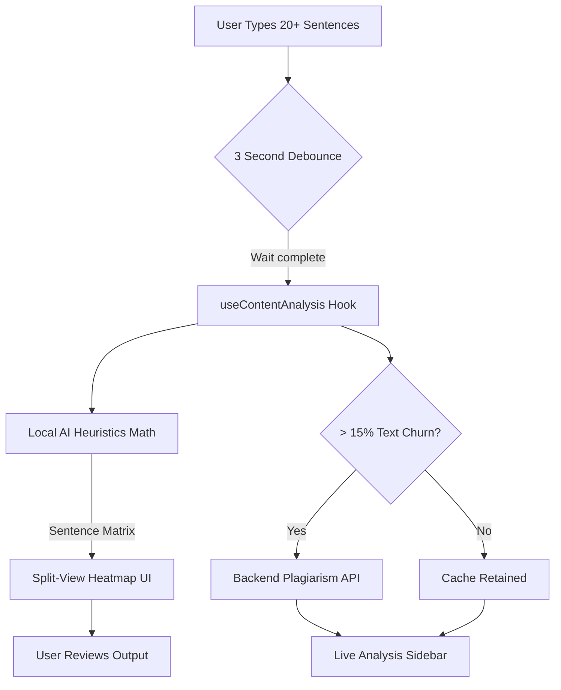

# Product Requirements Document (PRD)
**Project Name:** Scholarassist
**Creation Date:** April 2026
**Version:** 1.0.0

## 1. Product Overview

### 1.1 Purpose
Scholarassist is an advanced, AI-powered academic writing and text analysis platform designed to help students, researchers, and professional writers craft high-quality documents. It seamlessly blends a robust rich-text editor with real-time analytics, guaranteeing academic integrity via proprietary offline AI content detection and cloud-based plagiarism scanning.

### 1.2 Target Audience
- **Students & Academics:** Needing strict formatting (APA, MLA) and citation management.
- **Researchers:** Requiring structural templates (Case Studies, Literature Reviews).
- **Professional Writers:** Ensuring human-authentic writing signatures against LLM detection traps.

## 2. Core Features

### 2.1 The Smart Editor (TipTap Core)
A highly performant, distraction-free WYSIWYG editor optimized for long-form academic writing.
- **Feature Set:** Standard text formatting, tables, image insertion, layout margins (Standard, Narrow, Wide), and language localization (English US/UK, Hindi).
- **Templates:** Pre-configured architectures including *Academic Paper*, *Case Study*, *Literature Review*, and *Lab Report*.
- **Live Cloud Sync:** Real-time auto-saving hooked into a NoSQL database, presenting clear UI states (`SAVING...`, `SAVED TO CLOUD`).

### 2.2 Offline AI Content Detection (Heuristics Engine)
A mathematically robust, client-side sentence analyzer designed to protect users' privacy while analyzing writing style without API latency or server costs.
- **Metrics Evaluated:**
  - **Perplexity & TTR:** Word uniqueness ratio per sentence.
  - **Variation & Burstiness:** Running standard deviation across the latest 4 sentences to detect predictable LLM structural chunking.
  - **Stylometry & Rigidity:** Measuring density of common AI transitional phrases ("however", "conversely").
  - **Human Handprints:** Positive score inflation for informal patterns and specific contractions (e.g. *"don't"*, *"it's"*).
- **Analysis Execution:** Runs asynchronously after 20 sentences are typed, respecting a 3-second typing debounce. Score evaluates locally from `0 - 100%`.

### 2.3 Split-View Heatmap Visualization
A side-by-side analytical overlay allowing users to see their entire document mathematically graded.
- **Three-Band Coloring:**
  - **Green (0-35%):** Highly natural human variance.
  - **Amber (36-65%):** Mixed, overly uniform, or predictably structured.
  - **Red (66-100%):** Strong stylistic correlation with Language Learning Models (LLMs).
- **Explanatory Tooltips:** Hovering over any sentence span surfaces the precise probability score and deterministic reasoning (e.g., *"Informal human signals detected"*).

### 2.4 Active Plagiarism Scanner
- **Cloud Execution:** Calls the backend Copyleaks/Scanner API securely. 
- **Smart Delta Logic:** Bypasses unnecessary network requests unless the document mutates significantly (`> 15%` semantic/length churn).
- **Result Output:** Maps directly to `LiveAnalysisReport` rendering flagged sentences and direct similarity percentages.

### 2.5 Citation Management
- **In-Editor Engine:** Dynamic referencing allowing users to build a master "Library".
- **Insertion Tracking:** Keeps references sequentially numbered in the text body `[1]`, formatted dynamically (Standard APA 7th mapping).

### 2.6 Freemium Access & Analytics
- **Usage Throttling:** Non-premium users face server-side increments (`incrementUsage`) restricting unlimited Plagiarism and ML queries.
- **Tiers:** Validated securely via Firebase/JWT authentication layers wrapped in the `useAuth()` React Context.

### 2.7 Exporting Infrastructure
- **PDF Generation:** Powered by `html2pdf.js`, generating crisp 2x scale academic handouts.
- **DOCX Compilation:** Uses the `docx` node module to translate the JSON TipTap AST into Microsoft Word structurally compatible documents with precise line spacing mappings (`360` vs `480`).

---

## 3. High-Level Architecture Flow

## 4. UI/UX Specifications

> [!TIP]
> **Performance First**
> The UI splits the difference between writing and analysis. To maintain maximum frame rates while writing, the editor completely suppresses red TipTap inline decorations, routing all complex coloring natively to the `HeatmapPreview` DOM overlay. 

### Global Layout
1. **Left Container:** Document list / Templates Grid (`w-full` stacked).
2. **Editor Frame:** Center console, maximum page width 850px mimicking A4 physical bounds.
3. **Right Sidebar:** Sticky layout holding Citations, Margins, and the `LiveAnalysisReport`.

## 5. Future Implementation Roadmap
1. **Backend Stylometry Reinjection:** Allowing massive texts (books, 10,000+ words) to optionally farm the processing to a scalable Cloud Function if browser RAM ceilings are met.
2. **Grammar Integrations:** Incorporating standard stylistic warnings (Passive vs Active voice flags).
3. **ML Re-Adoption:** Restoring RoBERTa if a highly efficient ONNX client-side wasm runtime can be deployed locally.
